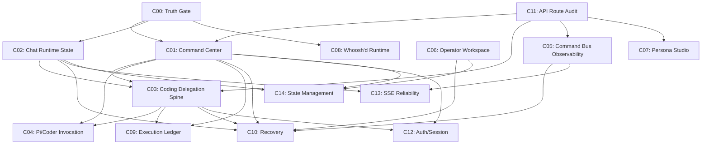

# Domain Dependency Graph

## Purpose

Show the dependency relationships between all Guardian Maturity campaigns and explain the wave ordering rationale.

## Text Dependency Graph

```
Wave 0 — Truth Baseline
─────────────────────────
C00 (Truth Gate) ───────────────┐
                                 ├──→ All subsequent campaigns depend on C00 for worktree/runtime truth
C11 (API Route Audit) ──────────┘


Wave 1 — Operator Truth Surface
─────────────────────────────────
C01 (Command Center) ←── depends on C00 + C11 (needs verified health routes)
C02 (Chat Runtime State) ←── depends on C00 (needs runtime truth baseline)

C01 and C02 are parallelizable after C00 + C11.


Wave 2 — Governed Delegation + Observability + Workspace
──────────────────────────────────────────────────────────
C03 (Coding Delegation Spine) ←── depends on C01 (needs health/truth surface)
                              ←── depends on C02 (needs request state awareness)
                              ←── depends on C11 (needs confirmed API route surface)

C05 (Command Bus Observability) ←── depends on C11 (needs verified command bus routes)
                                ←── benefits from C01 (truth surface for presentation)

C06 (Operator Workspace) ←── partially independent
                         ←── benefits from C01 (Command Center integration)

C03, C05, and C06 are parallelizable after C01 + C02 + C11 are complete.


Wave 3 — Invocation Boundary + Config + Local Runtime
───────────────────────────────────────────────────────
C04 (Pi/Coder Invocation) ←── strictly depends on C03 (needs governed delegation drafts)
                          ←── depends on C01 (needs runtime truth surface)

C07 (Persona Studio) ←── partially independent
                     ←── depends on C11 (needs verified config API routes)

C08 (Whoosh'd Runtime) ←── partially independent
                       ←── depends on C00 (needs runtime truth)


Wave 4 — Ledger + Recovery
────────────────────────────
C09 (Execution Ledger) ←── depends on C03 (needs delegation runs to track)
                       ←── depends on C01 (needs truth surface for presentation)

C10 (Recovery) ←── depends on C01 (needs truth surface)
              ←── depends on C02 (needs request state tracking)
              ←── depends on C03 (needs delegation runs to recover)


Wave 5 — Cross-Cutting Hardening
──────────────────────────────────
C12 (Auth/Session) ←── cross-cutting; depends on C01 + C03 for surface integration
C13 (SSE Reliability) ←── cross-cutting; depends on C02 + C05 for event surface
C14 (State Management) ←── cross-cutting; depends on C01 + C02 + C06 for state flows
```

## Key Dependency Rationale

### Why C04 depends on C03 and C01

C04 (Pi/Coder Invocation Boundary) requires:
- **C03**: A governed coding delegation draft with source lineage, explicit permissions, and result return target. The invocation envelope must wrap a delegation draft that C03 creates.
- **C01**: Runtime truth about provider state, catalog visibility, and health. The invocation surface must show whether the harness is available before offering execution.

C04 must not create an invocation UI before C03 can produce a governed delegation draft and C01 can show runtime truth. The system needs eyes before hands.

### Why C10 depends on C01, C02, and C03

C10 (Recovery and Operator Repair) requires:
- **C01**: Operator truth surface to show what is healthy and what is degraded. Recovery decisions need evidence.
- **C02**: Per-message request state tracking to identify orphaned, timed-out, and failed requests. Recovery must target specific attempts.
- **C03**: Governed delegation runs to recover. Stale locks, missing workers, and queue backlog are meaningless without delegation runs to reference.

### Why C11 is Wave 0 alongside C00

C11 (API Route Audit) is essential before any backend-dependent campaign. C01 needs health routes. C03 needs work order CRUD routes. C05 needs command bus routes. C04 needs invocation validation routes. Running C11 after C00 prevents campaigns from discovering missing backend surfaces mid-implementation.

## Mermaid Dependency Graph


