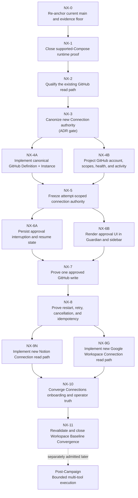

# Workspace Baseline Convergence — Next-Phase Execution Graph (2026-08-21)

**Campaign:** Workspace Baseline Convergence (`CAMPAIGN_SWEEP_FROZEN` at G0)
**Document class:** Architecture-impact steering overlay
**Status:** Frozen — no ADR impact, no implementation, no release claim change
**Date:** 2026-08-21
**Repository anchor:** current `origin/main` at graph freeze time
**Editing rule:** No runtime, schema, profile, connector, provider, or frontend implementation file is modified by this task. Only this dated document and the bounded README pointer are added.

> **Purpose.** This document does not implement or rewrite the next phase of the
> Workspace Baseline Convergence Campaign. It freezes a single, dependency-ordered,
> model-lane-assigned execution graph that extends the existing Campaign and
> routes the GitHub observation the operator reported on 2026-08-21 through the
> Campaign's intake gate into a controlled next-phase plan. The graph stops with
> one named sole next executable slice. Everything else in the graph is a future
> atomic Task Spec that must be opened through its own architecture-impact
> intake and — where its evidence changes an accepted authority boundary —
> through its own ADR or ADR amendment.

---

## 1. Relationship to the existing Campaign

This document is a **steering overlay** on `docs/Campaign/workspace-baseline-convergence/README.md`.

It is not:

- a new Campaign;
- a replacement capability ledger;
- a new architecture authority;
- a release-readiness declaration;
- a second backlog with independent status truth.

The original Campaign and its accepted ADRs remain governing authority. Specifically:

- `docs/Campaign/workspace-baseline-convergence/README.md` keeps its frozen thesis, dependency order, gates, and stop rule.
- `docs/Campaign/workspace-baseline-convergence/capability-ledger.md` remains the G0 reconciliation of record.
- `docs/Campaign/workspace-baseline-convergence/deferred-capabilities.md` remains the deferred register.
- `docs/architecture/00-current-state.md` remains release truth. No release claim widens here.
- `ADR-069` (Beta runtime support boundary), `ADR-071` (Connections control plane boundary), and `ADR-072` (bounded Settings and Connections route promotion) remain accepted doctrine.

This overlay adds only:

1. A canonical intake decision about the 2026-08-21 GitHub observation;
2. A frozen node-by-node execution graph from current state to first canonical Connection authority for GitHub, Notion, and Google Workspace;
3. A model-lane allocation lane table for the next-phase atomic slices;
4. A single sole next executable task (NX-1).

---

## 2. Current-truth anchors used to freeze this graph

### 2.1 True now

These statements are true on current `main` at freeze time.

- `docs/architecture/00-current-state.md` reports that the current Beta envelope admits Chat, threads, durable messages, projects, workspace retrieval, and Persona Studio core as bounded, but keeps Coding Loop, provider/tool-turn lanes, Hosted Rooms, Hosted Room guest semantics, Browser Host release, and DeepSeek / private-preview lanes **Qualification Pending**.
- `ADR-071` established the Settings Connectors bay as one canonical Connections control plane: aggregation without execution ownership, configuration distinct from authorization, authorization distinct from runtime health, catalog visibility distinct from implementation, server-owned user-scoped credentials, and credential-bearing tokens never serialized through the read API.
- `ADR-072` promoted the read-only `/api/connections` route and the auth-gated identity/prompt/system-document settings routes in the supported `v1-local-core-web-mcp` profile, while leaving generic connector mutation and sync (`/api/connectors`) quarantined in that profile.
- `docs/architecture/connections-control-plane.md` records that legacy sync connectors — including GitHub — remain on the existing connector subsystem surface and are not assigned a Connections catalog category.
- The implemented chat tool loop permits exactly one model-selected command, one result reinjection, and one final assistant answer (`docs/architecture/agent-tool-loop-contract.md`). Its canonical observability surface records `messageId`, `requestId`, `toolTurnId`, `toolTurnState`, `loopStopReason`, and `commandRunId`.
- Command Bus persists `command_runs` and ordered `command_run_events`; that is the bounded internal command lane in current `main`.
- Postgres is canonical durable authority for conversation, message, command run, audit, and identity state. Redis is operational transport and coordination.
- A GitHub repository-read interaction was observed by the operator in a Guardian chat session on 2026-08-21: Guardian selected the GitHub access surface, retried repository discovery after an initial miss, received repository data, and incorporated it into the active conversation.
- A canonical supported-Compose live proof is not yet current-tip proven for the reconciled head (`00-current-state.md` lists this as the first active blocker).

### 2.2 Not yet true

- The observed GitHub interaction is not captured as current-tip supported-profile proof with complete correlation and durable readback.
- GitHub is not yet a canonical Connection Definition and Connection Instance under the new desired contract. Under `ADR-071` it remains on the legacy connector subsystem.
- Notion and Google Workspace are not proven current canonical Connections; their prior working history is not established as current state.
- Generic tool calls do not yet have a proven universal durable approval/pause/resume path.
- An approved GitHub mutation has not been proven in a designated sandbox repository.
- Connection-scoped authority is not proven immutable for an execution attempt.
- Multi-tool recursive execution is not approved and remains outside the Beta envelope.

### 2.3 Assumptions requiring verification

- Prior Notion and Google / GSuite paths reportedly worked historically.
- Existing GitHub, Notion, and Google code may still provide useful adapter, credential, scope, and payload maps.
- Historical success does not establish present reachability, correct credential custody, current authority, or release support.
- No old implementation may be declared reusable until current code and live evidence establish what it actually owns.

---

## 3. Intake decision

The GitHub observation of 2026-08-21 **passes** the Workspace Baseline Convergence intake gate. It is recorded as an input to the next phase of the Campaign rather than as release proof.

The observation passes the gate because:

- it reveals a mature-workspace capability that is already partially reachable, so a manageable next-phase Campaign slice can converge it instead of starting from zero;
- it exposes a discrepancy between runtime capability and operator / control-plane legibility, which is precisely the gap the Campaign's operator-and-integration-control-plane track was admitted to close;
- it reveals that the current `ADR-071` exception for legacy GitHub is now a sequencing blocker for GitHub, Notion, and Google Workspace work, and resolving it materially simplifies all three under one canonical Connection Instance contract.

The observation **does not**:

- prove runtime behavior;
- qualify GitHub under the current Beta envelope;
- qualify Notion or Google Workspace;
- authorize any release-claim change;
- authorize implementation work in this task.

The observation may be referenced inside `NX-2` (qualification) and inside subsequent GitHub implementation slices as operator input. It is not a substitute for current-tip runtime proof or for canonical attribution across message, request, task, tool turn, command run, and external result identities.

---

## 4. Product-owner decision registered by this graph

The product-owner decision for this next phase is:

> GitHub, Notion, and Google Workspace must become new canonical Connections. Existing implementations may be inspected and referenced as maps, compatibility sources, or migration inputs, but must not remain the new architecture's execution or identity authority.

This graph records and sequences that decision. It does not implement it.

The decision changes an accepted authority boundary established by `ADR-071`. Implementing canonical Connection authority, including identity, credential custody, runtime owner, and the relationship to the legacy connector subsystem, is therefore explicitly **gated on a new ADR or an explicit `ADR-071` amendment/supersession before implementation**.

> **Requires new ADR or an explicit amendment/supersession of `ADR-071` before implementation.**

If a newer accepted ADR on current `main` already governs this decision, that ADR is cited instead and the reconciliation is reported at graph closeout. This task does not create a duplicate decision.

---

## 5. Frozen execution graph

The graph below is the frozen next-phase execution plan for Workspace Baseline Convergence. Reordering nodes, adding dependencies, or starting parallel work without a serialization rule below is a graph modification that requires a new steering document.

Critical-path reading order is `NX-0 → NX-1 → NX-2 → NX-3 → NX-4A/NX-4B → NX-5 → NX-6A/NX-6B → NX-7 → NX-8 → NX-9N/NX-9G → NX-10 → NX-11`. The post-Campaign multi-tool execution node is **not** part of this Campaign; it is shown only so the reader can see what stays parked at the next Campaign boundary.

A more impressive UI must not be used to justify advancing `NX-4B` ahead of `NX-5` or skipping `NX-6A` before `NX-7`.

---

## 6. Node ledger

Every node below is one future atomic Task Spec. Each row names its atomic outcome, prerequisite, proof gate, and default development lane. Lanes are development-operations guidance only; they do not become Codexify provider contracts, supported profiles, release assertions, or runtime routing by this task.

| Node | Atomic outcome | Proof gate | Default development lane |
|---|---|---|---|
| `NX-0` | Start from a clean checkout of current `origin/main`; record HEAD, branch, upstream, dirty state, route inventory, and governing source revisions. Classify the GitHub observation of 2026-08-21 as operator observation rather than canonical proof. | Current repository truth is unambiguous; no stale worktree is used as release evidence; the operator observation is recorded as input and not as proof. | Hermes / DeepSeek V4 Flash Ultra |
| `NX-1` | Run the supported local Compose profile and prove health, selected model inventory, enqueue, dequeue, turn-lock lifecycle, terminal task state, assistant persistence, independent message readback, and workspace retrieval. | One bounded proof packet distinguishes acceptance, execution, persistence, readback, and UI visibility. This node does not qualify a tool-enabled provider or coding loop lane by itself. | Hermes / DeepSeek V4 Pro Ultra; Luna MAX only for final integration diagnosis or closeout |
| `NX-2` | Reproduce the GitHub repository-read path and identify the exact execution owner, command or tool identity, credential owner, capability exposure path, and durable correlation fields. | The turn can be traced through `messageId`, `requestId`, `taskId`, `toolTurnId`, `commandRunId`, external result, and final assistant message. Any missing link is explicitly classified; missing links are not papered over. | Hermes / DeepSeek V4 Pro Ultra |
| `NX-3` | Accept the architecture decision for canonical Connection Definitions and Instances. GitHub, Notion, and Google Workspace are new canonical Connections; old implementations become reference maps, migration inputs, or compatibility sources only. | A new ADR or an explicit `ADR-071` amendment / supersession is accepted; no dual authority or dual-write ambiguity remains at gate close. | DeepSeek V4 Pro Ultra for drafting; Codex / Luna MAX for final architecture review and repository integration |
| `NX-4A` | Implement a new canonical GitHub Definition and user-scoped Instance with account label, auth mode, safe credential reference, granted scopes, capability declaration, enabled state, health classification, last activity, and sanitized error posture. | Read-only GitHub capability works through the new instance; raw secrets never reach the frontend; legacy code is not the new identity or state owner. | Hermes / DeepSeek V4 Pro Ultra |
| `NX-4B` | Project the new GitHub Connection through the existing Settings Connectors bay without fabricating implementation, authorization, or health. | The UI separately shows catalog visibility, setup, credentials, authorization, health, capability, and last use. | Hermes / MiniMax M3 Ultra |
| `NX-5` | Persist the effective connection and tool authority selected for one execution attempt. | Changing Settings after dispatch cannot alter the in-flight snapshot; unknown connection, scope, capability, policy, or lineage state fails closed. | Hermes / DeepSeek V4 Pro Ultra |
| `NX-6A` | Add durable approval interruption, decision, expiration, rejection, cancellation, and exact resume behavior before an external mutation. | Approval survives process restart and reconnect; no external side effect occurs before approval; the decision is linked to the exact attempt and tool call. | Hermes / DeepSeek V4 Pro Ultra |
| `NX-6B` | Render the same approval request and decision state in main Guardian chat and the sidebar / browser client. | Both surfaces read one backend approval object; refresh and reconnect preserve state; neither client owns approval truth. | Hermes / MiniMax M3 Ultra |
| `NX-7` | Execute one reversible GitHub mutation in a designated sandbox or test repository after explicit approval. Use issue creation as the first specimen unless current evidence proves a safer existing fixture. | One approval produces exactly one external issue and one durable receipt; rejection produces none; duplicate delivery produces no duplicate issue; the final chat output names the outcome. | DeepSeek V4 Pro Ultra for implementation; Codex / Luna MAX reserved for final proof and integration |
| `NX-8` | Fault-inject around approval, external dispatch, external success, receipt persistence, terminal publication, and final message return. | Restart, retry, timeout, cancellation, and duplicate delivery remain reconstructable from Postgres without treating Redis as durable truth. | Hermes / DeepSeek V4 Pro Ultra |
| `NX-9N` | Build a new canonical Notion Connection read path. Existing Notion code is used only as a behavioral and payload map. | One user-scoped page or database read is proven through the new Connection Instance with no legacy authority or secret duplication. | Hermes / MiniMax M3 Ultra, with DeepSeek V4 Flash Ultra for inventory and Pro escalation for auth failures |
| `NX-9G` | Build a new canonical Google Workspace Connection read path, beginning with Drive content or metadata rather than the entire Google suite. Existing GSuite code is used only as a map. | One user-scoped Drive read is proven through the new Connection Instance with explicit scopes and no legacy authority. | Hermes / MiniMax M3 Ultra, with DeepSeek V4 Flash Ultra for inventory and Pro escalation for auth failures |
| `NX-10` | Add onboarding and operator navigation over the canonical Connection APIs, approval state, health, and activity. | A user can connect, inspect, diagnose, and safely use the representative integrations without reading environment files or logs. | Hermes / MiniMax M3 Ultra |
| `NX-11` | Re-run the Workspace Baseline Convergence capability ledger, reconcile current state and release posture, close satisfied Expected gaps, and stop the Campaign when its stop rule is met. | Every Expected capability is proven, bounded, accepted as a documented limitation, or explicitly blocked; release claims match evidence. | Codex / Luna MAX for final audit and narrow reconciliation |

A node becomes executable only when its prerequisite dependency's proof gate has passed. A failed proof gate blocks every downstream node unless the failure is explicitly classified as unrelated and bounded inside the same gate's closeout.

---

## 7. New-Connection migration doctrine

This doctrine governs every GitHub, Notion, and Google Workspace slice in the graph. The doctrine does not become authoritative for runtime behavior until `NX-3` is closed.

### 7.1 New canonical path

- New Connection Definitions and Connection Instances receive new canonical identities.
- They use Guardian-owned, user-scoped authority.
- They expose safe metadata through the Connections projection.
- Runtime execution stays with the correct domain adapter or Command Bus path.
- Credential material stays server-side.
- Connection identity is distinct from Codexify identity, provider family, model selection, and external account identity.

### 7.2 Permitted use of old implementations

Old GitHub, Notion, Google, GSuite, sync, OAuth, or connector code may be used to learn:

- endpoint and payload shapes;
- existing credential custody;
- scope names;
- normalization rules;
- prior adapter behavior;
- migration and compatibility requirements;
- known tests and fixtures.

### 7.3 Prohibited use of old implementations

Old implementations must not:

- become the identity owner for new Connection Instances;
- remain a parallel mutation authority;
- create dual writes;
- silently supply health or authorization truth;
- be cosmetically renamed and called the new architecture;
- expose old credentials to the frontend;
- remain indefinitely active after the new path is proven and promoted.

### 7.4 Cutover lifecycle

`discover → classify → map → implement new path → shadow/prove → promote → quarantine legacy → separately retire`

Legacy retirement is a later atomic task outside the initial mapping or implementation tasks. It is not bundled into `NX-4A`, `NX-9N`, or `NX-9G`.

### 7.5 Dual-authority and dual-write prohibition

`ADR-071` already establishes the catalog as a control-plane projection rather than a new execution owner. The new canonical Connections path extends that boundary rather than competing with it: identity, authority, mutation, health, and activity each have one owner. No parallel authority or parallel write surface may be introduced for GitHub, Notion, or Google Workspace.

---

## 8. Attempt authority snapshot

The graph requires a future attempt-scoped snapshot. The snapshot is the durable record of the connection and tool authority selected for one execution attempt. It is built from data that already exists, is incrementally extended, or is separately admitted by the graph's gating slices. The snapshot must contain, at minimum:

- source thread ID;
- source message ID;
- request or attempt ID;
- task ID where applicable;
- tool-turn ID;
- command ID and command-run ID;
- Connection Definition ID;
- Connection Instance ID;
- external account label or safe identifier;
- requested capability;
- granted capability subset;
- granted scopes;
- policy or permission source;
- whether approval is required;
- provider or model or executor selected for this attempt;
- limits and relevant egress posture;
- contract or schema version;
- creation timestamp;
- immutable integrity hash or equivalent versioned identity.

The snapshot must **not** contain access tokens, refresh tokens, API keys, OAuth verifiers, or raw secret-bearing request payloads. This rule is invariant, not a tuning knob.

---

## 9. Approval posture

For the first approval implementation:

- Read-only operations may proceed without a popup only when the frozen capability snapshot explicitly permits them.
- External mutations require explicit per-call approval.
- Approval is evaluated before Command Bus dispatch or adapter mutation.
- Rejection resumes the conversation with a bounded rejection result; rejection does not execute the command.
- Expiration and cancellation remain distinct outcomes.
- No "always approve" policy is introduced in the first slice.
- No frontend client may manufacture or mutate approval truth outside the canonical backend API.
- Existing canonical token registries must be inspected before any approval state, event, or error literal is added.

The first approval implementation lives in `NX-6A` (backend persistence and resume) and `NX-6B` (frontend rendering). `NX-7` proves one approved GitHub write on top of that surface.

---

## 10. GitHub write specimen

The first mutation proof uses a designated sandbox or test repository and prefers issue creation because issue creation is bounded, inspectable, and reversible.

The proof must include:

- explicit target repository;
- explicit proposed title and body;
- sanitized argument preview before approval;
- per-call approval;
- deterministic idempotency key;
- external issue identifier after success;
- durable command or connection receipt;
- source-thread continuation;
- independent GitHub readback;
- duplicate-delivery test;
- rejection test;
- restart test.

The first mutation proof must not begin with:

- pushing code;
- merging a pull request;
- changing branch protection;
- modifying repository settings;
- deleting content;
- altering collaborators or permissions.

---

## 11. Model and environment lane allocation

These assignments are development-operations guidance for the next-phase slices. They are not Codexify provider contracts, supported profiles, release assertions, or runtime routing.

| Lane | Default use | Escalation rule |
|---|---|---|
| Hermes / DeepSeek V4 Flash Ultra | Repository reconnaissance, owner and file maps, contract comparisons, test inventory, fixture generation, narrow docs updates, low-risk deterministic corrections. | Escalate when the task changes persistence, authority, recovery, command dispatch, or repeatedly fails focused validation. |
| Hermes / DeepSeek V4 Pro Ultra | Backend contracts, state machines, persistence, migrations, Command Bus integration, approval and resume logic, fault injection, complex debugging. | Escalate to Codex / Luna MAX only for final integration, unresolved architecture conflict, or repository-level proof gate. |
| Hermes / MiniMax M3 Ultra | Connections UI, approval UI, onboarding, browser-visible workflows, Notion and Google adapter mapping, large-context cross-surface reviews. | Escalate backend authority or persistence questions to DeepSeek V4 Pro rather than improvising in UI code. |
| Codex / GPT-5.6 Luna MAX | Scarce gate work: final ADR integration, high-blast-radius cross-cutting patch review, rebase and conflict resolution, current-main proof closeout, and Campaign closure. | Do not spend on broad grep, first-pass recon, routine test generation, visual polish, or repeated speculative attempts. |

### 11.1 Luna / Codex access discipline

- Do not spend Luna / MAX on reconnaissance for this docs task.
- Prepare every Luna task in Hermes first.
- A Luna task must arrive with one atomic Task Spec, exact authorized files, current HEAD and branch, proven prerequisite state, focused validation commands, and (where relevant) known failure output when fixing a defect. It must not request broad exploratory cleanup.
- Preserve the first available Luna gate for either current-tip supported-Compose / tool-path proof closeout, or final review of the Connection-authority ADR. Do not attempt both in one Luna session.
- Lack of Luna access does not authorize skipping an ADR, a proof gate, or an invariant. The gate is parked and Hermes continues independent work.

---

## 12. Serialization and parallelism

The following seams serialize all work touching them. Work on these seams is never parallelized across slices inside this graph.

- `guardian/protocol_tokens.py`;
- database models or migrations;
- connection-instance authority;
- `guardian/core/chat_completion_service.py`;
- `guardian/workers/chat_worker.py`;
- `guardian/command_bus/`;
- approval state or execution-resume contracts;
- supported profiles;
- release or current-state claims.

The following parallelism is permitted inside the graph.

- After `NX-3`, backend GitHub Connection work and the read-only UI projection may proceed in separate worktrees when file ownership does not overlap. Convergence before `NX-5` is required.
- After `NX-8`, `NX-9N` and `NX-9G` may proceed in parallel.
- Notion and Google tasks must not edit the same canonical registry concurrently.
- Frontend polish may not outrun backend contract acceptance.
- No parallel work may change the same migration chain, token domain, or authority contract.

---

## 13. Sole next executable slice

> **SOLE NEXT TASK: NX-1 — Capture current-tip supported-Compose runtime closure evidence.**

`NX-0` is the mandatory preflight for `NX-1`, not a separate implementation outcome.

`NX-1` must complete before new Connection-authority implementation because the current release-truth document (`docs/architecture/00-current-state.md`) still treats runtime closure, queue and worker behavior, persistence and readback, and tool-enabled provider continuation as open.

The 2026-08-21 GitHub observation may be recorded as an input inside `NX-1` and `NX-2`, but it is not a substitute for `NX-1` or `NX-2` proof. The observation is operator evidence, not canonical execution evidence.

---

## 14. Campaign stop rule carried into this graph

`Workspace Baseline Convergence` closes when, and only when, **all** of the following are true.

- Supported Compose closure is current-tip proven.
- The GitHub read path is attributable and reconstructable.
- Canonical Connection authority is accepted under the ADR or ADR amendment that `NX-3` requires.
- GitHub uses a new Definition and Instance rather than legacy authority.
- Execution attempts freeze effective connection and capability authority.
- Approval pause and resume survives restart.
- One approved GitHub write is exactly-once and durably receipted.
- Fault and recovery proof passes.
- Notion and Google Workspace each prove one new-instance read path.
- Onboarding and Settings expose canonical operator truth.
- No unresolved Expected capability remains an unclassified structural gap.
- Current-state and release posture accurately match proof.

After that, the Campaign closes. A bounded multi-tool loop is a possible later Campaign or explicitly admitted follow-up. It is not smuggled into this phase merely because one tool turn now works.

The post-Campaign node in the graph above exists so the reader can see what stays parked at the next Campaign boundary; that node is **not** part of this Campaign.

---

## 15. Invariants

These invariants apply to every node in this graph. They are restated here so future slices do not relitigate them inside their Task Specs.

1. PostgreSQL remains canonical durable authority.
2. Redis remains transport and coordination, not historical truth.
3. Guardian owns policy, lineage, approval, validation, and result return.
4. Command Bus remains the sole Codexify command authority.
5. Connections remains a control-plane projection, not a new executor.
6. New Connection identities must not borrow legacy connector identity.
7. Old connector code may inform the new implementation but may not own it.
8. No parallel truth or dual-write surface is introduced.
9. Secrets remain server-owned and user-scoped.
10. Message, request, task, tool turn, command run, approval, Connection Instance, and external result identities remain distinguishable.
11. Acceptance is not completion.
12. Event publication is not client receipt.
13. External success is not user-visible success until durable receipt and source-thread continuation succeed.
14. Unknown credential, scope, capability, approval, connection, or lineage state fails closed.
15. Read and mutation capabilities remain explicitly distinct.
16. The default local-only Beta provider posture is unchanged.
17. Development model assignments do not change Codexify provider support.
18. No recursive or unrestricted autonomous loop is introduced.
19. No durable identity or memory mutation is introduced.
20. Release claims change only after separately authorized current-tip proof and documentation reconciliation.

---

## 16. Proof surface and what this document does not prove

This document is a planning and governance artifact.

It proves only:

- dependency order;
- task boundaries;
- authority gates;
- model-lane allocation;
- stopping condition;
- the selected next task.

It does **not** prove runtime behavior. It does not qualify GitHub, Notion, or Google Workspace. It does not introduce a new Campaign, a new ledger, a new ADR, or a release-claim change.

Future Task Specs must each carry their own runtime, schema, profile, connector, provider, or frontend implementation follow-through appropriate to their evidence level. This document does not pre-authorize any of that follow-through.

---

## 17. Validation commands and expected results

The author of this document ran the following validation commands at freeze time and captured their results for graph closeout. Reproducible commands are listed in the order the validation contract specifies.

1. `git fetch origin`
2. `git status --short --branch --untracked-files=all`
3. `git rev-parse HEAD`
4. `git rev-parse origin/main`
5. `python scripts/validate_docs.py`
6. `rg -n "NX-0|NX-1|NX-11|SOLE NEXT TASK|GitHub|Notion|Google Workspace|DeepSeek V4 Flash|DeepSeek V4 Pro|MiniMax M3|GPT-5.6 Luna MAX|legacy|dual-write|ADR-071" docs/Campaign/workspace-baseline-convergence/2026-08-21-next-phase-execution-graph.md`
7. `rg -n "2026-08-21-next-phase-execution-graph.md" docs/Campaign/workspace-baseline-convergence/README.md`
8. `git diff --check`
9. `git diff --name-only`

Expected changed files for this task are exactly:

- `docs/Campaign/workspace-baseline-convergence/2026-08-21-next-phase-execution-graph.md`
- `docs/Campaign/workspace-baseline-convergence/README.md`

No automated runtime tests apply to this task.

If `scripts/validate_docs.py` reports a pre-existing unrelated corpus failure, the exact failure must be captured, reproduced against unmodified `origin/main`, and reported at closeout. Unrelated documents are not altered by this task.

---

## 18. Anti-goals expressed as non-negotiable lists

These lists repeat the spec's prohibited set so future graph edits are not tempted to relax them inside the steering overlay.

- No GitHub, Notion, or Google implementation in this task.
- No external write or test issue creation in this task.
- No OAuth flow change in this task.
- No credential migration in this task.
- No database migration in this task.
- No approval API or UI implementation in this task.
- No Command Bus change in this task.
- No chat worker change in this task.
- No supported-profile change in this task.
- No provider-registry change in this task.
- No Codexify model-routing change in this task.
- No current-state or Beta posture update in this task.
- No new Campaign in this task.
- No new ADR in this task.
- No capability-ledger rewrite in this task.
- No model benchmark in this task.
- No general connector inventory expansion in this task.
- No recursive agent or multi-tool loop in this task.

---

## 19. Deferred work held over from this graph

The following work is named by this graph but not done in this task. Each item enters its own Task Spec with its own architecture-impact intake and — where it changes an accepted authority boundary — its own ADR or ADR amendment.

- GitHub qualification past `NX-2`.
- Canonical Connection implementation past `NX-4A` / `NX-4B`.
- Approval and resume implementation past `NX-6A` / `NX-6B`.
- GitHub write proof past `NX-7`.
- Notion implementation past `NX-9N`.
- Google Workspace implementation past `NX-9G`.
- Onboarding convergence past `NX-10`.
- Post-Campaign multi-tool execution (parked at the next Campaign boundary).

---

## 20. Source evidence

The graph was frozen against the following repository evidence and external comparative references.

Repository sources:

- `docs/architecture/00-current-state.md`
- `docs/architecture/README.md`
- `docs/architecture/adr/069-codexify-beta-runtime-support-boundary.md`
- `docs/architecture/adr/071-connections-control-plane-boundary.md`
- `docs/architecture/adr/072-bounded-settings-and-connections-route-promotion.md`
- `docs/architecture/connections-control-plane.md`
- `docs/architecture/agent-tool-loop-contract.md`
- `docs/architecture/chat-runtime-contract.md`
- `docs/architecture/runtime-protocol-token-contract.md`
- `docs/architecture/data-and-storage.md`
- `docs/architecture/config-and-ops.md`
- `docs/Campaign/workspace-baseline-convergence/README.md`
- `docs/Campaign/workspace-baseline-convergence/capability-ledger.md`
- `docs/Campaign/workspace-baseline-convergence/deferred-capabilities.md`

Operator evidence:

- 2026-08-21 Guardian chat observation showing GitHub repository discovery, retry, result return, and final response. Treated as operator-observed input until `NX-2` captures canonical execution evidence.

External reference specimens (comparative only; they do not override Guardian authority, Command Bus ownership, Codexify persistence, identity doctrine, accepted ADRs, or the Campaign stop rule):

- Model Context Protocol Tasks extension.
- Model Context Protocol authorization and incremental-scope guidance.
- OpenAI Agents SDK human-in-the-loop pause, serialization, and resume model.
- GitHub MCP toolset-minimization guidance.
- Official GPT-5.6 Luna, MiniMax M3, and DeepSeek V4 Flash / Pro model guidance.
