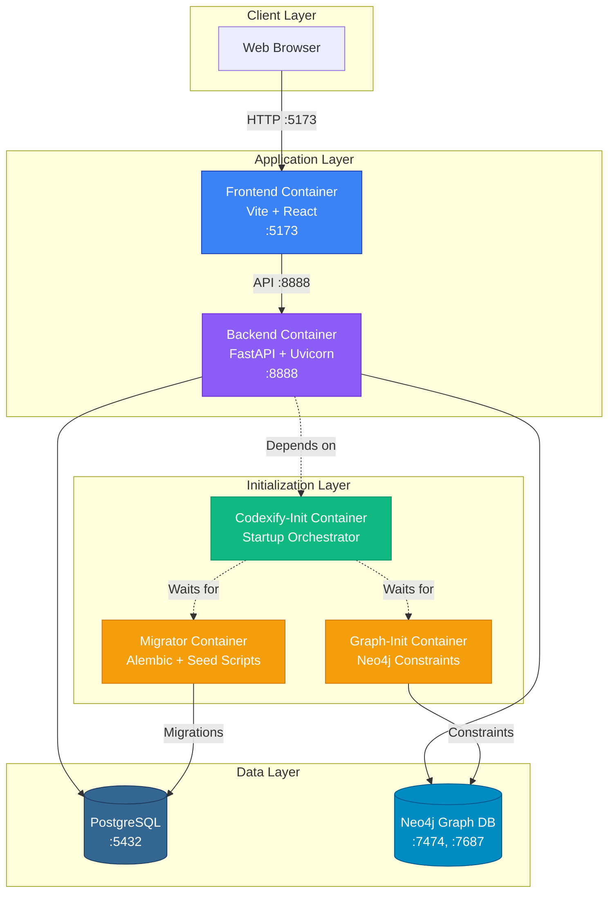

# 🐋 Docker Setup Guide

**Codexify Docker Environment**
A complete containerized architecture for local development and CI deployment.

---

## 📖 Overview

Docker provides Codexify with **isolation, reproducibility, and zero-dependency development**. The entire stack—frontend, backend, databases, and initialization services—runs in orchestrated containers, eliminating the need for local Python, Node.js, PostgreSQL, or Neo4j installations.

### Why Docker?

- **Consistency**: Identical environments across development, testing, and CI pipelines
- **Isolation**: No conflicts with host system dependencies
- **Reproducibility**: Fresh deployments in seconds with guaranteed configuration
- **Zero Setup**: Clone, compose, and code—no manual dependency installation

---

## 🏗️ Architecture



### Service Relationships

| Service | Purpose | Ports | Health Check |
|---------|---------|-------|--------------|
| **db** | PostgreSQL 15 database | 5432 | `pg_isready` |
| **neo4j** | Graph database for relationships | 7474 (HTTP), 7687 (Bolt) | Cypher shell query |
| **migrator** | Runs Alembic migrations + seed data | — | Service completion |
| **graph-init** | Creates Neo4j constraints/indexes | — | Service completion |
| **codexify-init** | Orchestrates initialization order | — | Service completion |
| **backend** | FastAPI application server | 8888 | `/ping` endpoint |
| **frontend** | Vite dev server with HMR | 5173 | Process readiness |

---

## ⚙️ Prerequisites

### Required Software

- **Docker Desktop** 4.20+ ([Get Docker](https://docs.docker.com/get-docker/))
- **docker-compose** 2.17+ (bundled with Docker Desktop)
- Git (for cloning the repository)

### System Requirements

| Resource | Minimum | Recommended |
|----------|---------|-------------|
| CPU | 2 cores | 4+ cores |
| RAM | 4 GB | 8+ GB |
| Disk | 10 GB free | 20+ GB free |

### Environment Configuration

Create a `.env` file in the project root (copy from `.env.example`):

```bash
cp .env.example .env
```

**Required Variables:**

```bash
# LLM Provider Configuration
GENAI_API_KEY=your-gemini-api-key-here
LLM_PROVIDER=groq
GROQ_API_KEY=your-groq-api-key-here

# Optional: External Integrations
NOTION_API_KEY=your-notion-token-here
ANTHROPIC_API_KEY=your-anthropic-key-here
```

**Note:** For local testing, you can use `dummy` values, but full functionality requires valid API keys.

### Port Availability

Ensure these ports are free on your host machine:

- **5173** — Vite frontend dev server
- **8888** — FastAPI backend
- **5432** — PostgreSQL
- **7474** — Neo4j HTTP
- **7687** — Neo4j Bolt

Check for conflicts:

```bash
# macOS/Linux
lsof -i :5173 -i :8888 -i :5432 -i :7474 -i :7687

# Windows (PowerShell)
Get-NetTCPConnection | Where-Object {$_.LocalPort -in 5173,8888,5432,7474,7687}
```

---

## 🚀 Quick Start

### 1. Clone the Repository

```bash
git clone https://github.com/Resonant-Jones/Codexify.git
cd Codexify
```

### 2. Build All Services

```bash
docker compose build
```

**Expected Output:**
```
[+] Building 45.2s (28/28) FINISHED
 => [backend internal] load build definition from Dockerfile
 => [frontend internal] load build definition from Dockerfile
 ...
```

### 3. Start the Stack

```bash
docker compose up
```

**Or run in detached mode:**

```bash
docker compose up -d
```

### 4. Verify Health

**Backend Health Check:**

```bash
curl http://localhost:8888/ping
# Expected: {"status":"ok"}
```

**Frontend:**

Open your browser to [http://localhost:5173](http://localhost:5173)

**Database Connections:**

```bash
# PostgreSQL
docker exec -it codexify-db-1 psql -U guardian -d guardian -c "SELECT 1;"

# Neo4j Web UI
# Navigate to http://localhost:7474
# Credentials: neo4j / guardian
```

---

## 🔨 Development Workflow

### Hot Reload Behavior

#### Frontend (Vite)

The frontend container uses **Vite's dev server with Hot Module Replacement (HMR)**:

- **Volume Mount**: `./frontend:/app` — All changes in `./frontend/src` are instantly reflected
- **Config**: Vite watches for file changes via native FS events
- **Rebuild**: Not required for `.tsx`, `.ts`, `.css` changes
- **Port**: Exposed at `localhost:5173` with host binding `0.0.0.0`

**How It Works:**

```dockerfile
# frontend/Dockerfile
CMD ["sh","-lc","pnpm --dir src dev -- --host 0.0.0.0 --port ${VITE_DEV_PORT:-5173}"]
```

**Testing Hot Reload:**

1. Edit `frontend/src/App.tsx`
2. Save the file
3. Browser auto-refreshes within ~500ms

#### Backend (Uvicorn)

The backend container runs **Uvicorn without auto-reload by default** (for stability). To enable watch mode:

**Option A: Modify `docker-compose.yml`**

```yaml
backend:
  command: >
    sh -lc 'ln -sf /app/guardian /app/codexify &&
            uvicorn codexify.guardian_api:app --host 0.0.0.0 --port 8888 --reload'
```

**Option B: Manual Restart**

```bash
docker compose restart backend
```

**Volume Mount**: `.:/app` — Backend code is mounted, so changes persist

**Note**: Uvicorn's `--reload` watches `.py` files but may not detect changes in mounted volumes. Use manual restart for guaranteed reload.

### Volume Mounts Explained

| Service | Mount | Purpose |
|---------|-------|---------|
| **frontend** | `./frontend:/app` | Live source editing with HMR |
| **backend** | `.:/app` | Code persistence + manual reload |
| **migrator** | `.:/app` | Access to migration scripts |
| **db** | `pg_data:/var/lib/postgresql/data` | Persistent database storage |
| **neo4j** | `neo4j_data:/data` | Persistent graph database |

### Development Commands

**View Logs:**

```bash
# All services
docker compose logs -f

# Specific service
docker compose logs -f backend
docker compose logs -f frontend
```

**Restart a Service:**

```bash
docker compose restart backend
docker compose restart frontend
```

**Rebuild After Dependency Changes:**

```bash
# Backend (requirements.txt changed)
docker compose build backend
docker compose up -d backend

# Frontend (package.json changed)
docker compose build frontend
docker compose up -d frontend
```

**Run Migrations Manually:**

```bash
docker compose run --rm migrator sh -c "alembic -c backend/alembic.ini upgrade head"
```

**Access a Shell Inside a Container:**

```bash
docker exec -it codexify-backend-1 bash
docker exec -it codexify-frontend-1 sh
```

---

## 🐛 Common Issues and Fixes

### Port Conflicts

**Symptom:**

```
Error: Bind for 0.0.0.0:5173 failed: port is already allocated
```

**Solutions:**

1. **Kill conflicting process:**

```bash
# macOS/Linux
lsof -ti:5173 | xargs kill -9

# Windows
Get-Process -Id (Get-NetTCPConnection -LocalPort 5173).OwningProcess | Stop-Process
```

2. **Change port in `docker-compose.yml`:**

```yaml
frontend:
  ports: ["5174:5173"]  # Map host :5174 to container :5173
```

### Permission Errors on `node_modules`

**Symptom:**

```
EACCES: permission denied, mkdir '/app/node_modules'
```

**Root Cause:** Host and container user ID mismatch.

**Solution A: Adjust Volume Ownership (macOS/Linux)**

```bash
sudo chown -R $(id -u):$(id -g) frontend/node_modules
```

**Solution B: Use Named Volume (Recommended)**

```yaml
frontend:
  volumes:
    - ./frontend/src:/app/src  # Only mount source code
    - frontend_node_modules:/app/node_modules  # Isolated node_modules

volumes:
  frontend_node_modules:
```

### Rebuilding Native Modules

**Symptom:**

```
Error: Module did not self-register
```

**Cause:** Native modules compiled for host OS don't work in container.

**Solution:**

```bash
# Frontend (esbuild, @parcel/watcher, etc.)
docker compose run --rm frontend sh -c "pnpm --dir src rebuild esbuild @parcel/watcher"

# Backend (psycopg2, etc.)
docker compose build --no-cache backend
```

### Missing `.env` or Database Credentials

**Symptom:**

```
sqlalchemy.exc.OperationalError: FATAL: password authentication failed
```

**Solution:**

1. Ensure `.env` exists and contains valid credentials
2. Verify `docker-compose.yml` uses correct environment variables:

```yaml
backend:
  environment:
    DATABASE_URL: postgresql://guardian:guardian@db:5432/guardian
```

3. Restart the stack:

```bash
docker compose down -v  # WARNING: Deletes data
docker compose up -d
```

### Database Connection Refused

**Symptom:**

```
psycopg2.OperationalError: could not connect to server: Connection refused
```

**Diagnosis:**

```bash
docker compose ps  # Check if 'db' is healthy
docker compose logs db
```

**Solution:**

Wait for health check to pass:

```bash
docker compose up -d db
docker compose exec db pg_isready -U guardian
```

---

## 🏭 Production Notes

### Multi-Stage Builds

For production deployments, use multi-stage Dockerfiles to reduce image size:

**Example: `backend/Dockerfile.prod`**

```dockerfile
# Stage 1: Build
FROM python:3.11-slim AS builder
WORKDIR /build
COPY requirements.txt .
RUN pip install --user --no-cache-dir -r requirements.txt

# Stage 2: Runtime
FROM python:3.11-slim
WORKDIR /app
COPY --from=builder /root/.local /root/.local
COPY guardian ./guardian
ENV PATH=/root/.local/bin:$PATH
EXPOSE 8888
CMD ["uvicorn", "codexify.guardian_api:app", "--host", "0.0.0.0", "--port", "8888"]
```

**Build Production Image:**

```bash
docker build -f backend/Dockerfile.prod -t codexify-backend:prod .
```

### Environment Profiles

Use separate compose files for production:

**`docker-compose.prod.yml`:**

```yaml
services:
  backend:
    environment:
      DATABASE_URL: ${PROD_DATABASE_URL}
      NEO4J_BOLT_URL: ${PROD_NEO4J_URL}
      GUARDIAN_API_KEY: ${PROD_API_KEY}
    restart: always
    deploy:
      resources:
        limits:
          cpus: '2'
          memory: 4G
```

**Deploy:**

```bash
docker compose -f docker-compose.yml -f docker-compose.prod.yml up -d
```

### Security Hardening

1. **Use Secrets Management:**

```yaml
secrets:
  db_password:
    file: ./secrets/db_password.txt

services:
  db:
    secrets:
      - db_password
    environment:
      POSTGRES_PASSWORD_FILE: /run/secrets/db_password
```

2. **Run as Non-Root User:**

```dockerfile
RUN adduser --disabled-password --gecos '' appuser
USER appuser
```

3. **Read-Only Filesystem:**

```yaml
backend:
  read_only: true
  tmpfs:
    - /tmp
    - /app/.cache
```

---

## 🔍 Troubleshooting

### View Logs

**Tail All Services:**

```bash
docker compose logs -f
```

**Filter by Service:**

```bash
docker compose logs -f backend | grep ERROR
```

**Last 100 Lines:**

```bash
docker compose logs --tail=100 backend
```

### Execute Commands Inside Containers

**Backend Shell:**

```bash
docker exec -it codexify-backend-1 bash

# Inside container:
python -c "from guardian.db import get_session; print(next(get_session()))"
```

**Frontend Shell:**

```bash
docker exec -it codexify-frontend-1 sh

# Inside container:
pnpm --dir src list
```

**Database Shell:**

```bash
docker exec -it codexify-db-1 psql -U guardian -d guardian
```

### Reset Everything

**Nuclear Option — Deletes ALL Data:**

```bash
docker compose down -v        # Stop and remove volumes
docker compose down --rmi all # Also remove images
docker system prune -a --volumes  # Clean up Docker system
```

**Then rebuild:**

```bash
docker compose build --no-cache
docker compose up -d
```

### Health Check Failures

**Backend Won't Start:**

```bash
# Check health status
docker compose ps backend

# Inspect health check logs
docker inspect codexify-backend-1 | jq '.[0].State.Health'

# Test health endpoint manually
docker exec codexify-backend-1 curl http://localhost:8888/ping
```

**Database Not Ready:**

```bash
# Watch health checks in real-time
watch -n 2 'docker compose ps'

# Increase retry count in docker-compose.yml
db:
  healthcheck:
    retries: 50  # Increase from 20
    start_period: 60s
```

### Performance Issues

**Container Using Too Much Memory:**

```bash
docker stats  # Real-time resource usage
```

**Limit Resources:**

```yaml
backend:
  deploy:
    resources:
      limits:
        cpus: '1.5'
        memory: 2G
      reservations:
        cpus: '0.5'
        memory: 1G
```

---

## 📚 References

### Official Documentation

- [Docker Compose Specification](https://docs.docker.com/compose/compose-file/)
- [Docker Multi-Stage Builds](https://docs.docker.com/build/building/multi-stage/)
- [FastAPI in Containers](https://fastapi.tiangolo.com/deployment/docker/)
- [Uvicorn Deployment](https://www.uvicorn.org/deployment/)

### Framework-Specific Guides

- [Vite + Docker Best Practices](https://vitejs.dev/guide/troubleshooting.html#vite-and-docker)
- [Node.js in Docker with pnpm](https://pnpm.io/docker)
- [PostgreSQL Docker Official Image](https://hub.docker.com/_/postgres)
- [Neo4j Docker Guide](https://neo4j.com/developer/docker-run-neo4j/)

### Codexify-Specific Resources

- [Main README](./Codexify/README.md) — Full system architecture
- [Database Setup](./dev/setup-postgres.md) — PostgreSQL configuration
- [System Architecture](./infra/system_architecture.md) — Component relationships
- [Contributing Guide](./Codexify/CONTRIBUTING.md) — Development guidelines

---

## 🧪 Testing in Docker

### Run Backend Tests

```bash
# Run pytest inside backend container
docker compose run --rm backend pytest tests/

# With coverage
docker compose run --rm backend pytest --cov=guardian tests/

# Specific test file
docker compose run --rm backend pytest tests/test_system_integration.py -v
```

### Run Frontend Tests

```bash
# Run Vitest (if configured)
docker compose run --rm frontend pnpm --dir src test

# E2E tests (if Cypress is installed)
docker compose run --rm frontend pnpm --dir src test:e2e
```

### CI/CD Integration

**GitHub Actions Example:**

```yaml
name: Docker CI

on: [push, pull_request]

jobs:
  test:
    runs-on: ubuntu-latest
    steps:
      - uses: actions/checkout@v3

      - name: Build services
        run: docker compose build

      - name: Start stack
        run: docker compose up -d

      - name: Wait for health checks
        run: |
          timeout 120 sh -c 'until docker compose ps backend | grep healthy; do sleep 2; done'

      - name: Run backend tests
        run: docker compose run --rm backend pytest

      - name: Run frontend tests
        run: docker compose run --rm frontend pnpm --dir src test

      - name: Cleanup
        run: docker compose down -v
```

---

**🌟 The Codexify Docker environment provides a sovereign, containerized realm for AI operating system development. Build, deploy, and iterate with mythic precision.**

*Last Updated: 2025-01-08*
