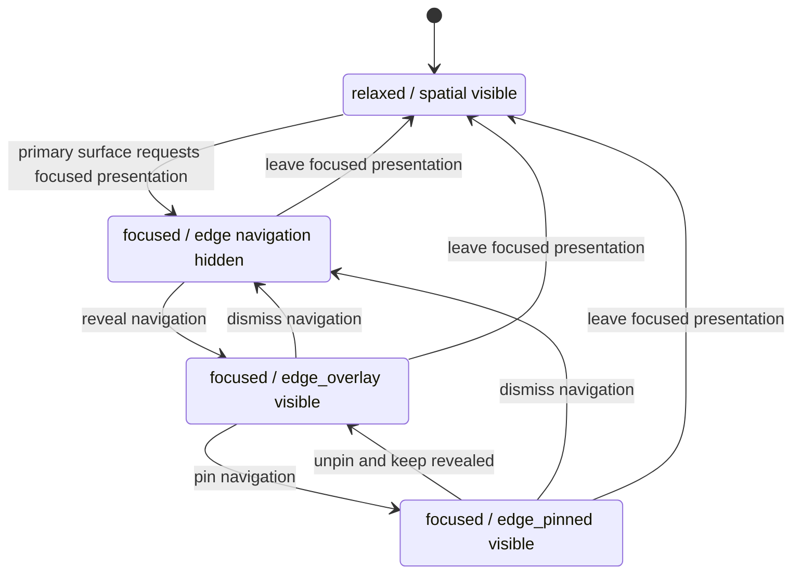

# ADR-095: Adaptive Application Sidebar Posture and Shell Boundary

- Status: Proposed
- Date: 2026-09-29
- Human decision requested: Resonant Jones acceptance before implementation
- Supersedes: None

## Context and current evidence

Codexify already presents application navigation through several layouts. The ordinary desktop Guardian view composes `SidebarRoot` beside chat. Narrow layouts use a portal drawer. The [Unified Desktop Compositor](../../../frontend/src/components/persona/layout/UnifiedDesktopCompositor.tsx) has browser `closed`, `docked`, and `focused` presentations, an edge reveal control, and `focusedSidebarOpen` / `focusedSidebarPinned` inputs. [AppShell](../../../frontend/src/components/persona/layout/AppShell.tsx) coordinates those values and reuses [MobileAppSidebarDrawer](../../../frontend/src/components/persona/layout/MobileAppSidebarDrawer.tsx) with `presentation="shelf"` in browser focus. [GuardianChatWithSidebar](../../../frontend/src/components/persona/layout/GuardianChatWithSidebar.tsx) likewise uses its desktop grid or that drawer according to the browser and viewport state.

These are compatible precursors, not the generalized contract. Browser focus currently initializes sidebar visibility and pinning together. The focused browser's [CSS geometry](../../../frontend/src/components/persona/layout/AppShell.css) remains an absolutely positioned content rectangle; its pinned data attribute does not reserve sidebar width. The current pin therefore keeps a visible edge surface but does not yet establish the shell boundary specified here. `BrowserPresentation` is a browser-specific state, `browserFocused` is a child-layout input, and `shelf` is a component presentation string. None is the canonical vocabulary for shell attention or sidebar posture. The component named `MobileAppSidebarDrawer` now also serves a desktop focused browser. Renaming or replacing it is deferred.

The [Guardian Chat Portal](../guardian-chat-portal.md) accurately describes its existing desktop split and mobile portal behavior but does not describe a generalized focused shell. The [Workspace Surface Spec](../codexify_workspace_surface_spec_v_1.md) and [Workspace layout mode](../../../frontend/src/features/workspace/state/useWorkspaceLayoutMode.ts) distinguish `chat_focus`, `balanced_split`, and `workspace_focus` within Workspace. Those modes are pane-emphasis choices, not application-navigation posture. The existing [breakpoint contract](../../../frontend/src/components/persona/layout/shellBreakpointContract.ts) determines when split or collapsed layout is available.

The release boundary remains [00 Current State](../00-current-state.md). This proposed decision is architecture only; it proves no new UI behavior or release support.

## Decision proposed

Codexify presents **one semantic application-navigation system** through adaptive shell postures. Focus changes the posture of the shell, not the identity of its parts. The ordinary relaxed desktop retains a compact, floating, spatial sidebar beside the primary content. This decision does not replace it with a conventional permanent desktop rail.

Two independent conceptual axes govern the desktop presentation:

| Axis | Meaning | Conceptual values |
| --- | --- | --- |
| Shell attention | Whether a primary surface has explicitly requested deep-work emphasis from the shared shell | `relaxed`, `focused` |
| Sidebar posture | How the same navigation system occupies the shell | `spatial`, `edge_overlay`, `edge_pinned` |

`focused` means a shell-level presentation request, not browser DOM focus, keyboard focus, a focused text input, a route name, or sidebar visibility. A primary surface may remain focused with navigation hidden. Exact runtime type names and storage shape are deferred; these labels define semantics, not a TypeScript API or a new persistence contract.

### Posture contracts

| Posture | Use | Occupancy and behavior |
| --- | --- | --- |
| `spatial` | Default relaxed desktop posture | Compact, floating presentation in Codexify's spatial composition; it occupies the ordinary composition beside Guardian Chat and remains available when no surface requests shell-level focus. |
| `edge_overlay` | Transient navigation over a focused primary surface | Flat, full shell-viewport height, attached to the physical application edge. An explicit control, edge gesture, appropriate hover, or keyboard action may reveal it. It overlays content without reallocating the focused surface's rectangle; dismissal leaves the primary surface focused. |
| `edge_pinned` | Persistent navigation beside a focused primary surface | Flat, full shell-viewport height, attached to the application edge. The shell reserves its width before laying out content, so the primary surface reflows beside it and cannot render beneath it. It persists until explicit unpin/dismissal or a governing shell transition. |

The overlay and pinned postures are distinct layout contracts, not visual variants of the same fixed drawer. Overlay has transient occupancy; pinned creates a shell boundary. A hidden sidebar in focused mode is a visibility state, not a fourth desktop posture.

### Transition model

The primary surface remains focused during all transitions on the right side of this diagram. Leaving focus is a separate shell transition.

An implementation may return from unpinning directly to hidden navigation when that action explicitly dismisses the sidebar. It must not leave shell focus merely because navigation is revealed, pinned, unpinned, or dismissed. Entering focus need not automatically open or pin navigation; that current browser behavior is an implementation precursor, not a required rule.

### Authority and geometry

| Owner | Owns | Does not own |
| --- | --- | --- |
| `AppShell` or equivalent shared shell compositor | Shell attention, resolved sidebar posture and visibility, responsive projection, available content rectangle, and pinned width reservation | Project/Thread selection or navigation authority |
| `SidebarRoot` or its semantic successor | Projects and Threads projection, application destinations, search and filtering controls, navigation actions, and selected-state presentation | Shell focus and shell geometry |
| Primary surfaces, including Guardian and browser; future Canvas, artifacts, document/editor, and Focus Chat surfaces if implemented | Request focused presentation and consume the rectangle supplied by the shell | Reposition the global sidebar, reserve its width independently, or create route-local navigation authority |

The compositor calculates the pinned boundary once. Child surfaces receive or occupy the resulting content area; they do not each subtract a width, add a compensating margin, or let browser/chat/Canvas content extend under the pinned edge. This geometry rule applies to any future focused surface that participates in the shared shell contract. It does not claim that those surfaces are presently implemented.

Posture changes are presentation-only. They cannot change the active Project, active Chat Thread, current destination, Thread ownership, retrieval scope, source/provider filtering semantics, provider or model, Persona, Workspace contents, canonical identity, or authorization. Navigation actions remain explicit actions of the one semantic sidebar. Moving or hiding its presentation must not imply a change in provenance, selection, or runtime state.

### Responsive and Workspace relationship

The desktop posture model is subject to the shared responsive shell. When the viewport profile or available rectangle cannot support a pinned edge and viable primary surface, the shell projects the same navigation system through its existing narrow/mobile drawer or overlay contract. That fallback does not create an independent mobile navigation authority and does not change breakpoint values or mobile behavior in this ADR.

Workspace's `chat_focus`, `balanced_split`, and `workspace_focus` remain Workspace pane-layout modes. They can inform composition with shell attention, but they are not merged into one enum or state machine with sidebar posture. The [Workspace Surface Spec](../codexify_workspace_surface_spec_v_1.md) continues to govern Shelf, Scratchpad, and Inspector, not global application navigation.

## Relationship to existing decisions and guides

No accepted ADR found in the current index directly governs adaptive application-sidebar posture or pinned shell geometry. This is a new presentation decision with no supersession. [ADR-054](054-browser-host-topology-and-release-ownership.md) governs Browser Host topology and the trusted shell boundary; browser content remains a consumer of shell geometry and gains no authority over navigation or trusted-shell policy. [ADR-064](064-orthogonal-ui-material-personalization.md) governs appearance axes, which remain independent of posture. The [Guardian Chat Portal](../guardian-chat-portal.md) remains a current-code guide; after human acceptance and implementation, it should distinguish relaxed spatial, focused overlay, focused pinned, and narrow/mobile drawer presentations. Its current-runtime description is not rewritten here as if the proposed behavior already exists.

## Consequences and deferred work

- The shared shell must eventually reconcile browser-specific focus state with generic shell attention and sidebar visibility without changing navigation semantics.
- The current focused-browser pinned drawer needs a true AppShell width reservation and content reflow before it can satisfy `edge_pinned`. Layout and interaction proof must cover Guardian, browser, responsive fallback, keyboard access, and no content beneath the pinned edge.
- The `MobileAppSidebarDrawer` name and `presentation="shelf"` string are implementation-specific naming debt. A future implementation may choose a name such as `AdaptiveAppSidebar` or `SidebarPresentationShell`; this ADR does not rename or prescribe a component.
- Future focused surfaces may request the common shell contract; they must not grow independent route-local sidebar geometry. Focus Chat, Canvas, HTML artifacts, and document/editor focus are not implemented by this decision.
- No CSS, DOM placement, breakpoints, state stores, persistence, Workspace modes, navigation data, provider behavior, or release claims change here. Acceptance authorizes a separate scoped implementation task, not an automatic runtime change.

## Human decision

Resonant Jones is asked to accept or reject Adaptive Application Sidebar Posture as the canonical AppShell presentation model, including `spatial`, transient `edge_overlay`, and shell-boundary `edge_pinned` semantics. Until that decision, this ADR remains Proposed.
