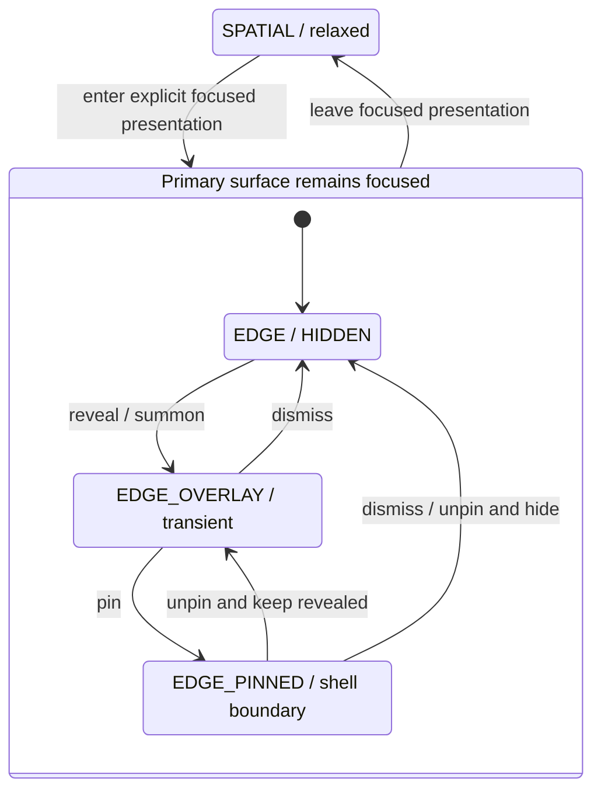

# ADR-095: Adaptive Application Sidebar Posture and Shell-Boundary Authority

- Status: Proposed
- Date: 2026-09-29
- Human decision requested: Resonant Jones acceptance before implementation
- Lane: Architecture-impact; architecture-only prerequisite
- Evidence posture: documented-contract + proven-code-path inspection; no live runtime proof
- Supersedes: None

## Context and inspection provenance

Codexify needs one shell presentation contract before focused primary surfaces
grow independent sidebar implementations. **Focus changes the posture of the
shell, not the identity of its parts.** This is a proposed decision, not an
accepted contract, implementation claim, or release-support change.

Two source revisions were inspected because this task's starting checkout is
behind canonical main:

- Starting checkout: `4760ba82589a9f04fada926bdd4d0d3bf47cd288`. Its ADR files
  reach ADR-089. `UnifiedDesktopCompositor.tsx`, `BrowserPresentation`,
  `focusedSidebarOpen`, `focusedSidebarPinned`, `browserFocused`, and the
  drawer's `presentation="shelf"` path are absent here.
- Fetched `origin/main`: `9810971690d6fdcd80acbee519772316af803303`. Its ADR files
  reach ADR-094, whose status is **Proposed**, not Accepted. ADR-095 is the next
  unissued canonical number at this inspected revision; no ADR-095 identity
  was found in either tree. Main's code contains the browser-focused precursor
  discussed below. The source comparison does not import those files into this
  branch or establish their live behavior.

### Existing implementation interpretation

Paths in this table are repository-relative source anchors. The compositor
anchor exists at the fetched revision only; the other files exist locally,
with browser-specific extensions inspected at the fetched revision.

| Source anchor | Observed code path | Classification and remaining work |
|---|---|---|
| `frontend/src/components/persona/layout/AppShell.tsx` | Owns application view, viewport/profile projection, themed portal root, and shared mobile application disclosure. On fetched main, owns `BrowserPresentation`, `focusedSidebarOpen`, and `focusedSidebarPinned`, composes `UnifiedDesktopCompositor`, and passes browser state into Guardian. Entering browser focus currently sets both open and pinned true. | Compatible shell coordination precursor. General attention/posture resolution and pinned content-boundary allocation remain future work. The existing browser-specific entry default is not a universal focus-entry policy. |
| `frontend/src/components/persona/layout/UnifiedDesktopCompositor.tsx` | Fetched main defines `BrowserPresentation = closed / docked / focused`, resizes docked peer panes, makes the Codexify pane inert while browser-focused, renders a preview placeholder, and offers pointer/button edge reveal when navigation is hidden and unpinned. | Compatible explicit presentation and edge-reveal precursor. Browser presentation is implementation vocabulary, not a generic shell-attention enum or proof of a browser engine. |
| `frontend/src/components/persona/layout/GuardianChatWithSidebar.tsx` | Locally composes `SidebarRoot` in the desktop grid or mobile drawer with Guardian-owned thread/project selection. On fetched main, `browserFocused` selects a collapsed-drawer path and supplied shelf visibility/pin callbacks. | Reuses navigation semantics, but browser-specific branching and child-level desktop grid ownership are potential refactor targets. `browserFocused` must not become generic architectural focus vocabulary. |
| `frontend/src/components/persona/layout/MobileAppSidebarDrawer.tsx` | Locally supplies modal portal, scrim, focus containment/return and Escape disclosure/dismissal. Fetched main adds `modal / shelf`, pin controls and pointer-leave dismissal, portals the shelf to `document.body`, and avoids modal focus trapping/body-scroll lock for shelf presentation. | Compatible presentation wrapper precursor. It has outgrown its mobile-only name at the fetched revision; record naming debt, do not rename. `shelf` is not the architecture term for the edge family. |
| `frontend/src/components/sidebar/SidebarRoot.tsx` | Projects/thread projection, selected state, search, origin/source filtering and navigation callbacks are supplied through the existing navigation/data seams. | Semantic navigation surface; retain one underlying authority across wrappers. Rendering this component in multiple projections does not grant independent navigation ownership. |
| `frontend/src/components/persona/layout/shellBreakpointContract.ts` | Profiles classify phone, small tablet and desktop and project sidebar `collapse / split` and Workspace `stack / split` arrangements. | Responsive constraint authority remains intact; viewport class is distinct from attention and posture. No breakpoint changes are proposed. |
| `frontend/src/features/workspace/state/useWorkspaceLayoutMode.ts` | Defines `chat_focus`, `balanced_split`, and `workspace_focus`, derives pane ratios and retains thread-keyed browser-local preferences. | Separate Workspace layout domain. Its Chat Focus label is not proof of shell-level Focus Chat. |
| `frontend/src/components/persona/layout/AppShell.css` | On fetched main, focused browser uses absolute positioning with shell-edge inset. The shelf is a fixed full-viewport portal; the pin flag controls persistence, and no corresponding pinned width reservation was found in this composition. | Current pinning is not proof of `edge_pinned` geometry. Shell allocation and full-height edge treatment need later implementation/geometry proof. CSS is read-only in this task. |

This evidence establishes a browser-focused precursor only. It does not prove
Focus Chat, Canvas, HTML artifacts, focused editors, or a generalized focused
surface system. Source inspection is not browser interaction or release proof.

## Proposed decision

### Independent attention, posture and visibility

Shell-level focused presentation means a primary surface explicitly requests
exclusive/deep-work emphasis through shared shell composition. AppShell or its
equivalent shared compositor owns and resolves that state, including responsive
constraints. A surface may request focus; it does not determine global sidebar
geometry. A browser's existing focus/restore control is one precursor example.

Conceptual attention vocabulary is `relaxed / focused`. Relaxed means no primary
surface has requested exclusive emphasis. Focused means one has entered an
explicit shell-level focused presentation. DOM focus, input focus, pointer
hover, selected routes and ordinary text editing do not themselves enter this
state. A viewport-driven browser transition is existing precursor policy, not
permission to infer generic focus from every resize.

Canonical desktop sidebar postures are `spatial`, `edge_overlay`, and
`edge_pinned`. Visibility is orthogonal: hidden edge navigation is not a fourth
posture and is not the absence of primary-surface focus. These are semantic
terms only; this ADR decides no TypeScript API, store, persistence key, runtime
registry token or numeric geometry default.

### Three presentations of one navigation system

| Posture | Presentation | Content allocation and dismissal |
|---|---|---|
| `spatial` | Default relaxed desktop: compact, floating/spatial, visually consistent with Codexify's spatial desktop, beside ordinary Guardian Chat. | Occupies space in the spatial composition. Remains the default; this proposal rejects replacing it with a conventional permanent desktop rail. |
| `edge_overlay` | Focused transient navigation: flat, attached to the application/display edge, full-height from shell viewport top to bottom. Summon by explicit control, edge interaction, hover where appropriate, or keyboard interaction. | Overlays focused content; the primary surface retains the full underlying content rectangle. No permanent width allocation. Dismiss after quick selection/navigation without inherently exiting focus. |
| `edge_pinned` | Focused persistent navigation: flat, edge-attached and full-height from shell viewport top to bottom. | AppShell reserves its width before primary layout. It defines the content boundary; browser/chat/Canvas/editor content reflows beside it and never renders beneath it. Remains visible until explicit unpin/dismiss or a governing posture transition. |

Overlay and pinned are different layout contracts, not visual styles on the
same allocation. Shell viewport means the application shell bounds, not
physical monitor pixels outside the application window. Inner toolbar/card
geometry must not shorten the edge sidebar into a floating panel.

### Authority and constitutional boundary

| Actor or state | Authority |
|---|---|
| AppShell / shared shell compositor | Owns shell attention, resolved sidebar posture, available-content rectangle, pinned width reservation, focus/navigation coordination and responsive fallback. |
| Sidebar semantic surface (`SidebarRoot` or successor) | Owns navigation contents and actions, Projects/Threads projection, search/filter controls and selected-state presentation through existing authorized data/navigation seams. Does not own shell geometry or canonical backend records. |
| Guardian Chat, browser, Documents, Canvas/artifacts and future primary surfaces | May request focused presentation and consume the resolved available-content rectangle. Must not reposition the global sidebar, subtract sidebar width independently, add compensating margins or create route-local navigation authority. |
| Existing backend/domain authorities | Retain canonical Project/Thread ownership, identity, retrieval, Persona and provider/runtime semantics. Presentation cannot change them. |
| Resonant Jones | Accepts or rejects this proposed architecture; implementation needs a separate scoped task after acceptance. |

The authoritative presentation state is shell-local, resolved within one
composition. Source code, browser pages, previews, diagrams and navigation
projections are evidence, not authorization. User navigation and focus controls
request presentation through the shell; they cannot grant ownership or retrieval
capabilities. This task makes only Git-backed architecture documentation durable,
under repository review; it creates no durable user preference or application
state.

The relevant node is the trusted client shell on a user's device. The device,
user/account and network boundaries are unchanged. Untrusted browser content is
still evidence, not shell policy, credentials or navigation authority; malicious
page content must not acquire focus/geometry authority through this contract.
Honest-but-buggy child surfaces must not override the shared rectangle. No peer
sync, cross-node consistency, new network protocol, identity binding or storage
migration is introduced. Composition changes must resolve attention, visibility
and geometry coherently; there is no eventual-consistency or distributed merge
requirement for these transient presentation states.

### Required invariants

1. One semantic navigation system: all three postures expose the same Projects,
   Chat Threads, selection, application navigation, search, source/provider
   filtering and navigation authority. Wrappers must not independently own them.
2. Posture is presentation only. Changing it must preserve active Project,
   active Chat Thread, thread ownership, application destination, retrieval
   scope, provider/model, Persona, Workspace contents and canonical identity or
   authority. An explicit navigation action may change its ordinary destination;
   merely changing posture may not.
3. Relaxed desktop defaults to `spatial`; spatial navigation is not deprecated.
4. Explicit primary-surface focus activates the edge family without requiring
   navigation visibility. Future Focus Chat, browser, Canvas, HTML artifact or
   document/editor consumers may reuse this contract; their existence is not
   asserted here.
5. Overlay is transient occupancy; pinned is persistent shell geometry.
6. AppShell reserves pinned width once and supplies the resulting content
   rectangle. Child surfaces must not independently subtract width or compensate.
7. Primary surfaces request focus and consume geometry; they do not dictate
   global sidebar posture or create route-local copies of its authority.
8. Focus and visibility remain orthogonal through reveal, dismissal, pin and
   unpin. None of those operations inherently exits primary-surface focus.
9. Responsive constraints retain authority. Unsupported pinned geometry projects
   the same navigation system through the existing narrow/mobile drawer/overlay
   contract; it is not an independent mobile navigation authority.
10. Presentation remains truth-preserving: hidden or moved navigation never
    implies changed ownership, scope, selection, Project/Thread provenance or
    runtime state.

### State transitions

Last reviewed: 2026-09-29. Confidence: high for proposed semantics only.
Source anchors: the inspected shell code table above and the task decision;
this is a proposed presentation diagram, not a runtime topology diagram.

The hidden entry illustrates a valid focus path, not a mandated visibility
initialization policy. Any chosen entry visibility must obey the same allocation
rules. For example, Focus Chat may remain focused with navigation hidden, reveal
an overlay to choose something and dismiss it, or reveal and pin, then unpin
back to overlay/hidden. Those examples are future semantics, not implemented
Focus Chat behavior. Leaving focus restores the relaxed spatial family.

When the shell profile or available geometry cannot support pinned desktop
navigation, AppShell removes persistent width allocation and uses its existing
responsive drawer/overlay projection. This does not inherently end attention
focus or mutate navigation state. Pin restoration preferences, simultaneous
surface requests and concrete focus-entry policies require a later implementation
contract; no persisted pin preference is added here.

## Relationships and contradiction analysis

No inspected accepted ADR directly governs these adaptive sidebar postures.
This is a new shell-presentation decision extending/refining AppShell and
Guardian presentation doctrine, with no manufactured supersession.

- The [Guardian Chat Portal](../guardian-chat-portal.md) describes desktop
  sidebar/chat split and mobile portal overlay. It is incomplete for the
  proposed generalized doctrine, not evidence of generic focus support. After
  acceptance and implementation, update it to distinguish relaxed spatial,
  focused transient edge, focused pinned shell-boundary and narrow/mobile drawer
  projections. Its current runtime guide is deliberately not rewritten here.
- The [Workspace Surface Spec v1](../codexify_workspace_surface_spec_v_1.md)
  requires the existing stable shell/card/drawer hierarchy and describes
  Workspace presentation states. The inspected hook further distinguishes chat
  focus, balanced split and workspace focus. Workspace layout and sidebar
  posture retain separate semantic domains and state machines; they may inform
  AppShell composition without being merged into one enum. Neither Workspace
  architecture nor its existing local preferences are superseded.
- [ADR-054](./054-browser-host-topology-and-release-ownership.md) continues to
  own Browser Host topology, trusted-shell boundaries and release ownership.
  A compositor preview and sidebar proposal do not implement its browser engine.
- [ADR-064](./064-orthogonal-ui-material-personalization.md) retains orthogonal
  material/personalization doctrine; no CSS or token change is authorized.
- [ADR-005](./005-runtime-mode-and-account-boundary-invariants.md),
  [ADR-004](./004-retrieval-policy-as-control-plane.md), and
  [ADR-081](./081-project-ownership-authority.md) retain account, retrieval and
  Project ownership authority. Presentation cannot supersede them.
- [Current State](../00-current-state.md) remains the release gate; no supported
  path, qualification or release claim changes.

## Consequences, failure modes and deferred work

One shell contract lets future focused surfaces reuse navigation without
route-specific implementations. Persistent edge navigation costs content width;
transient overlays trade occlusion for fast navigation while retaining full
underlying allocation. Responsive fallback prevents unusable pinned layouts.

| What breaks first | Required mitigation in later implementation |
|---|---|
| Pin only changes visibility and content stays underneath | Reserve width once in the compositor; prove actual browser/chat/editor rectangles and no overlap. |
| Each child adds its own offsets | Supply one shared rectangle; remove compensating child calculations in an explicitly scoped refactor. |
| Reprojection resets selection or scope | Keep semantic state independent of presentation wrappers; prove unchanged Project/Thread/filter/Persona/provider and Workspace state. |
| Narrow geometry retains stale pinned allocation | Resolve responsive fallback centrally; prove resize transitions without duplicate reservation or navigation authority. |
| Reveal/dismiss traps keyboard focus or exits deep work | Provide explicit and keyboard reveal/dismiss, appropriate focus return, and separate attention state from DOM focus; retain existing modal mobile behavior. |

Deferred implementation includes generalized shell attention/posture resolution,
pinned width allocation, child rectangle consumption, transition arbitration,
accessibility/geometry/selection proofs and portal-guide follow-through. The
mobile-only component name could later become `AdaptiveAppSidebar`,
`AppSidebarSurface` or `SidebarPresentationShell`; this task selects none of
those API names and does not rename the component. Existing `shelf` and
browser-specific booleans remain naming debt, not architectural vocabulary.

Non-goals: implement Focus Chat, Canvas or HTML Artifacts; change CSS, dimensions,
DOM placement, compositor behavior, SidebarRoot, breakpoint values, mobile
behavior or Workspace modes; add persistence or frontend stores; mutate
Project/Thread, provider/model, retrieval, identity or runtime state; claim
shipped/release-supported behavior; accept this ADR on the human's behalf.

## Validation and acceptance boundary

Documentation checks must validate number uniqueness at the inspected canonical
revision, source availability at each declared revision, relative links,
architecture policy checks and the final four-file diff. No runtime/UI source
may change. Documentation or architecture checks establish static proof only;
no live runtime qualification is implied. The proposed state diagram leaves
runtime topology diagrams unchanged under [Diagram Governance](../diagram-governance.md).

Static validation performed for this proposal:

- `make docs PYTHON=python3`, `python3 scripts/check_diagram_freshness.py --strict`,
  `bash scripts/verification/deny_invalid_git_paths.sh`, and `git diff --check`
  passed. New relative links, declared frontend anchors at their stated
  revisions, unique ADR-095 identity, Proposed labels and the exact four-file
  architecture allowlist were verified.
- Host `python3 -m pytest -q --disable-warnings tests/architecture` could not
  execute tests because the inherited fixture requires unavailable FastAPI.
  Retrying with `/Volumes/Dev_SSD/Codexify-main/.venv/bin/python -m pytest -q
  --disable-warnings tests/architecture` executed the suite: 428 passed,
  3 failed. The existing current-state test expects an absent blocker phrase;
  the other two failures exercise DLG validation.
- `python3 scripts/knowledge_graph/validate_and_generate_dlg.py validate`
  failed: the current-state source hash was already stale at starting HEAD;
  editing the ADR index and README makes their previously matching node hashes
  stale as well. Six existing README link findings predate this task. DLG node
  hash/freshness refresh and existing link/current-state reconciliation are
  explicitly deferred because their files are outside the authorized write
  scope. This proposal does not claim a green architecture suite or DLG gate.
- No live runtime tests or UI implementation were performed. The Guardian
  Portal update remains deferred until acceptance and implementation.

Human decision requested: Accept or reject Adaptive Application Sidebar Posture as the canonical AppShell presentation model, including spatial, transient edge_overlay, and shell-boundary edge_pinned semantics.
