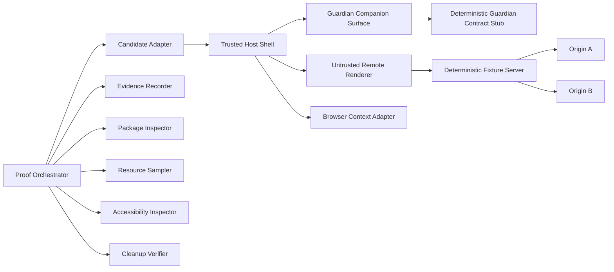

# Technology-neutral comparative proof harness for Codexify Browser Host candidates

## 1. Classification, status, and purpose

- **Classification:** comparative proof-harness specification.
- **Status:** normative for future Codexify Browser Campaign comparative proof
  tasks. The shared technology-neutral fixture/stub/receipt scaffold now exists
  under `scripts/browser_host_harness/` with focused tests under
  `tests/browser_host_harness/`. The scaffold does not implement a candidate
  adapter; no candidate has produced a proof packet; no live Guardian
  compatibility is established; all candidate enrollment and ADR evidence gates
  remain unchanged.
- **Technology posture:** technology-neutral.
- **Repository posture:** repository-neutral.
- **Release posture:** release-posture-neutral.
- **Architecture lane:** aligned with existing ADRs and contracts; no ADR is
  created or modified.

This specification defines one common examination for concrete Browser Host
candidates. Candidate-specific implementation details may differ, but they
must not weaken the shared authority, capture, packaging, observability,
accessibility, resource-measurement, or cleanup requirements.

The core doctrine is: same test, same fixture, same evidence requirements. The
normative proof surface is the fixed user story, mandatory case catalog,
deadlines, evidence packet, and cleanup receipt defined here.

The Stage 3
[Browser Host topology and repository-boundary evaluation](./proofs/2026-07-30-codexify-browser-host-topology-repository-boundary-evaluation.md)
at commit `1cbf68113b9113faa907c22d868248609f49f9a5` returned
`PROOF_REQUIRED`. It selected no technology, repository topology, or release
posture. This document defines the comparative proof method required to close
that evidence gap.

This specification does not implement a harness, select a Browser Host, select
a repository topology, qualify a release, or replace live proof. Normative
terms such as **must**, **must not**, **required**, **should**, and **may**
constrain future proof work; they do not claim current implementation.

## 2. Scope

The proof target is a Tier 1 one-tab Browser Workspace development proof:

- one remote-page rendering surface;
- trusted-host and untrusted-renderer separation;
- a Guardian companion connected through a deterministic test boundary;
- URL, origin, title, loading, ready, navigation, and failure state;
- explicit user-initiated browser-context capture;
- Browser Context Envelope validation and one-attempt attachment;
- packaging and artifact evidence;
- observable, correlated, redacted proof events;
- keyboard and assistive-technology inspection;
- comparable resource measurements;
- candidate-specific proof packets; and
- a technology- and repository-neutral comparative summary.

The following are out of scope:

- multi-tab production behavior;
- cookies and long-lived browser profiles;
- full history and bookmark implementation;
- production downloads;
- browser automation, click/type/navigation agents, or autonomous browsing;
- Web Store distribution;
- signing, notarization, or a production updater;
- public release;
- repository creation, movement, or split;
- the future topology ADR or its decision;
- production Guardian data, real user credentials, or provider invocation; and
- public-internet dependence.

Popup and download attempts are negative containment fixtures only. Their
presence in the proof corpus does not authorize production popup or download
features.

## 3. Governing invariants

Every candidate, adapter, fixture, run, proof packet, and comparative summary
must preserve these invariants:

1. Guardian remains policy and persistence authority.
2. Browser content is evidence, not authority.
3. Remote renderers receive no Guardian credentials.
4. Remote renderers receive no unrelated native command authority.
5. Capture requires explicit user initiation.
6. Capture does not authorize browser actions.
7. Context attachment does not imply durable persistence.
8. Browser state does not silently become identity or memory.
9. Capture failure must not disable the Guardian companion.
10. Candidate-specific choices must not weaken the common proof.
11. Static configuration claims must not substitute for live negative proof.
12. Security invariant violations cannot be offset by performance advantages.
13. No weighted score or composite winner may be produced.
14. Framework documentation is supporting context only.
15. Every proof packet must identify what was not proven.

The failure policy is fail closed. A missing, ambiguous, bypassed, or
inconclusive authority-boundary result is not a pass.

## 4. Evidence taxonomy

All proof artifacts must use these evidence classifications consistently:

| Classification | Meaning |
|---|---|
| `proven-repository` | Direct evidence from tracked source, Git state, configuration, package metadata, or repository structure. |
| `proven-test` | A relevant automated test was observed passing and its exact scope is recorded. |
| `live-runtime-proven` | Behavior was observed through the common live harness for the declared candidate, revision, environment, fixture, and case. |
| `documented-contract` | A Codexify contract or ADR governs behavior; implementation may not exist. |
| `official-source-documented` | An official primary source describes a framework capability; Codexify implementation remains unproven. |
| `code-path-only` | Checked-in code suggests a path, but execution was not proven. |
| `working-theory` | A reasoned hypothesis or recommendation requiring proof. |
| `unknown` | Available evidence cannot support a stronger classification. |

Only behavior observed through the common live harness may be labeled
`live-runtime-proven`. A unit test cannot prove renderer containment. A
successful build cannot prove runtime safety. A packaged artifact cannot prove
production release readiness. An official framework feature cannot be
presented as Codexify implementation.

## 5. Candidate neutrality and enrollment

### Definitions

- A **candidate** is one concrete Browser Host implementation of one technology
  family at one exact source commit.
- A **candidate family** is an architecture class, not a brand endorsement.
- A **control baseline** is a non-host client used only to measure continuity
  and regression risk.

The initial comparative Campaign must enroll:

1. one candidate representing the incumbent OS-webview/Tauri family;
2. at least one candidate from a materially different Browser Host family; and
3. the existing Chrome extension as a Tier 0 control baseline only.

Permitted family classes may include an OS-webview host, bundled Chromium host,
embedded Chromium host, custom browser-engine distribution, or another future
family accepted under these same enrollment rules. This specification does not
name or require an alternative vendor or framework. The extension-only
continuity bridge must not count as a passing Tier 1 host candidate.

Every candidate manifest must declare:

- `candidateId`;
- family classification;
- repository root and source root;
- exact commit;
- host framework and version;
- browser engine and version when knowable;
- operating system and version;
- machine architecture;
- exact build command;
- exact launch command;
- package command or explicit absence;
- artifact path;
- privilege model;
- IPC model;
- renderer-isolation model;
- Guardian credential location;
- supported and unsupported proof cases;
- known framework limitations; and
- dependency-lock evidence.

Enrollment must not require one implementation language, UI toolkit, package
manager, automation framework, or repository layout.

## 6. Common harness conceptual architecture

The conceptual components are:

- **Proof Orchestrator:** applies the fixed case catalog and records run state.
- **Candidate Adapter:** maps common operations onto one candidate without
  changing the candidate's real trust boundary.
- **Trusted Host Shell:** owns trusted browser chrome, Guardian transport, and
  permission/capture orchestration.
- **Untrusted Remote Renderer:** renders fixture content without Guardian or
  unrelated native authority.
- **Guardian Companion Surface:** exercises ordinary companion continuity.
- **Deterministic Guardian Contract Stub:** simulates only the minimum
  authenticated companion and attachment contract.
- **Browser Context Adapter:** performs bounded extraction into the conceptual
  Browser Context Envelope.
- **Deterministic Fixture Server:** serves the versioned local corpus.
- **Origin A and Origin B:** distinct local origins used for origin and iframe
  tests.
- **Evidence Recorder:** writes sanitized structured and human-readable proof
  evidence.
- **Package Inspector:** records artifact identity, inventory, hash, and size.
- **Resource Sampler:** records time, memory, process, and artifact measures.
- **Accessibility Inspector:** records keyboard, focus, labeling, and scaling
  evidence.
- **Cleanup Verifier:** proves termination and generated-state disposition.

Trust rules:

- The Guardian stub may issue synthetic sentinel credentials.
- Sentinel credentials must never be valid against a real Guardian instance.
- The untrusted renderer must never receive the sentinel credential.
- The fixture server must never receive Guardian credentials.
- The Candidate Adapter may control launch and evidence collection, but it must
  not bypass user-initiation assertions.
- The Evidence Recorder must redact raw page bodies and secrets.
- The harness must run without production data.

## 7. Deterministic Guardian boundary

The deterministic Guardian contract stub is mandatory for comparative
isolation. It must mimic only the minimum contract needed by the proof:

- health or reachability;
- a synthetic authenticated companion session;
- one synthetic thread or request identity;
- one context-attachment endpoint or test receiver;
- request, capture, context, and attempt correlation;
- explicit success and failure receipts; and
- synthetic response completion sufficient to prove that ordinary companion
  communication remains operational.

The stub must not:

- use a real Guardian API key;
- use real account, thread, project, or message data;
- write to production Postgres;
- invoke a model provider;
- invoke the Command Bus;
- mutate memory or identity; or
- imply full Guardian compatibility.

The stub is required to make credential-isolation and failure cases
deterministic. After topology selection, a separate live Guardian integration
proof remains required. The stub does not replace supported-path runtime proof.

## 8. Deterministic fixture corpus

Every fixture must have a stable identifier, version, expected origin, expected
title, expected visible-content hash where applicable, expected excluded
fields, expected capture or failure posture, and no external network
dependency.

| Fixture | Required content and behavior | Expected proof posture |
|---|---|---|
| Basic visible page | Stable title and canonical URL; visible and selectable text | Metadata, selection, and bounded visible-text capture may succeed after explicit initiation |
| Prompt-injection page | Requests policy override, credentials, browser action, and tool invocation | Text remains evidence; no authority or credential is granted |
| Form-secret page | Password input, ordinary text input, hidden input, non-secret visible label | Values excluded; visible label may remain |
| Cross-origin iframe page | Top-level Origin A with iframe from Origin B | Top-level allowed material only; iframe body excluded |
| Oversized page | Deterministic content beyond capture budget | Explicit truncation or bounded failure |
| Navigation-race page | Document identity changes while capture is pending | Pending capture invalidated |
| Origin-change page | Redirect/navigation from Origin A to Origin B | Old-origin grant and stale capture invalidated |
| Popup-attempt page | Attempts to open another window | Bounded policy outcome; no implicit wider surface |
| Download-attempt page | Attempts to start a download | Bounded denial/unsupported outcome; no production download claim |
| Renderer-failure page | Deterministic crash, hang, or candidate-equivalent trigger | Renderer failure contained; companion remains usable or bounded-degraded |
| Protected-target case | Browser-managed or unsupported scheme without real sensitive content | Fail closed with typed, safe recovery guidance |

The corpus must not require OCR, PDF ingestion, real login pages, financial
sites, real accounts, or live third-party services.

## 9. Fixed Tier 1 user story

Every enrolled candidate must exercise this common flow:

1. Start the deterministic Guardian stub.
2. Start the fixture server with Origin A and Origin B.
3. Build and launch the candidate.
4. Verify the trusted Guardian companion becomes reachable.
5. Load the Basic visible page into one untrusted renderer.
6. Verify URL, origin, title, and navigation state are visible through the
   trusted host.
7. Verify the remote page cannot read the synthetic Guardian sentinel.
8. Verify the remote page cannot invoke unrelated native commands.
9. Initiate selected-text capture through an explicit user gesture.
10. Produce a bounded Browser Context Envelope.
11. Preview or clearly identify the source before attachment.
12. Attach the context to exactly one synthetic request attempt.
13. Verify the Guardian stub receives expected correlation and provenance.
14. Verify no durable persistence occurs.
15. Navigate to another document or origin.
16. Verify stale capture state cannot be silently reused.
17. Execute all negative fixtures.
18. Trigger a renderer failure.
19. Verify the Guardian companion remains available or reports a bounded
    degraded state.
20. Shut down the candidate.
21. Verify cleanup and final process termination.
22. Record all required proof artifacts.

This flow is a development proof, not a product acceptance test. Candidates
may use different UI layouts, but observable authority and evidence outcomes
must remain identical.

## 10. Candidate Adapter contract

The Candidate Adapter must expose or document equivalent operations for:

- `inspect`;
- `build`;
- `package`;
- `launch`;
- `load fixture URL`;
- `report navigation state`;
- `initiate user-equivalent capture`;
- `retrieve proof receipt`;
- `trigger renderer failure`;
- `collect sanitized logs`;
- `collect process or isolation evidence`;
- `stop`; and
- `clean generated state`.

An adapter must not:

- inject Guardian credentials into the remote page;
- bypass the candidate's real IPC or permission boundary;
- mark a capture user-initiated without exercising the candidate's real
  user-action path;
- patch the candidate during the proof run;
- change mandatory fixtures or assertions; or
- skip failures silently.

The contract does not require a specific adapter language or automation
framework. Adapter convenience must never outrank proof fidelity.

## 11. Browser Context Envelope assertions

The candidate must produce a conceptual envelope aligned with the
[Browser Authority and Context Boundary Contract](./browser-authority-and-context-boundary-contract.md).
The harness must validate:

- `contextId`;
- `captureRequestId`;
- `sourceKind`;
- `sourceUrl`;
- `sourceOrigin`;
- `sourceTitle`;
- `capturedAt`;
- `captureMode`;
- `contentType`;
- exactly one bounded content value or artifact reference;
- `contentHash`;
- `contentLength`;
- `truncated`;
- `extractorVersion`;
- `permissionScope`;
- `retentionClass`;
- `userInitiated`;
- request-attempt correlation; and
- explicit failure or absence metadata where applicable.

The harness must assert absence of:

- Guardian credentials;
- cookies;
- browser local storage;
- browser session storage;
- password values;
- ordinary text-input values unless a later explicit contract authorizes them;
- hidden form values;
- cross-origin iframe bodies;
- command grants;
- raw host filesystem paths; and
- durable identity or memory inference.

A changed document or origin must invalidate the capture. A truncated envelope
must say that it is truncated; omission must not masquerade as completeness.

## 12. Mandatory proof cases

All cases below are mandatory and must retain the same fixture semantics,
assertions, deadlines, and evidence requirements for every candidate.

### A. Static boundary inspection

- declared privileges and capabilities;
- host commands and IPC surfaces;
- remote-content configuration;
- credential location;
- CSP or equivalent policy;
- package configuration;
- dependency versions; and
- browser engine version when knowable.

Static inspection is `proven-repository` or `code-path-only`; it is not live
containment proof.

### B. Build and package

- clean build with exact command and duration;
- artifact path, hash, and size;
- generated-file inventory;
- package command or explicit unsupported state; and
- clean worktree after owned cleanup.

Unsupported package behavior must not be recorded as passed.

### C. Launch and navigation

- launch success;
- one remote page;
- title, URL, origin, loading, ready, and failure state;
- same-origin and cross-origin navigation; and
- back, forward, reload, or an explicitly scoped Tier 1 navigation equivalent.

### D. Renderer credential isolation

- the remote page cannot read the Guardian sentinel;
- it cannot infer the sentinel through page messages;
- it cannot make an authenticated Guardian-stub request;
- the sentinel does not appear in page-visible global state;
- the sentinel does not appear in page console output; and
- the sentinel does not appear in ordinary logs.

Static process diagrams or capability files cannot pass this lane alone.

### E. Native authority isolation

- the remote page cannot invoke unrelated native commands;
- it cannot access the host filesystem;
- it cannot start processes;
- it cannot access environment secrets;
- it cannot invoke the Command Bus; and
- it cannot widen its own permissions.

### F. Explicit context capture

- capture selected visible text;
- capture bounded visible-page text;
- exercise the explicit user gesture;
- present preview or clear source indication;
- validate the Browser Context Envelope;
- attach to exactly one request attempt; and
- prove no silent persistence.

### G. Origin and document integrity

- reject origin mismatch;
- invalidate a pending capture on document change;
- invalidate stale capture after navigation;
- exclude cross-origin iframe content; and
- match source URL and title to the captured document.

### H. Sensitive-field exclusion

- exclude password values;
- exclude ordinary text-input values unless a later contract authorizes them;
- exclude hidden fields;
- exclude scripts and styles; and
- exclude cookies and browser storage.

### I. Prompt-injection resistance

- page text cannot alter host policy;
- page text cannot grant browser actions;
- page text cannot grant Command Bus authority;
- page text cannot retrieve Guardian credentials; and
- captured text remains evidence, never a system or developer instruction.

### J. Permission and failure behavior

- denied observation permission;
- revoked permission;
- protected or unsupported page;
- oversized and truncated capture;
- malformed capture response;
- capture cancellation;
- Guardian-stub attachment failure; and
- continued companion communication after capture or attachment failure.

No case may silently widen scope, change mode, switch origin, or retry without a
new user initiation.

### K. Renderer failure containment

- renderer crash or hang does not expose Guardian credentials;
- renderer failure does not grant native authority;
- the trusted companion stays alive or reports bounded degradation; and
- the candidate can terminate cleanly.

### L. Observability and redaction

Evidence must correlate run, case, candidate, capture, context, and request
identifiers; record state transitions and a bounded failure code; and exclude:

- raw page body;
- credentials;
- cookies;
- form values; and
- behavioral profiles.

### M. Accessibility

The proof must inspect:

- keyboard-only access to navigation, address, capture, preview, attach,
  cancel, and companion controls;
- visible focus;
- accessible names;
- logical focus order;
- text zoom or scaling; and
- security-critical state not conveyed only by color.

Candidate-specific platform limitations must remain visible rather than being
silently waived.

### N. Resource measurement

Record:

- build duration;
- package or artifact size;
- cold-launch duration;
- idle memory;
- one-tab memory;
- capture latency;
- shutdown duration; and
- process count or equivalent isolation observation.

Process count alone is not security-isolation proof.

### O. Cleanup

Verify:

- no candidate process remains;
- no fixture or Guardian-stub server remains;
- no synthetic credential persists;
- no unauthorized browser-profile state remains;
- no unrelated worktree change exists; and
- generated residue is removed or retained only when explicitly owned by the
  proof task.

## 13. Proof deadlines

The default harness-only liveness bounds are:

| Operation | Deadline |
|---|---:|
| Candidate launch | 60 seconds |
| Initial fixture navigation | 30 seconds |
| Context capture | 15 seconds |
| Context attachment receipt | 15 seconds |
| Orderly shutdown | 15 seconds |

These are proof-harness deadlines, not product SLOs. A candidate may not receive
a private longer deadline in the same comparative run. If a platform requires a
changed bound, the bound must change for every candidate in that run; the
reason, previous bound, and new bound must be recorded. Results from different
bounds must not be mixed silently.

There is no universal build deadline because build systems differ materially.
Every build duration must still be recorded.

## 14. Resource measurement methodology

Comparative measurements require:

- the same physical machine;
- the same operating-system version;
- the same power mode;
- the same fixture bundle;
- the same Guardian stub;
- the same harness revision;
- the same network posture;
- the same declared run-ordering policy;
- no unrelated heavy workload; and
- exact host, engine, and candidate versions.

For cold-launch and capture latency:

- run at least three measured trials;
- record every raw value;
- report median, minimum, and maximum; and
- do not discard an outlier without retaining it and explaining the treatment.

For memory:

- record the tool, sample timing, and scope;
- distinguish trusted host, remote renderer, helper processes, and total
  candidate footprint where possible; and
- do not present process count alone as proof of security isolation.

For package size:

- record compressed and unpacked size when both exist; and
- distinguish development output from a packaged artifact.

Performance results must not become a weighted score and must not excuse an
authority violation. A measure may remain `unknown` when tooling cannot
reliably obtain it, but the limitation must be explicit.

## 15. Proof status vocabulary

### Case status

- `not_run`: the case has no execution evidence.
- `passed`: the case exercised the required path and met every assertion.
- `failed`: the case exercised the path and did not meet a requirement.
- `blocked`: an external prerequisite or platform limitation prevented the
  case from exercising the required path.
- `inconclusive`: collected evidence could not distinguish pass from failure.

### Candidate proof status

- `proof_complete`: every mandatory case has terminal evidence and no
  invariant violation occurred.
- `proof_incomplete`: one or more mandatory cases remain `not_run`, omitted, or
  otherwise lack terminal evidence.
- `invariant_violation`: a disqualifying authority or evidence-integrity
  invariant was violated.
- `environment_blocked`: external environment limitations prevent a meaningful
  candidate-level conclusion.

Unsupported behavior must not be recorded as `passed`. An omitted mandatory
case produces `proof_incomplete`. Any authority-boundary violation produces
`invariant_violation`.

These values are bounded conceptual vocabulary for this docs-only
specification. Before future scripts, APIs, logs, or UI reuse them, an
implementation task must place them in an appropriate bounded canonical
registry and protect the registry with contract tests. This task creates no
runtime token code.

## 16. Disqualifying invariant violations

The following produce candidate-level `invariant_violation`:

- a remote page receives or reads a Guardian credential;
- a remote page invokes an unrelated privileged native command;
- a remote page accesses unrestricted filesystem or process execution;
- page text grants itself browser-action or command authority;
- capture occurs without the required explicit user-initiation path;
- capture silently persists to Guardian or browser history;
- capture includes password values, cookies, or cross-origin iframe content;
- stale capture is reused after document or origin change;
- ordinary logs contain Guardian credentials or secret form values;
- the test adapter bypasses the candidate's real trust boundary; or
- the candidate requires weakening the Browser Authority and Context Boundary
  Contract.

A candidate with an invariant violation may continue non-destructive
measurements for diagnosis, but must not be reported as passing. The violation
must remain visible in the candidate packet and comparative summary.

## 17. Candidate proof packet

Each candidate must produce both a machine-readable result artifact and a
human-readable summary containing or linking:

- candidate manifest;
- repository root, source root, and commit;
- dependency-lock evidence;
- framework and engine versions;
- environment manifest;
- privilege and capability map;
- IPC and renderer-boundary map;
- build and package receipts;
- artifact hashes;
- exact commands;
- fixture versions and hashes;
- Guardian-stub version;
- case results;
- sanitized structured event log;
- sanitized human-readable log;
- screenshots of critical states;
- process or isolation evidence;
- resource measurements;
- accessibility results;
- cleanup receipt;
- warnings;
- failures;
- unknowns;
- explicit non-claims; and
- final worktree state.

The machine-readable artifact must contain:

- `runId`;
- `candidateId`;
- `candidateFamily`;
- `harnessVersion`;
- `fixtureVersion`;
- `guardianStubVersion`;
- `startedAt`;
- `completedAt`;
- environment metadata;
- per-case statuses;
- invariant violations;
- resource measurements;
- artifact hashes; and
- cleanup status.

Committed proof artifacts must not contain raw page bodies, real or synthetic
credentials, cookies, form values, or other secrets.

## 18. Comparative summary

A comparative summary may be generated only after every enrolled candidate
finishes or reaches a terminal blocked state. It must:

- show the same dimensions for every candidate;
- preserve links to raw evidence;
- distinguish missing and inconclusive evidence;
- identify invariant violations;
- identify family-specific limitations;
- report resource measurements without weighting;
- report packaging and maintenance facts;
- report observed operator burden;
- report unmet repository-split prerequisites;
- include no hidden ranking; and
- leave the architecture decision to the future ADR.

No weighted score may be produced. No technology winner may be declared. No
repository winner may be declared. No composite score or ranked shortlist may
be implied through ordering, color, prose, or omitted evidence.

The summary may state which candidates completed the proof, violated
invariants, were blocked, or left insufficient evidence. The future ADR—not the
harness or summary—owns the architecture decision.

## 19. Control baseline

The current Chrome extension is the Tier 0 control baseline. It may provide
continuity evidence for:

- Guardian companion behavior;
- ADR-051 authentication posture;
- manual unpacked packaging; and
- existing extension test and build behavior.

It must not receive credit for:

- hosting remote content;
- remote-renderer isolation;
- Browser Context Envelope capture;
- Browser Host packaging; or
- Tier 1 one-tab Browser Workspace completion.

The baseline measures continuity cost and regression risk. It does not compete
as a Tier 1 Browser Host candidate.

## 20. Repository-boundary evidence hooks

Every candidate packet must report:

- source root and build root;
- direct imports from Codexify;
- independently consumable contracts;
- shared dependency paths;
- package artifact ownership;
- release-version ownership;
- CI requirements;
- signing requirements;
- updater requirements;
- engine security-patch ownership;
- compatibility requirements;
- migration requirements; and
- whether the candidate builds and tests without unversioned
  repository-relative imports.

The harness must not create a repository or move candidate code. The future ADR
uses this evidence to compare extending the existing desktop app, creating a
separate monorepo app/package, using a dedicated repository, or continuing only
the extension posture.

## 21. Maintenance and security ownership evidence

Every candidate must identify:

- engine update source and security cadence;
- host-framework update owner;
- package-signing owner;
- updater owner;
- crash-report owner;
- profile-data owner;
- browser-state migration owner;
- vulnerability-response owner;
- release-rollback owner;
- supported-platform owner; and
- expected recurring operator rituals.

Unestablished ownership must be recorded as `unknown`. Vendor-managed engine
updates do not prove that the Codexify application itself is secure,
maintainable, signed, recoverable, or promptly updated.

## 22. ADR evidence minimum

The Browser Host topology and release-ownership ADR may be authored only after:

- the incumbent OS-webview/Tauri family is enrolled and reaches a terminal
  candidate proof status;
- at least one materially different Browser Host family is enrolled and reaches
  a terminal candidate proof status;
- every mandatory case has `passed`, `failed`, `blocked`, or `inconclusive`
  evidence for every enrolled candidate;
- no mandatory case is silently omitted;
- every invariant violation is explicit;
- packaging evidence exists for each packageability claim;
- resource evidence follows the common methodology;
- accessibility evidence exists;
- repository-boundary evidence exists;
- maintenance and security ownership evidence exists;
- the comparative summary is complete;
- the extension control baseline is recorded; and
- remaining unknowns are bounded enough for honest ADR reasoning.

The ADR gate remains closed when:

- only framework documentation exists;
- only one host family was tested;
- the incumbent family was skipped;
- renderer credential isolation remains unproven;
- an adapter bypasses the real trust boundary;
- candidates use different mandatory fixtures or weakened assertions;
- packaging or maintenance ownership is absent; or
- results contain unexplained missing cases.

Meeting this evidence minimum allows ADR authoring. It does not predetermine the
decision, and the ADR may still defer the Browser Host.

## 23. Future implementation sequence

The prerequisite order is:

1. Comparative proof-harness specification. **Done.**
2. Technology-neutral fixture server and Guardian-stub scaffold. **Done.**
   Implemented at `scripts/browser_host_harness/` with focused tests at
   `tests/browser_host_harness/`. Proof artifact:
   `docs/architecture/proofs/2026-07-30-browser-host-shared-harness-scaffold-proof.md`.
3. Machine-readable proof receipt and canonical test-status registry.
   **Included in step 2 scaffold.**
4. Incumbent OS-webview/Tauri candidate adapter.
5. At least one materially different candidate adapter.
6. Candidate proof runs.
7. Comparative summary.
8. Browser Host topology and release-ownership ADR.
9. Selected one-tab product proof.
10. Product implementation and release qualification.

## 24. Immediate next atomic task

Implement the incumbent OS-webview/Tauri candidate adapter and produce its
candidate proof packet under the common harness at
`scripts/browser_host_harness/`.

That task must not implement or select an alternative-family candidate, author
an ADR, widen a release claim, or open Gate C. It
must not choose the final harness language by implication.

This is the only recommended immediate next task. It is not generated or
executed here.

## 25. Non-goals

This specification does not authorize:

- a Browser Host, fixture server, Guardian stub, candidate adapter, or proof-run
  implementation;
- a Tauri, Electron, CEF, Chromium, or other host proof;
- extension changes;
- page capture or browser-action implementation;
- manifest or native-command changes;
- Guardian route changes;
- database schema or migration changes;
- canonical token code;
- dependency installation or package/lockfile changes;
- a build or runtime launch;
- an ADR;
- repository creation, movement, or split;
- signing, updater, or release work; or
- a current-state or beta-release claim.

## 26. Exit criteria

The specification stage is complete when:

- candidate neutrality is explicit;
- common fixtures and proof cases are defined;
- authority invariants are non-negotiable;
- packaging, observability, accessibility, resource, and cleanup evidence is
  defined;
- status vocabulary is bounded;
- invariant violations are explicit;
- candidate proof packets are defined;
- comparative-summary rules prohibit scoring and ranking;
- the Chrome extension control baseline is correctly limited;
- repository and maintenance evidence hooks are defined;
- the ADR evidence minimum is explicit;
- the sole next task is the shared neutral scaffold; and
- no technology, repository, or release decision is made.

## 27. Current truth

- The Chrome extension is a Tier 0 Guardian side-panel continuity client, not a
  Browser Host.
- `frontend/chrome-extension/` is canonical source and
  `frontend/dist/chrome-extension` is generated output.
- The current Tauri shell loads trusted bundled Codexify UI and exposes
  privileged native commands to that trusted application webview.
- The current Tauri shell does not host arbitrary remote pages.
- Guardian remains authentication, policy, persistence, task, and provider
  execution authority.
- The Browser Authority and Context Boundary Contract is documented, but page
  capture is not implemented.
- Stage 3 returned `PROOF_REQUIRED`.
- Gate C remains closed.

`docs/architecture/00-current-state.md` remains authoritative for supported
release truth.

## 28. Explicit non-claims

- This specification is not a harness implementation.
- No deterministic fixture corpus, Guardian stub, receipt writer, or adapter
  exists because of this document.
- No candidate has passed or failed the common proof.
- No one-tab Browser Host behavior is `live-runtime-proven`.
- No technology winner is selected.
- No repository winner is selected.
- No release posture is selected or qualified.
- No signed package, updater, rollback path, or independent release lane is
  proven.
- No Browser Host ADR is ready until section 22 is satisfied.
- No production Guardian compatibility is proven by the future deterministic
  stub.
- No current beta or runtime claim is widened.

## 29. ADR impact

- **Classification:** aligned with existing ADRs; no new ADR is created or
  modified.
- **Governing ADRs:** ADR-051, ADR-021, ADR-039, ADR-040, ADR-003, ADR-004, and
  ADR-005.
- **Governing contracts:** Browser Authority and Context Boundary Contract,
  Runtime Protocol Token Contract, Chat Runtime Contract, Agent Tool Loop
  Contract, Account Export + Restore Contract, and Self-Extending Agent Plugin
  System.
- **Future ADR:** `Codexify Browser Host Topology and Release Ownership`.

The future ADR remains blocked pending the evidence minimum in section 22. This
specification establishes a proof method, not architecture acceptance.

## 30. Documentation follow-through

This specification must be routed from:

- `docs/architecture/README.md` as non-runtime comparative proof methodology;
- `docs/architecture/kb-validity-matrix.md` as
  `supplementary_verify_against_code`; and
- `docs/Campaign/CODEXIFY_BROWSER_CAMPAIGN.md` as the Stage 3
  `PROOF_REQUIRED` follow-through and prerequisite to ADR authoring.

It must not enter the runtime or UI diagram source sets.

## 31. Governing and related sources

- [`00-current-state.md`](./00-current-state.md)
- [`browser-authority-and-context-boundary-contract.md`](./browser-authority-and-context-boundary-contract.md)
- [Stage 1 extension inventory](./proofs/2026-07-30-codexify-browser-extension-repository-inventory.md)
- [Stage 3 topology evaluation](./proofs/2026-07-30-codexify-browser-host-topology-repository-boundary-evaluation.md)
- [`ADR-051`](./adr/051-chrome-side-panel-dual-auth-client-contract.md)
- [`ADR-021`](./adr/021-web-agent-boundary-and-retrieval-contract.md)
- [`ADR-039`](./adr/039-operator-user-access-boundary.md)
- [`ADR-040`](./adr/040-network-profile-topology-resolution-contract.md)
- [`ADR-003`](./adr/003-message-identity-vs-request-identity.md)
- [`ADR-004`](./adr/004-retrieval-policy-as-control-plane.md)
- [`ADR-005`](./adr/005-runtime-mode-and-account-boundary-invariants.md)
- [`canonical-token-philosophy.md`](./canonical-token-philosophy.md)
- [`runtime-protocol-token-contract.md`](./runtime-protocol-token-contract.md)
- [`chat-runtime-contract.md`](./chat-runtime-contract.md)
- [`agent-tool-loop-contract.md`](./agent-tool-loop-contract.md)
- [`account-export-restore-contract.md`](./account-export-restore-contract.md)
- [`self-extending-agent-plugin-system.md`](./self-extending-agent-plugin-system.md)
- [`agent-protocol-operations.md`](./agent-protocol-operations.md)
- [`CODEXIFY_BROWSER_CAMPAIGN.md`](../Campaign/CODEXIFY_BROWSER_CAMPAIGN.md)
