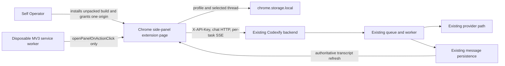

# Chrome Side-Panel Client

## Purpose

The Chrome side-panel client is a private, unpacked Manifest V3 operator client that projects only Codexify's existing chat loop into Chrome's native side panel. It is intentionally not a narrow rendering of the normal web application and does not mount `AppShell`.

The smallest viable network is one operator-controlled Chrome profile, one configured Codexify backend origin, and that backend's existing queue/worker/provider/persistence path. The client adds no coordinator, backend route, database state, provider route, or release-support surface.

## Implementation status

The implementation lives in `frontend/chrome-extension` and builds independently to `frontend/dist/chrome-extension`. It includes the connection form, one extension-local profile, thread/message/completion adapters, per-task event observation, a side-panel chat shell, unit tests, and an installation runbook.

This status is code-path and automated-build evidence until a live unpacked Chrome session completes the manual proof below. It is not evidence that the extension is a supported Codexify client.

## Governing architecture

This client is aligned with the following accepted ADRs:

- [ADR-001: Queue-Based Completion Acceptance Model](./adr/001-Queue-Based-Completion-Acceptance-Model.md): completion acceptance is enqueue evidence, never completion evidence.
- [ADR-002: Dual State Machine Model](./adr/002-Dual-State-Machine-Model.md): provider/runtime readiness and request execution remain separate state planes.
- [ADR-003: Message Identity vs Request Identity](./adr/003-Message-Identity-vs-Request-Identity.md): persisted message identity is distinct from per-attempt request and turn identity.
- [ADR-005: Runtime Mode and Account Boundary Invariants](./adr/005-Runtime-Mode-and-Account-Boundary-Invariants.md): the client consumes the backend's current authentication/account boundary and creates no alternate identity scope.
- [ADR-038: Chat Transport Visibility and Adaptive Stream Recovery Contract](./adr/038-Chat-Transport-Visibility-and-Adaptive-Stream-Recovery-Contract.md): task-event transport loss is visibility loss, not proof of request failure and not authority to replay.

It also observes these proposed, docs-only guardrails without claiming to implement them:

- [ADR-039: Operator / User Access Boundary](./adr/039-operator-user-access-boundary.md): this is explicitly a private Self Operator client, not a general hosted-user access surface.
- [ADR-040: Network Profile Topology Resolution Contract](./adr/040-network-profile-topology-resolution-contract.md): the extension's single local connection record is not Codexify's deferred shared Network Profile model. It does not alter application settings, provider URLs, topology resolution, or automatic switching.

No new ADR is required because the implementation does not change authentication semantics, backend exposure semantics, browser authority beyond a user-granted origin, chat semantics, storage schemas, queue behavior, or supported release claims. A durable shared authentication/profile contract, silent topology selection, broader browser authority, or backend exposure change would cross this task boundary and require a new architecture decision.

## Client/runtime topology

The extension page owns active React state, HTTP requests, and the task-event subscription. The service worker owns only extension lifecycle and toolbar-to-side-panel behavior. It contains no connection profile, credential, selected thread, chat state, completion identity, or event stream, so Chrome may terminate and restart it safely.

## State ownership and consistency

| State | Source of truth | Consistency / conflict policy |
|---|---|---|
| Threads and messages | Existing Codexify backend | Backend-authoritative; the client refreshes derived views. Persisted assistant output is final truth. |
| Completion attempt | Existing backend task/queue state | Acceptance is non-terminal. Per-task SSE is an observation plane; missing events do not rewrite task truth. |
| `taskId`, `requestId`, `turnId`, discovery URLs | Completion acceptance receipt | Preserved for the attempt; never silently replaced by a replay. |
| Backend URL, credential, selected thread, verification timestamps | One extension-local record in `chrome.storage.local` | Local to the installed extension. Explicit Save, thread selection, or Disconnect wins. No cross-device merge or Sync. |

No browser-only thread or transcript store exists. If the side panel and backend differ, a backend reload replaces the local derived view. The client does not synthesize an assistant message from event payloads.

## Trust boundary and threat model

### Nodes and boundaries

- **Chrome profile / host boundary:** an operator who controls the browser profile or host can inspect extension-local storage. The API key is not application-level encrypted.
- **Extension boundary:** only packaged extension code executes. There are no content scripts or remotely hosted scripts.
- **Network boundary:** the side-panel extension page connects directly to the configured backend. Loopback HTTP is suitable for same-device use; private HTTPS is preferred across LAN or overlay boundaries.
- **Backend identity boundary:** the existing `X-API-Key` contract remains authoritative. The extension does not create users, sessions, cookies, roles, or browser-derived identity.

The MVP assumes an honest operator, an uncompromised Chrome profile, and the existing backend's authenticated exposure posture. It does not defend a credential against a compromised host/browser profile, a malicious extension with local inspection authority, a hostile TLS endpoint, or an operator who explicitly grants the wrong origin. Network intermediaries can observe HTTP metadata and plaintext when non-TLS HTTP is used.

## Credential-storage posture

The single profile contains:

- `backendBaseUrl`
- `apiKey`
- `selectedThreadId`
- `connectedAt`
- `lastVerifiedAt`

It is stored under one versioned key in `chrome.storage.local`, never `chrome.storage.sync`. Writes request the `TRUSTED_CONTEXTS` storage access level. The saved key is held only in memory after restoration and is never rendered back into a form, debug summary, log, error, analytic event, test fixture secret, manifest, or generated build constant.

**Disconnect** closes the active event subscription, removes the stored profile, clears local chat state, and removes the granted backend-origin permission. Removing the extension also clears its local storage.

This posture is intentionally modest: extension-local storage provides scope and persistence, not secret encryption. A future requirement for hardware-backed credentials, session exchange, multiple users, delegated authority, or synced connection material would require a separate authentication design and ADR.

## Exact permission posture

Required manifest permissions:

- `sidePanel`
- `storage`

Optional, not install-time-granted host declarations:

- `http://*/*`
- `https://*/*`

Those declarations allow the extension to ask for an HTTP(S) origin at runtime. On **Save and connect**, the page normalizes the URL, derives `${url.origin}/*` including an explicit non-default port, and calls `chrome.permissions.request({ origins: [pattern] })` directly from the submit gesture. It stores nothing unless Chrome grants that pattern and both reachability and authenticated chat checks succeed. It never requests another origin for backend-provided discovery URLs; absolute discovery URLs must match the configured origin.

There are no required `host_permissions`, content scripts, or permissions for `tabs`, `activeTab`, `scripting`, `debugger`, `webRequest`, cookies, downloads, clipboard, page capture, or browser automation. The extension does not inspect or mutate the active page.

This follows Chrome's documented [optional permissions](https://developer.chrome.com/docs/extensions/reference/api/permissions), [match-pattern](https://developer.chrome.com/docs/extensions/develop/concepts/match-patterns), and [cross-origin extension request](https://developer.chrome.com/docs/extensions/develop/concepts/network-requests) contracts.

## Event ownership and lifecycle

The side-panel page creates the authenticated per-task SSE transport after completion acceptance. It reuses the existing fetch-backed `GuardianEventSource`, including `Last-Event-ID` recovery and bounded reconnect behavior, while mapping existing task events into the compact UI.

The observable sequence is:

1. `dispatching`: persist the user message.
2. `awaiting_ack`: completion receipt accepted; work remains pending.
3. `awaiting_model`: worker/task progress observed.
4. `connection_lost`: the observation plane is disconnected; no failure or replay is inferred.
5. `completed`, `failed_retryable`, or `cancelled`: terminal task evidence.
6. On completion only, refresh persisted messages and render the stored assistant reply.

The client imports canonical `CHAT_REQUEST_STATES` instead of inventing parallel runtime tokens. `connection_lost` is an extension transport-view state, deliberately not the server-side `orphaned` request state.

The MV3 service worker uses `chrome.sidePanel.setPanelBehavior({ openPanelOnActionClick: true })`. Chrome's [side-panel contract](https://developer.chrome.com/docs/extensions/reference/api/sidePanel) defines that action behavior, while Chrome's [service-worker lifecycle](https://developer.chrome.com/docs/extensions/develop/concepts/service-workers/lifecycle) requires the worker to tolerate termination rather than own long-running chat state.

## Existing backend contracts reused

The extension changes no routes and uses these current contracts directly:

- `GET /ping` for a reachability-only probe.
- `GET /api/chat/threads` and `POST /api/chat/threads` for persisted thread listing/creation.
- `GET /api/chat/{threadId}/messages` and `POST /api/chat/{threadId}/messages` for authoritative transcript reads and user-message persistence.
- `POST /api/chat/{threadId}/complete` with a generated `turn_id` and `X-Request-ID` for completion acceptance.
- `GET /api/tasks/{taskId}/events` with `X-API-Key` for attempt lifecycle observation.
- Completion receipt fields `task_id`, `thread_id`, `turn_id`, `acceptance_status`, `acceptance_warnings`, `messages_url`, and `trace_url`.

Shared reuse is deliberately bounded:

- `frontend/src/theme/index.ts` supplies canonical design custom properties.
- `frontend/src/contracts/runtimeTokens.ts` supplies canonical chat-request tokens.
- `frontend/src/lib/guardianEventSource.ts` supplies authenticated SSE parsing and reconnect behavior.

`runtimeConfig.ts`, `api.ts`, and `useLiveEvents.ts` are not imported because their current interfaces own normal-web/Tauri environment resolution, Axios/auth-shell behavior, session-spine state, or application-global event coordination. `codexifyExtensionApi.ts` is therefore a contract-equivalent fetch adapter, not a copy of application navigation or provider state. No existing frontend source file was changed to create this seam.

## Release-truth boundary

`docs/architecture/00-current-state.md` remains unchanged. Local Docker Compose remains the supported runtime path, and this private client does not widen the beta claim to browser extensions, remote instances, Tailscale, hosted access, cloud providers, or the Chrome Web Store.

An installable build proves only that the extension artifacts exist. Unit tests prove only focused client behavior. A live unpacked run proves only the backend URL class and runtime exercised in that run.

## Invariants

- Existing backend authentication, exposure, queue, worker, retry, provider, persistence, identity, and event semantics remain unchanged.
- HTTP acceptance is never labeled completion.
- Missing progress is never labeled failure.
- Timed-out, disconnected, or orphaned work is never automatically replayed.
- Persisted assistant messages, not event payloads, are the final transcript.
- The API key and backend origin are operator input, never build input.
- The full `AppShell` and normal web navigation are absent.
- No active-page or browser-control authority exists.
- The normal frontend build remains independent.

## Proof surface

Automated proof:

- URL/profile/storage/permission unit tests.
- Side-panel first-run, connected-shell, empty-submit, acceptance/terminal, transcript-refresh, and disconnect tests.
- Independent Vite production build.
- Generated-manifest and artifact inspection.
- Existing frontend tests and diff hygiene.

Manual live proof still required for a specific environment:

- Chrome accepts `frontend/dist/chrome-extension` through **Load unpacked**.
- The toolbar action opens the side panel.
- Chrome prompts for only the configured backend origin.
- A live backend lists/creates threads, persists a message, accepts and executes a completion, emits terminal evidence, and returns the persisted assistant reply.
- Side-panel reload restores the profile and selected thread.
- Disconnect clears the credential.

## Non-goals and deferred features

Not implemented: page awareness, selection capture, content scripts, page summarization, screenshots, tabs, form filling, browser automation, context menus, document upload, Workspace/Shelf/Scratchpad/Inspector, voice, provider/model/profile selectors, persona editing, tools/command-bus UI, Web Store packaging, automatic updates, hosted authentication, backend changes, or release-support expansion.

Deferred deliberately:

- persistence/resubscription for an in-flight task across side-panel teardown;
- multiple connection profiles or a shared ADR-040 Network Profile resolver;
- stronger at-rest credential protection or session exchange;
- signed/distributed packaging and update policy;
- live Chrome/backend proof receipts for each tested topology.
