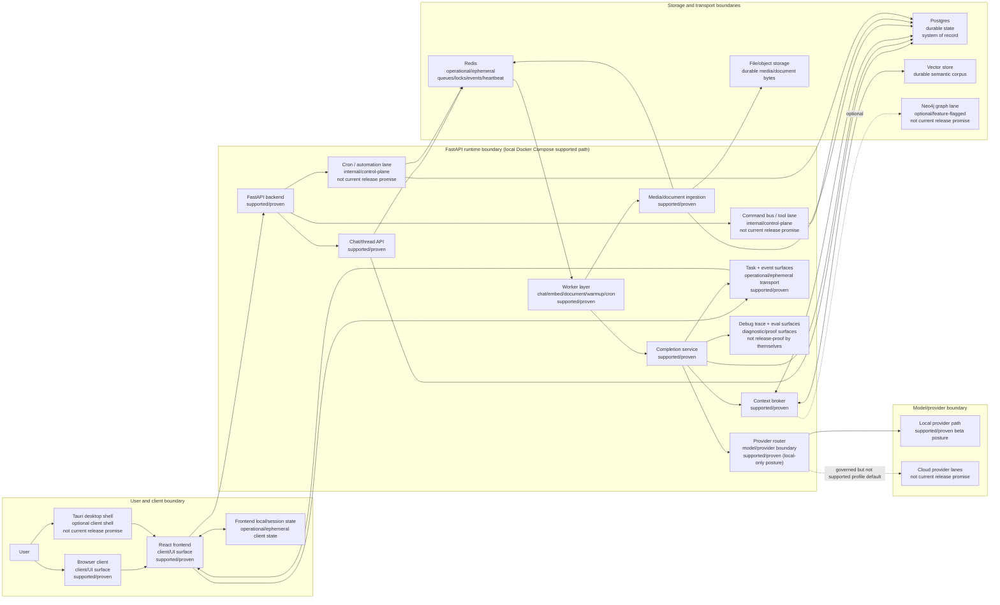
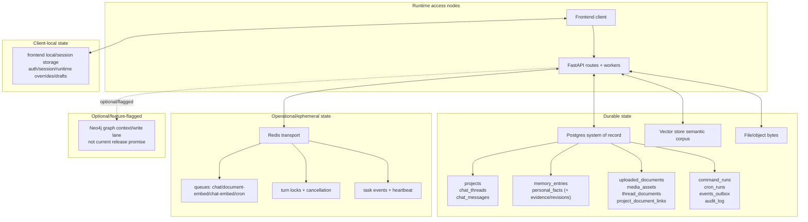
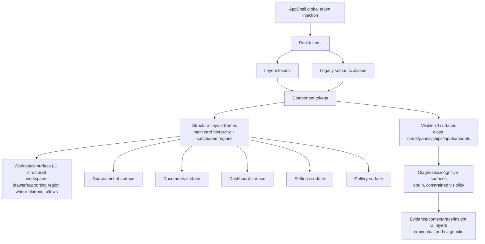

# Codexify Development Map v1

## 1. Title and purpose

This document is a first-pass visual current-state map for development orientation.

It is intended to help operators and contributors quickly see how major Codexify systems connect today, what depends on what, and which surfaces are supported versus internal, optional, experimental, or outside the current release promise.

This is not a release promise, roadmap, ADR, or implementation plan.

## 2. Source set and interpretation rules

### Required source docs read

1. `/docs/architecture/00-current-state.md`
2. `/docs/architecture/adr/adr-index.md`
3. `/docs/architecture/README.md`
4. `/docs/architecture/kb-validity-matrix.md`
5. `/docs/architecture/system-overview.md`
6. `/docs/architecture/runtime-diagrams-v1.md`
7. `/docs/architecture/ui-diagrams-v1.md`
8. `/docs/architecture/modules-and-ownership.md`
9. `/docs/architecture/data-and-storage.md`
10. `/docs/architecture/flows.md`
11. `/docs/architecture/config-and-ops.md`
12. `/docs/architecture/tech-debt-and-risks.md`

### Interpretation rules

- `00-current-state.md` is the short-horizon release-truth gate and overrides broader docs when there is conflict.
- `kb-validity-matrix.md` governs what is valid source material for runtime and UI diagramming.
- Runtime maps and UI maps are adjacent but not interchangeable.
- This map does not override `00-current-state.md` and must not widen the supported release promise.

### Source notes

- All required files were present at the specified paths.
- No substitutions were required.

## 3. Legend

| Label | Meaning |
|---|---|
| `supported/proven` | Explicitly supported on the current local Docker Compose beta path with current-state evidence. |
| `internal/control-plane` | Internal or operator-facing control-plane surface; not automatically a user-facing release surface. |
| `optional/feature-flagged` | Present behind runtime/profile flags or optional lanes; not required for baseline supported operation. |
| `experimental/scaffold` | Scaffold, planning, or early lane that exists without broad release-level support guarantees. |
| `not current release promise` | Must not be treated as shipped user-facing release behavior on the present beta posture. |
| `durable state` | Restart-stable persisted system-of-record or persisted retrieval corpus. |
| `operational/ephemeral` | Queue/lock/event/process transport state required for runtime operation but not canonical durable truth. |
| `client/UI surface` | Browser/desktop-visible interface and client-resident state surfaces. |
| `model/provider boundary` | Boundary where provider selection, governance posture, and execution path are enforced. |

## 4. Diagram 1: Current Codexify system map



Not release promise caveat: command bus as user-facing tooling, broad cron automation UX, cloud-provider posture, graph writes, and desktop-packaged runtime replacement are not treated here as current supported release surfaces.

## 5. Diagram 2: Core chat interoperation flow

```mermaid
sequenceDiagram
    participant User as User
    participant FE as React frontend
    participant API as Chat API routes
    participant PG as Postgres
    participant Redis as Redis queue/lock/events
    participant Worker as Chat worker
    participant Broker as Context broker
    participant Retrieve as Retrieval layers
    participant Router as Provider router
    participant Provider as Model provider
    participant Trace as Trace/eval surfaces
    participant Events as Task event surface

    User->>FE: Compose message
    FE->>API: POST /api/chat/threads (first-send path when needed)
    API->>PG: Persist thread
    FE->>API: POST /api/chat/{thread_id}/messages
    API->>PG: Persist user message
    FE->>API: POST /api/chat/{thread_id}/complete

    API->>Redis: Acquire turn lock
    API->>Redis: Enqueue ChatCompletionTask
    API->>Redis: Best-effort task.created
    API-->>FE: task_id, turn_id, trace_url, messages_url
    Note over API,FE: Route acceptance is not completion.

    FE->>Events: Subscribe /api/tasks/{task_id}/events
    Worker->>Redis: Dequeue task + emit task.running
    Worker->>Broker: Assemble context
    Broker->>Retrieve: Thread + doc + vector + memory assembly
    Broker-->>Worker: Context bundle + retrieval posture

    Worker->>Router: Select provider/model path
    Router->>Provider: Execute completion
    Provider-->>Worker: Assistant output

    Worker->>PG: Persist assistant message + audit/domain rows
    Worker->>Trace: Persist trace snapshot + enqueue eval lane
    Note over Worker,Trace: Worker-visible completion payload is stronger proof for executed behavior; debug-only reconstruction is diagnostic.

    Worker->>Redis: Publish terminal task event + release turn lock
    Redis-->>Events: Task stream updated
    Events-->>FE: Lifecycle events (publication)
    Note over Events,FE: Task-event publication is not guaranteed UI receipt.

    FE->>API: GET messages_url
    API-->>FE: Updated thread messages
```

Operational caveats anchored in current docs:

- Acceptance is lock + enqueue, not eventual success.
- Task-event stream availability is not equivalent to frontend receipt certainty.
- Debug trace endpoints are diagnostic; they are not a replacement for executed-path evidence.

## 6. Diagram 3: Data and dependency spine



Dependency posture:

- Postgres is the durable system of record.
- Redis is operational transport for queues, locks, cancellation, events, and heartbeat.
- Vector store carries semantic retrieval corpus.
- File/object storage carries raw media/document bytes.
- Neo4j remains optional/feature-flagged and not a baseline release promise surface.

## 7. Diagram 4: UI architecture map

UI canon note: this diagram is design/presentation truth, not backend/runtime topology.



Boundary caveat: UI token/layout/render canon should not be used to infer backend routing, queue behavior, provider execution, or durability semantics.

## 8. Diagram 5: Development maturity overlay

| System | Current maturity posture | Evidence posture |
|---|---|---|
| Chat completion path | `supported/proven` beta path | Supported local Compose path with queue-backed completion and persistence evidence in current-state/runtime docs. |
| Local provider posture | `supported/proven` | Local-only profile is current supported posture; cloud is not current release promise. |
| Upload -> embed -> readback | `supported/proven` | Included in current supported reality with documented proof anchors. |
| Workspace-local retrieval | `supported/proven` (bounded) | Current-state documents this as supported-path proven; proof doctrine still requires executed-path evidence discipline. |
| Command Center heartbeat/work-order visibility | `internal/control-plane` | Live-proofed visibility/recommendation seam exists, but non-dispatch/recommendation-only and not broad release expansion. |
| Command bus | `internal/control-plane` | Present and operational internally; current profile posture marks it internal-only rather than broad user-facing release surface. |
| Cron | `internal/control-plane` | Runtime lane exists with durable run rows, but not framed as a primary shipped beta user surface. |
| Federation/sync | `experimental/scaffold` + `not current release promise` | Present as routes/seams with risk and policy gates; not baseline supported release path. |
| Graph writes | `optional/feature-flagged` + `not current release promise` | Explicit default-off contract on supported Compose path. |
| Flow Builder | `experimental/scaffold` (contracts/planning) | ADR/spec and planning surfaces; not current runtime release claim. |
| Campaign Runner | `internal/control-plane` + `not current release promise` | MVP control-plane spine and evidence lanes exist; recommendation-oriented, not broad released workflow surface. |
| Job Intelligence | `experimental/scaffold` (contracts/planning) | Treated as architecture/planning contract surface, not supported runtime release feature. |
| Execution Ledger | `experimental/scaffold` (contracts/planning) | Contract/proposal artifacts exist; not declared as shipped user-facing runtime behavior. |
| Persona Studio | `optional/feature-flagged` or design surface | Documented architecture/design surface; not a current supported-path release-truth anchor for runtime topology. |
| Desktop shell (Tauri/packaged launcher) | `optional/feature-flagged` + `not current release promise` for install-path replacement | Exists as client/runtime shell, but supported install path remains local Docker Compose. |

## 9. Dependency matrix

| System | Depends on | Depended on by | Current posture | Blast radius | Notes / caveats |
|---|---|---|---|---|---|
| React frontend + AppShell | Backend APIs, event surfaces, client local/session state | End-user workflows | `supported/proven` client surface | High | UI shell is not runtime topology truth. |
| Chat/thread API routes | Auth boundary, Postgres, Redis turn locks/queue | Frontend chat, chat worker lane | `supported/proven` | High | Acceptance != completion. |
| Completion service + chat worker | Queue transport, context broker, provider router, Postgres | Core assistant output path | `supported/proven` | High | Worker-visible payload is stronger executed-path evidence. |
| Context broker | Postgres message/doc links, vector store, optional graph/memory/federation lanes | Completion service | `supported/proven` with optional widening lanes | High | Workspace-local widening remains user-bounded and proof-sensitive. |
| Provider router boundary | Runtime config/profile, provider registry, selected provider path | Completion service | `supported/proven` for local posture | High | Cloud inventory visibility does not equal release support. |
| Media/document ingestion | Storage backend, parser services, Postgres, Redis embed queue | Retrieval corpus and document UI | `supported/proven` | High | Inline parsing + async embedding split can affect latency. |
| Command bus / tool lane | Auth/policy/invoke store, loopback HTTP, Postgres | Internal tool invocation, bounded one-turn chat tool lane | `internal/control-plane` | High | Not current broad release promise. |
| Cron lane | Cron routes, scheduler, Redis queue, Postgres | Internal automation workflows | `internal/control-plane` | Medium | Exists as runtime lane; release posture remains conservative. |
| Event surfaces (`/api/events`, task streams) | Postgres outbox and Redis task events | Frontend live updates, operator diagnostics | `supported/proven` operational transport | Medium | Publication does not guarantee client receipt. |
| Postgres | DB adapter/migrations | Nearly all backend subsystems | `durable state` | High | System of record for chat/doc/control-plane entities. |
| Redis | Queue/lock/task-event/heartbeat paths | Chat, embedding, cron, health diagnostics | `operational/ephemeral` | High | Coordination concentration point; durability limits remain explicit. |
| Vector store | Embedder and retrieval integration | Context broker and retrieval surfaces | `durable semantic corpus` | High | Retrieval quality depends on embed/index coherence. |
| File/object storage | Storage adapter and upload flows | Media/doc ingestion and retrieval references | `durable state` | Medium | Carries raw bytes; metadata consistency still anchored in Postgres. |
| Optional Neo4j lane | Feature flags, graph backend selection | Optional graph/federation context lanes | `optional/feature-flagged` | Medium | Default-off on supported Compose path; not release promise. |
| Desktop shell/packaged lane | Tauri runtime bridge, frontend runtime config, local Docker runtime | Desktop operator/user workflows | `optional/feature-flagged` | Medium | Must not be interpreted as replacing supported Compose install truth. |

## 10. Map reading notes

- Use this map as orientation for dependency edges, subsystem boundaries, and maturity posture before changing architecture-impacting seams.
- Do not use this map as proof that a surface is shipped user-facing behavior.
- Resolve release-truth questions against `00-current-state.md` first.
- Resolve runtime flow detail against `runtime-diagrams-v1.md`, `system-overview.md`, `flows.md`, `modules-and-ownership.md`, `data-and-storage.md`, and `config-and-ops.md`.
- Resolve UI canon questions against `ui-diagrams-v1.md` and its source canon docs.
- If this map appears to conflict with current-state truth, treat this map as stale and update it conservatively rather than widening release claims.
