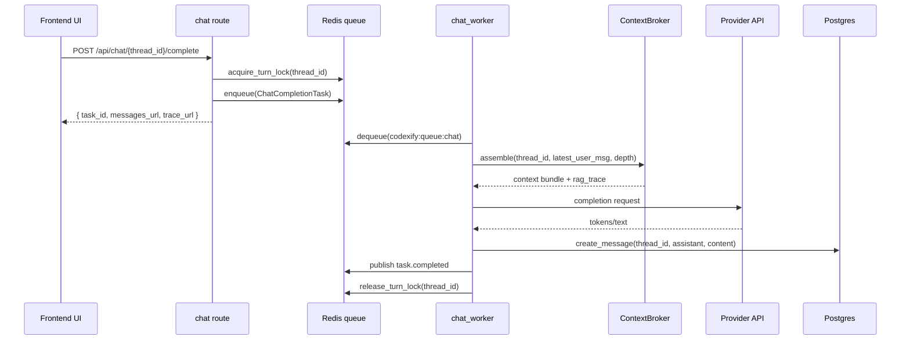
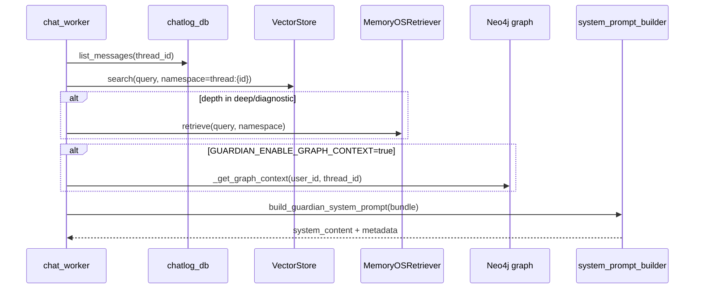
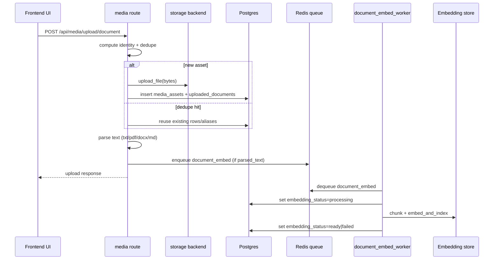
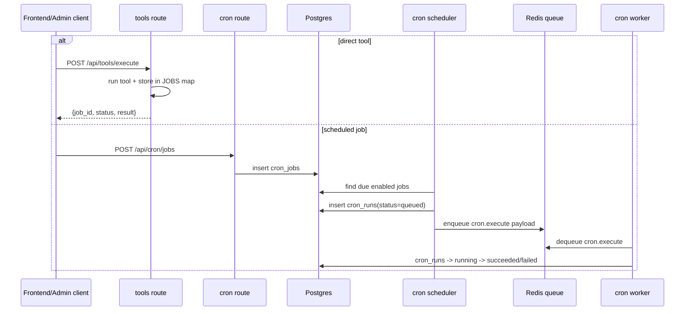

# Critical Flows

Purpose: Describe the high-value runtime flows in trigger/sequence/output/failure form with code anchors, so planning and debugging can start from exact control paths.
Last updated: 2026-02-17
Source anchors:
- guardian/routes/chat.py
- guardian/workers/chat_worker.py
- guardian/context/broker.py
- guardian/cognition/system_prompt_builder.py
- guardian/routes/media.py
- guardian/workers/document_embed_worker.py
- guardian/queue/document_embed_queue.py
- guardian/routes/tools.py
- guardian/routes/cron.py
- guardian/cron/scheduler.py
- guardian/workers/cron_worker.py
- guardian/routes/federation.py
- guardian/sync/api.py

## 1) Chat Completion Flow

Trigger:
- Frontend calls `POST /api/chat/{thread_id}/complete` after user message creation.

Sequence:
1. Route validates thread/context and tries to acquire per-thread Redis turn lock.
2. Route enqueues `ChatCompletionTask` to `codexify:queue:chat`.
3. `worker-chat` dequeues task.
4. Worker resolves effective profile/provider/model.
5. Worker assembles context bundle + system prompt.
6. Worker calls provider (`stream_local` or `chat_with_ai`).
7. Worker guards blank output and persists assistant message.
8. Worker emits `task.completed` and releases thread lock in `finally`.

Outputs:
- API immediate response with `task_id`.
- Task event stream (`task.created`, `task.running`, `task.progress`, terminal event).
- New assistant row in `chat_messages`.

Failure modes:
- `turn_in_flight` (429) when thread lock already held.
- `queue_unavailable` (503) if Redis enqueue fails.
- `thread_has_no_usable_context` or thread missing.
- Provider/network/timeouts causing `task.failed`.
- Blank assistant output replaced by fallback text.

Code anchors:
- `guardian/routes/chat.py`
- `guardian/queue/redis_queue.py`
- `guardian/workers/chat_worker.py`
- `guardian/queue/task_events.py`

## 2) RAG / Context Assembly Flow

Trigger:
- Chat worker enters `_build_messages_for_llm` for an active completion task.

Sequence:
1. Worker loads recent thread messages.
2. Worker determines latest user utterance as retrieval query.
3. `ContextBroker.assemble` runs retrieval by depth mode:
   - `shallow`: messages only
   - `normal`: + semantic
   - `deep`: + semantic + memory
   - `diagnostic`: + semantic + memory + sensors
4. Optional graph context added if `GUARDIAN_ENABLE_GRAPH_CONTEXT=true`.
5. Optional federated context added only when `federated=True` call path is used.
6. Worker builds system prompt (`build_guardian_system_prompt`) and context system message.
7. Worker prepends system message to conversation before provider call.

Outputs:
- Enriched message list for provider.
- `rag_trace` containing semantic/graph summaries.

Failure modes:
- Vector store unavailable -> semantic list empty.
- Memory retriever errors -> memory list empty.
- Graph modules unavailable/Neo4j errors -> graph list empty.
- Prompt build failure -> worker falls back to default safety system prompt.

Code anchors:
- `guardian/workers/chat_worker.py`
- `guardian/context/broker.py`
- `guardian/cognition/system_prompt_builder.py`
- `guardian/cognition/prompts.py`

## 3) Ingestion Flow (Documents and Images)

Trigger:
- Frontend uploads image/document to `/api/media/upload/image` or `/api/media/upload/document`.

Sequence:
1. Route validates file type + reads bytes.
2. Route computes canonical media identity and checks for dedupe hit.
3. If no hit, file stored via `storage.upload_file` and media rows inserted.
4. For documents, parser extracts text (`txt/md/pdf/docx`).
5. If parsed text exists, route enqueues `document_embed` task.
6. `worker-document-embed` dequeues, chunks text, embeds/indexes chunks, updates status.

Outputs:
- Upload response with IDs and metadata.
- `uploaded_documents.embedding_status` lifecycle updates (`pending` -> `processing` -> `ready` or `failed`).

Failure modes:
- Unsupported MIME type returns 400.
- Parser extraction failure leaves `parsed_text` empty and marks status failed.
- Embed enqueue failure sets `embedding_status=failed`.
- Embed worker/indexing failure writes `embedding_error`.

Code anchors:
- `guardian/routes/media.py`
- `guardian/services/document_parsers/`
- `guardian/services/document_chunking.py`
- `guardian/queue/document_embed_queue.py`
- `guardian/workers/document_embed_worker.py`

## 4) Tool Execution / Job Flow

Trigger:
- Direct tools call: `POST /api/tools/execute`.
- Scheduled job call: create/enable cron job via `/api/cron/jobs`.

Sequence:
1. Direct tools path executes synchronously and stores result in in-memory `JOBS` map.
2. Cron path persists `cron_jobs`; scheduler tick creates `cron_runs` + enqueues `cron.execute`.
3. Cron worker dequeues, marks run `running`, calls `execute_cron_job`, writes `succeeded/failed`.

Outputs:
- Direct tools: immediate JSON result + retrievable by `/api/tools/jobs/{job_id}`.
- Cron: durable run history in `cron_runs` and event bus emissions.

Failure modes:
- Direct tools state is process-local; restart loses job results.
- Unsupported cron `job_type` raises failure and stores error in run row.
- Webhook cron jobs can be blocked by egress policy or allowlist checks.

Code anchors:
- `guardian/routes/tools.py`
- `guardian/routes/cron.py`
- `guardian/cron/scheduler.py`
- `guardian/cron/executor.py`
- `guardian/workers/cron_worker.py`

## 5) Sync / Federation Flow

Trigger:
- Federation session request (`/api/federation/session/request`) or sync event POST (`/api/sync/event`).

Sequence:
- Federation: validate signed trust policy, check target allowlist/egress, fetch+verify peer manifest, mint relay session token, run relay/diff endpoints.
- Sync API: accept idempotent event payload, apply side-effect upserts by event type, publish SSE message via in-memory bus.

Outputs:
- Federation: relay metadata/token and peer communication channel.
- Sync API: idempotent acknowledgement + subscriber events.

Failure modes:
- Federation disabled or policy signature invalid => 403/503.
- Target origin/node not allowed by policy => 403.
- Sync bus is in-process only; events do not survive process restart.

Code anchors:
- `guardian/routes/federation.py`
- `guardian/routes/federation_context.py`
- `guardian/sync/api.py`
- `guardian/sync/bus.py`

