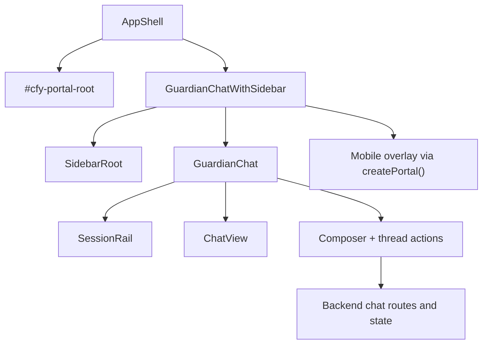

# Guardian Chat Portal

Purpose: Document the current Guardian chat portal shell so operators can understand how the chat surface is mounted, how the sidebar and mobile overlay work, and which controls are already available in the UI.
Last updated: 2026-06-25
Source anchors:
- frontend/src/components/persona/layout/AppShell.tsx
- frontend/src/components/persona/layout/GuardianChatWithSidebar.tsx
- frontend/src/features/chat/GuardianChat.tsx
- frontend/src/features/chat/ChatView.tsx
- frontend/src/components/SessionRail/SessionRail.tsx
- frontend/src/features/chat/components/Composer.tsx
- docs/architecture/chat-runtime-contract.md
- docs/architecture/remote-account-access-and-user-profile-contract.md

# Guardian Chat Portal

## Purpose and Scope

The Guardian Chat Portal is the browser shell that wraps the main thread-based chat experience.

It is not a public portal and it is not a standalone room server. It is the UI composition layer that:

- mounts the chat surface inside the AppShell
- renders the sidebar thread list
- shows the thread rail for tabs
- hosts the message history and composer
- opens the sidebar as a React portal on mobile
- keeps the chat surface, workspace preview, and diagnostics in sync

The current portal is a single-user browser surface around a thread timeline. It can look like "group chat" because it includes multiple threads and tab-like sessions, but the implemented runtime is still Guardian thread chat rather than a multi-actor room protocol.

## Current Status

| Surface | Status now | Meaning |
|---|---|---|
| AppShell portal root | runtime-active | `AppShell` renders `#cfy-portal-root` inside the themed shell wrapper so portaled UI inherits the same CSS variables. |
| Guardian chat shell | runtime-active | `GuardianChatWithSidebar` coordinates the sidebar, chat pane, workspace preview, and mobile overlay. |
| Thread list sidebar | runtime-active | `SidebarRoot` renders thread navigation and thread actions. |
| Session rail | runtime-active | `SessionRail` renders tabs for session/thread switching and a new-tab control. |
| Message timeline | runtime-active | `ChatView` renders history and older-message loading, but does not own fetch loops. |
| Composer and controls | runtime-active | The composer exposes provider, model, inference mode, source mode, depth, and voice controls. |
| Mobile overlay portal | runtime-active | The sidebar becomes a full-screen portal overlay on narrow layouts. |
| RAG trace panel | gated | The trace viewer is available when the RAG trace flag or route capability enables it. |

## How the Portal Is Wired

The portal wiring follows this path:

1. `AppShell` creates a themed shell wrapper and a dedicated `#cfy-portal-root`.
2. `GuardianChatWithSidebar` prefers that portal root when it mounts the mobile sidebar overlay.
3. On desktop, the sidebar stays in the normal layout grid.
4. On mobile, the sidebar is rendered into the portal root as a fixed overlay with a scrim.
5. `GuardianChat` renders the chat body, provider/request banners, session rail, and composer.
6. `ChatView` renders the message list and older-message pagination.

## Layout Modes

### Desktop

- The shell renders as a split layout when the sidebar is open.
- The sidebar sits beside the chat lane.
- The chat lane owns the message stream, composer, and status banners.
- The workspace preview can appear alongside the chat when a document is opened.

### Mobile

- Opening the sidebar turns it into a full-screen portal overlay.
- The overlay includes:
  - a scrim that closes the drawer when clicked
  - a fixed drawer panel
  - the same thread list and thread actions used on desktop
- While the overlay is active:
  - body scrolling is disabled
  - Escape closes the sidebar
  - the drawer stops click and pointer propagation so the scrim can close it cleanly

## Operator Controls

The current portal gives you these controls:

- Sidebar toggle
  - Shows or hides the thread list.
  - On desktop, this changes the split layout.
  - On mobile, this opens or closes the overlay drawer.
- Session rail
  - Switch between open session tabs.
  - Open a new tab.
  - Close the active tab.
- Thread actions
  - Move a thread to General.
  - Archive a thread.
  - Delete a thread.
  - Switch profile for a persisted thread.
  - Open the RAG trace panel when available.
- Composer controls
  - Pick provider.
  - Pick model.
  - Change inference mode.
  - Change retrieval source between project and personal knowledge.
  - Change depth mode.
  - Start a voice turn when voice mode is enabled.
- Workspace toggle
  - Opens or closes the workspace preview for the current document.

## Runtime State and Persistence

The portal mixes backend-backed thread state with browser-local state.

Backend-backed or server-synced state includes:

- thread history
- thread creation and persistence
- provider and model routing
- request lifecycle and runtime health
- profile-switch actions on persisted threads

Browser-local state includes:

- current sidebar open/closed state
- session tab state
- source mode per thread or per tab
- voice playback and voice turn preferences
- device id used for local session continuity

Common local storage keys include:

- `cfy.chat.source.thread:<threadId>`
- `cfy.chat.source.tab:<tabId>`
- `cfy.voice.playbackEnabled`
- `cfy.voice.turnEnabled`
- `cfy.voice.selectedVoice`
- `cfy.deviceId`

## What The Surface Shows When Things Go Wrong

The portal is designed to show operator-readable failures instead of silently hiding them.

Typical banners include:

- provider runtime offline or degraded
- LLM backend misconfiguration
- thread id resolution failures
- turn lock recovery notices
- voice turn upload failures

These are not all the same failure class:

- provider health banners mean the backend or model path is the problem
- thread id banners mean the request/response contract was incomplete
- turn lock banners mean the chat request state is stale or recovered
- voice banners usually mean file handling or voice backend setup is missing

## Operating Checklist

Use this sequence when you are learning or debugging the portal:

1. Open `/chat` or `/chat/<threadId>`.
2. Confirm the sidebar lists threads and the session rail is present.
3. Toggle the sidebar closed and reopened.
4. Open a different session tab, then return to the active one.
5. Send a simple message and watch the request banner/state update.
6. Switch provider or model only after you know the current runtime posture.
7. Change source mode if you want the thread to read from project context or personal knowledge.
8. On mobile widths, verify the sidebar becomes a portal overlay and closes with Escape or the scrim.
9. If a document is active, confirm the workspace preview opens without hiding the chat history.

## What This Portal Is Not

- not a public-facing SaaS portal
- not a separate group-room protocol
- not a collaboration server with presence or membership semantics
- not the source of truth for account identity
- not the place where runtime provider support is widened

## Extension Seams

If you want to change how the portal behaves, these are the first seams to inspect:

- `frontend/src/components/persona/layout/AppShell.tsx`
  - portal root placement
  - shell theme inheritance
- `frontend/src/components/persona/layout/GuardianChatWithSidebar.tsx`
  - desktop versus mobile layout selection
  - portal overlay behavior
  - scroll lock and Escape handling
- `frontend/src/features/chat/GuardianChat.tsx`
  - thread actions
  - provider/model controls
  - request banners and session rail
- `frontend/src/features/chat/ChatView.tsx`
  - message rendering and older-message loading
- `frontend/src/components/SessionRail/SessionRail.tsx`
  - tab behavior and tab affordances

## If You Want It To Work Differently

The current implementation is a strong starting point, but it still hardcodes a few product choices:

- one active chat surface at a time
- thread tabs rather than true room membership
- local overlay logic rather than server-driven layout orchestration
- source mode as a per-thread/per-tab preference
- mobile portal behavior that is intentionally UI-local

If your ideas change any of those choices, the biggest design questions are:

- Is this still a thread shell, or should it become a true room with membership and presence?
- Should routing and identity live in the browser, the backend, or both?
- Should source mode remain a chat-composer preference, or become a thread contract?
- Should the mobile overlay remain portal-based, or move into a different shell composition?

## Related Reading

- [Chat Runtime Contract](./chat-runtime-contract.md)
- [Remote Account Access and User Profile Contract](./remote-account-access-and-user-profile-contract.md)
- [Architecture README](./README.md)
