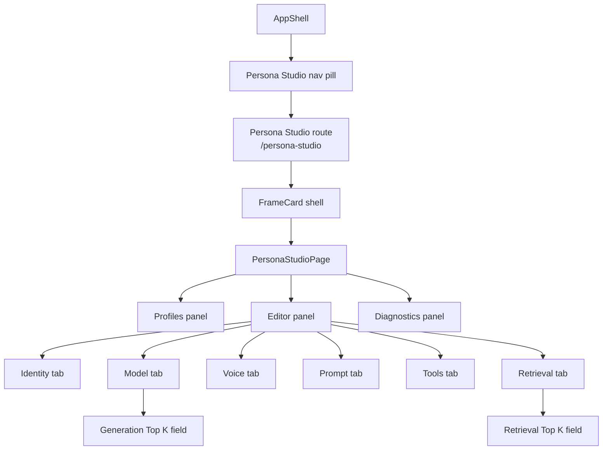
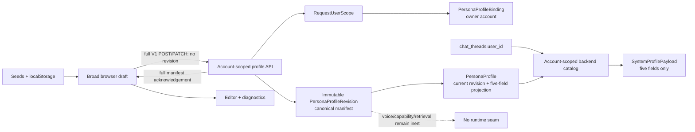
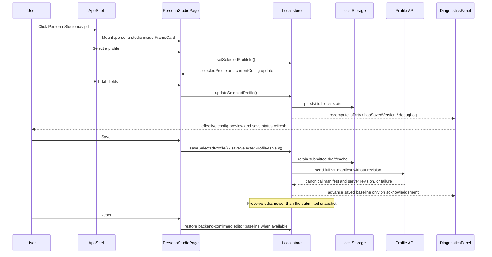

Purpose: Document Persona Studio as it exists in the shell today so readers can understand the page structure, local state flow, and boundary limits without reading implementation code first.
Last updated: 2026-09-06
Source anchors:
- frontend/src/components/persona/layout/AppShell.tsx
- frontend/src/features/personaStudio/PersonaStudioPage.tsx
- frontend/src/features/personaStudio/personaStudioStore.ts
- guardian/cognition/system_profiles/manifest.py
- guardian/cognition/system_profiles/store.py
- guardian/cognition/system_profiles/resolver.py
- guardian/routes/persona_profiles.py
- guardian/db/models.py
- guardian/db/migrations/versions/c3d9e1f4a6b8_persist_persona_profile_manifest_binding.py
- frontend/src/features/personaStudio/__tests__/PersonaStudioShell.test.tsx
- frontend/src/features/personaStudio/__tests__/PersonaStudioPage.persistence.test.tsx
- frontend/src/features/personaStudio/__tests__/personaStudioStore.persistence.test.tsx
- docs/architecture/persona-studio-spec.md
- docs/architecture/adr/082-persona-profile-manifest-and-binding-authority.md

# Persona Studio Architecture

## Purpose and Scope

Persona Studio is a non-conversational configuration surface for persona and
profile settings. It keeps a broad browser-local draft while the backend now
persists the canonical typed Persona Profile manifest, immutable revisions,
and a server-owned account binding under ADR-082.

The frontend hydrates and writes the full V1 authored manifest. Only a
coherent backend-returned manifest/revision establishes saved Persona truth.
localStorage retains draft/cache continuity, selection, and the active editor
tab; it never restores canonical saved authority. Only the existing five-field
projection is runtime-active; broad persisted requests remain inert.

Persona Studio is:

- not a chat surface
- not a memory-writing surface
- not a thread/history surface
- not a runtime assistant session

## Current Implementation Status

| Surface | Status now | Meaning |
|---|---|---|
| AppShell navigation entry and route | runtime-active | `AppShell` exposes `/persona-studio` as a first-class shell view and renders the page inside a `FrameCard`. |
| Three-panel layout | runtime-active | The page renders left Profiles, center Editor, and right Diagnostics panels. |
| Profile list | hybrid local/backend | Seed drafts and localStorage provide continuity; the request account's backend manifest/revision establishes the canonical saved baseline without discarding recovered work. |
| Editor draft state | frontend-local | The selected profile draft is mutated in browser state and persisted to localStorage. |
| Diagnostics panel | frontend-local preview | The panel renders a JSON config preview plus a synthetic debug log derived from the current draft. |
| Save / Save As New | canonical acknowledgement | Full V1 manifest writes omit revision. Saved state advances only after backend acknowledgement; failed writes retain drafts and the previous canonical baseline. |
| Reset | frontend-local | Reset restores the backend-confirmed manifest projected into editor state. Without a confirmed baseline it preserves the draft; it does not write the backend. |
| Canonical manifest persistence | backend-active | Strict V1 manifests, immutable revisions, and server-owned account bindings are durable and account-scoped. |
| Full-account recovery | backend-active | `account-export.v3` preserves account-bound registry rows, every immutable manifest revision, and server-owned binding rows as distinct integrity-covered families. Historical v1/v2 archives contain none of these families. |
| Runtime profile application | five-field only | A thread may resolve its owning account's current profile projection. Voice, capabilities, retrieval, and other broad fields remain inert. |

### Presentational, Frontend-Local, Runtime-Bound

| Category | Current contents |
|---|---|
| Presentational | Shell nav entry, route switch, frame wrapper, three panels, tabs, form controls, badges, diagnostics card |
| Frontend-local state | Seed profiles, selected profile, active tab, editable broad drafts, diagnostics, and localStorage persistence |
| Backend persistence | Account-scoped registry rows, server-owned bindings, immutable manifest revisions, and the current five-field projection |
| Runtime-bound behavior | Only name, system prompt, model provider, model ID, and temperature may flow from the current manifest projection for a thread owned by the same account |

### What Is Not Yet Wired

- No thread-to-immutable-revision binding
- No live application of voice, capability, retrieval, connector, or other
  broad manifest settings
- No import/export/delete flow in the current page
- No server-driven diagnostics feed or validation loop
- No Effective Config resolver or inspection endpoint

### Do Not Assume

- Do not assume localStorage or a pending Save establishes a saved Persona;
  only canonical backend acknowledgement establishes that baseline
- Do not assume Reset changes live assistant behavior
- Do not assume selecting a Studio profile changes an active thread or binds a
  manifest revision
- Do not assume Generation Top K and Retrieval Top K are interchangeable
- Do not assume persisted voice, capability, retrieval, or permission-shaped
  requests grant authority or affect runtime

## Where It Lives in the Shell

Persona Studio is a top-level AppShell view alongside Guardian, Dashboard, Documents, Gallery, and Settings.

- Route mapping: `/persona-studio`
- Shell entry: the navigation pill in `frontend/src/components/persona/layout/AppShell.tsx`
- Mounted content: `PersonaStudioPage` rendered inside a `FrameCard`

This matters because the page is not nested inside chat or settings as a subpanel. It is a sibling shell surface.

## UI Structure

The page uses a simple three-panel layout:

- Left panel: Profiles
- Center panel: Editor
- Right panel: Diagnostics

The center panel contains six tabs:

- Identity
- Model
- Voice
- Prompt
- Tools
- Retrieval

The Model tab contains generation controls, including `Generation Top K`.

The Retrieval tab contains retrieval controls, including `Retrieval Top K`.

These are separate concepts and must remain separate.

## Data Model

The current screen uses a narrower frontend-facing shape than the broader product spec. The effective profile draft shape is:

```ts
type PersonaStudioLocalState = {
  profiles: PersonaProfileDraft[];
  draftProfilesById: Record<string, PersonaProfileDraft>;
  selectedProfileId: string;
  activeTab: "Identity" | "Model" | "Voice" | "Prompt" | "Tools" | "Retrieval" | "Truth Matrix";
};

type PersonaProfileDraft = {
  id: string;
  name: string;
  description: string;
  isDefault?: boolean;
  config: {
    identity: {
      name: string;
      description: string;
    };
    model: {
      provider: string;
      model: string;
      temperature: number;
      topK: number;
      topP: number;
      maxTokens: number;
    };
    voice: {
      enabled: boolean;
      provider: string;
      voicePreset: string;
      speed: number;
      wakeWord: string;
      interruptible: boolean;
    };
    prompt: {
      systemPrompt: string;
      styleNotes: string;
      directives: string;
    };
    tools: {
      pinnedTools: string[];
      allowedTools: string[];
      skills: string[];
      permissions: {
        web: boolean;
        email: boolean;
        calendar: boolean;
        cli: boolean;
        filesystem: boolean;
      };
    };
    retrieval: {
      enabled: boolean;
      mode: string;
      topK: number;
      rerank: boolean;
    };
  };
};
```

Diagnostics-facing derived state is not a separate persisted contract. It is computed from the selected draft and the session-only canonical manifest:

- `selectedProfile`
- `currentConfig`
- `selectedSavedManifest` from session-only `savedManifestsById`
- `savedRevision` from that manifest, or null before backend confirmation
- `selectedSavedProfile` projected from that manifest into the editor shape
- `seedProfile`
- `isDirty`
- `hasSavedVersion`
- `debugLog`

The backend persistence model is separate:

- `PersonaProfile` is the stable profile registry and current five-field
  compatibility projection, with a positive `current_revision` pointer.
- `PersonaProfileRevision` stores each immutable, self-contained V1 manifest
  snapshot under the unique `(profile_id, revision)` key.
- `PersonaProfileBinding` stores the server-derived owning account only. It is
  not part of the portable manifest.

Full-account recovery preserves these three concepts separately. The v3
archive stores the stable registry/current pointer, every immutable manifest
revision, and the account binding in separate payload files. Restore validates
the binding against the archive account, writes authority under the validated
restore target, and reconstructs the five-field compatibility projection from
the current manifest. It does not treat archive YAML/JSON as new ownership
authority and does not allocate a new authored revision. Historical v1/v2
archives predate this coverage and therefore restore no Persona Profile state.

The V1 manifest can persist identity name/description, prompt systemPrompt,
styleNotes and directives, model provider/model/temperature/topK/topP/maxTokens,
the current voice shape, requested tools/skills/five permission flags, and the
current retrieval shape. Connector references are omitted because no concrete
V1 field shape is defined. Authority-bearing account, Project, participant,
credential, and grant fields are rejected.

## State Flow

1. `readPersonaStudioLocalState()` loads draft/cache continuity from
   localStorage, falling back to built-in seed drafts. The session starts with
   an empty `savedManifestsById`, regardless of stored values.
2. Account-scoped backend list hydration establishes canonical manifests and
   server revisions. Full manifest fields project into Studio configuration;
   compatibility fields do not supply authored values. Fresh, untouched seeds
   hydrate automatically; recovered drafts and edits made during loading remain
   intact and are compared against the backend-confirmed baseline.
3. `selectedProfileId` and `activeTab` retain editor continuity.
4. `updateSelectedProfile()` changes `draftProfilesById`. Storage serialization
   includes only profiles as cache, drafts, selection, and tab; it excludes
   session manifests/revisions and hydration bookkeeping.
5. `hasSavedVersion` requires a backend-confirmed manifest. `isDirty` compares
   the current draft with the editor projection of that manifest. An
   unconfirmed draft remains dirty even if it matches the local cache.
6. Save sends a full `PersonaProfileManifestWrite` with the accepted API version
   and `profileIdentity == profile.id`, never a revision. Confirmed profiles
   use PATCH; unconfirmed drafts use POST. Save As New prepares a recoverable
   local copy before POST, without establishing saved truth. Acknowledgement
   alone adopts the server manifest/revision, including a same-revision no-op.
   The draft reconciles to that acknowledgement only if it still equals the
   submitted snapshot; newer edits survive and remain dirty. Failed requests
   preserve the prior canonical baseline and draft. One request per profile
   may be in flight in this editor; later Save clicks during it are ignored,
   and a later explicit Save can submit remaining edits. Older list responses
   cannot roll back a newer acknowledged revision.
7. The API derives account identity from `RequestUserScope`; the client cannot
   submit owner authority.
8. A create transaction writes one registry row, one binding, and revision 1.
   A substantive update locks the profile, appends one revision, and advances
   the projection and current pointer atomically; a no-op appends nothing.
9. A legacy PATCH changes only its five mapped manifest values and preserves
   every unrelated authored field.
10. `resetSelectedProfile()` and `resetAllLocalPersonaStudioData()` affect local
    browser state only.
11. At runtime, `chat_threads.user_id` scopes the backend catalog. A missing or
    foreign owner cannot load another account's profile; built-in and env
    profiles keep their existing behavior.
12. Selecting a persisted Persona pins `active_profile_id` plus the server's
    current immutable `active_profile_revision` atomically on the thread.
    Edits do not advance existing pins. Explicit re-selection of the same ID
    advances to the then-current revision. Runtime projects the five fields
    from the exact pinned manifest; unavailable pins fail closed before
    inference. Built-in/env and flow selections clear the pin to NULL.

See [Chat Runtime State Contract](./chat-runtime-state-contract.md) for thread
binding and diagnostic semantics. Per-completion request/attempt snapshotting
remains deferred; a switch before worker resolution can affect an already
accepted completion.

The practical relationship is:

- browser draft state remains the editor and diagnostics source
- backend-confirmed manifests/revisions alone define saved state and its
  dirty-state comparison baseline
- localStorage remains the broad unsaved-draft store
- the canonical backend manifest is durable profile truth
- the binding is server-owned account authority, never manifest content
- immutable revisions preserve authored history
- only the five compatibility fields project into the current runtime seam
- account-export.v3 preserves canonical profile history and binding recovery
  without making persistence-only broad fields executable

## Saved-State Proof and Limits

The focused store and page persistence tests prove full V1 hydration/write
mapping, backend revision acknowledgement, failure preservation, offline
local-draft recovery, and concurrent-edit preservation. These are mocked API
state/component tests, not authenticated browser or live backend qualification.

Optional manifest values absent or null project to the existing blank-editor
defaults (empty text, default sampling controls, disabled voice/retrieval, and
empty requested capabilities). Present values are preserved. The acknowledged
manifest itself retains its exact optional-field representation; a later Save
submits the complete editor configuration, including displayed defaults.

An offline startup cannot confirm whether a cached ID exists on the backend.
Unconfirmed Save attempts creation; if the ID already exists, the backend may
reject it without changing saved state. Reload with backend hydration available
reestablishes the baseline before updating that existing profile. Reset without
a confirmed baseline preserves work. Existing Save/Reset presentation and
labels are unchanged by this store migration.

## Diagrams

### A. Component Hierarchy



### B. Data Flow



### C. User Interaction Flow



## Boundary Rules

Persona Studio does not:

- create chat messages
- create thread history
- write long-term memory
- act as a runtime assistant session
- grant Project, participant, connector, capability, credential, or other
  environmental authority
- apply broad voice, capability, retrieval, connector, or sampling settings to
  live runtime

Saving or validating a profile invokes no model, tool, retrieval, connector,
TTS, or memory mutation. The backend current manifest is account-scoped, but
the Studio remains a configuration surface rather than a second runtime.

## Next-Step Recommendations

Likely next phases, if the surface is promoted beyond local preview, are:

- YAML/JSON import and export
- richer Project, participant, and logical Connection binding scopes
- Effective Config inspection
- individually authorized capability, retrieval, connector, and voice
  enforcement

None of those phases are implemented by this persistence slice; release and
supported-profile posture remain unchanged.
