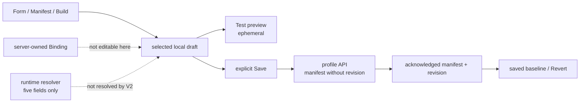

# Persona Studio Architecture

Purpose: describe the production Persona Studio composition, local draft flow,
and authority boundary without treating configuration UI as runtime proof.

Last updated: 2026-09-22

Source anchors:

- `frontend/src/components/persona/layout/AppShell.tsx`
- `frontend/src/features/personaStudio/PersonaStudioPage.tsx`
- `frontend/src/features/personaStudio/PersonaPreviewPanel.tsx`
- `frontend/src/features/personaStudio/personaStudioStore.ts`
- `frontend/src/features/personaStudio/personaStudioApi.ts`
- `docs/architecture/adr/082-persona-profile-manifest-and-binding-authority.md`

## Purpose and Scope

Persona Studio is a non-conversational configuration surface for Persona
Profiles. It keeps broad browser-local drafts while the backend persists the
canonical typed authored manifest, immutable positive revisions, and a
server-owned account binding under ADR-082.

Only a coherent backend-returned manifest/revision establishes saved Persona
truth. Browser localStorage provides draft/cache continuity and selection; it
does not establish canonical saved authority. The current runtime-bearing
projection remains limited to name, system prompt, model provider, model ID,
and temperature. Broad authored fields remain requested/inert until separately
implemented and proven enforcement seams exist.

Persona Studio is not a chat, memory-writing, thread/history, provider-runtime,
or authority-granting surface.

## Current Implementation Status

| Surface | Status now | Meaning |
|---|---|---|
| AppShell route | runtime-active | `/persona-studio` is a first-class shell view; AppShell owns Dock, scene, theme, and route wrapper. |
| V2 workspace | frontend-active | `PersonaStudioPage` directly owns two canonical FrameCards: Studio Assistant and Configuration. |
| Build | frontend-local | A pure deterministic configurator mutates recognized fields in the selected local draft only. |
| Test | frontend-local preview | Existing deterministic, draft-aware preview is ephemeral and non-threaded. |
| Form / Manifest | frontend-local | Two views over the same authored draft; Manifest JSON is strict and excludes revision/bindings/credentials. |
| Effective | observational | Requested values can be inspected; no authoritative effective-config resolver is present. |
| Profile persistence | backend-active | Account-scoped full manifests and immutable revisions establish acknowledged baselines. |
| Bindings | server-owned | Account binding is separate from portable manifest content and has no V2 editor. |
| Runtime application | five-field only | Broad voice, capabilities, retrieval, and permissions remain non-executing. |

## Where It Lives in the Shell

Persona Studio is a sibling AppShell view alongside Guardian, Dashboard,
Documents, Gallery, and Settings.

- Route: `/persona-studio`
- Shell entry: AppShell navigation
- Route containment: AppShell renders `PersonaStudioPage` directly, without an
  outer Persona Studio FrameCard.

The page itself renders the two production FrameCards. AppShell remains the
only owner of global Dock, wallpaper/gradient, theme, and shell tokens.

## V2 UI Structure

```text
AppShell scene + Dock
└── Persona Studio route
    └── PersonaStudioPage
        ├── FrameCard: Studio Assistant
        │   ├── Build — deterministic local draft edits
        │   └── Test — embedded ephemeral preview
        └── FrameCard: Configuration
            ├── profile / acknowledgement actions
            └── Form | Manifest | Effective
```

The desktop grid intentionally gives Configuration more width than Assistant;
narrow viewports stack the two surfaces. No page-wide status/footer band is
rendered. Profile state, Revert, Save, and Duplicate-as-new live in the
Configuration action area.

Form has collapsible Identity, Behavior / Prompt, Model, Voice, Capabilities,
Retrieval, and Activation & Bindings sections. This replaces the retired
top-level Identity/Model/Voice/Prompt/Tools/Retrieval/Truth Matrix tab row.

## Local State and Persistence Flow

The frontend draft shape keeps identity, model, voice, prompt, tool/permission,
and retrieval fields. The store exposes `selectedProfile`, `savedRevision`,
`isDirty`, `updateSelectedProfile`, `saveSelectedProfile`,
`saveSelectedProfileAsNew`, and `resetSelectedProfile`.

1. The store loads recoverable local drafts/cache or seed drafts.
2. Account-scoped profile hydration supplies acknowledged manifests and saved
   revisions when available.
3. Form, valid Manifest JSON, and Build all invoke the same local draft update
   seam. None persists automatically.
4. Save submits the writable V1 authored manifest without a predicted revision.
5. A successful backend acknowledgement alone advances the saved baseline and
   displayed revision. A failed write leaves the draft dirty.
6. Concurrent browser edits made after submission are preserved when an
   acknowledgement arrives.
7. Revert restores the last acknowledged manifest when one exists; with no
   acknowledgement it does not discard the draft.

Build owns only ephemeral transcript/highlight state. Test owns only ephemeral
preview transcript state. Neither state is saved to the Persona manifest,
memory, chat history, or a Guardian thread.

## Manifest, Binding, and Effective Boundaries

The writable manifest projection includes `apiVersion`, `profileIdentity`,
identity, prompt, model, voice, capabilities, and retrieval. It deliberately
excludes `revision`, Binding records, credentials, Project authority,
connector grants, and runtime grants.

Valid JSON updates the selected local draft. Invalid JSON, unknown fields, an
incompatible API version, or a mismatched profile identity stays in the editor
buffer and does not corrupt the draft.

`PersonaProfileBinding` remains server-owned environmental authority. The
Activation & Bindings section is observational because no authoritative Binding
editor exists in this surface.

The Effective projection does not simulate availability, provider health,
connector authorization, connector health, Project bindings, capability grants,
or runtime effect. Where no resolver exists, it says so explicitly. Requested
is not effective.

## Runtime and Authority Limits

The current runtime seam can carry only:

- name;
- system prompt;
- model provider;
- model ID; and
- temperature.

Saving, reverting, validating, Build, Test, and inspecting a Persona Profile do
not invoke a model, normal Guardian chat, tool, retrieval, connector, TTS,
memory mutation, capability grant, or binding change. Selection in Studio does
not bind a thread or alter active runtime behavior.

## Proof and Limits

Focused component/store tests prove the V2 page composition, deterministic
local Build behavior, preview boundary, Manifest round-trip and rejection,
acknowledged revision behavior, failure preservation, concurrent edits, and
Revert. They are mocked/local code-path proof, not authenticated-browser,
live-backend, provider, resolver, or release qualification.

### Component and State Flow



## Deferred Work

V2 does not add model-backed configuration, Binding persistence/editor,
effective-config resolution, project pins, `@persona` aliases, connector
grants, capability enforcement, retrieval execution, YAML import/export, or
legacy-component cleanup. Those require separate authority, runtime, and proof
work before they can affect a product or release claim.
