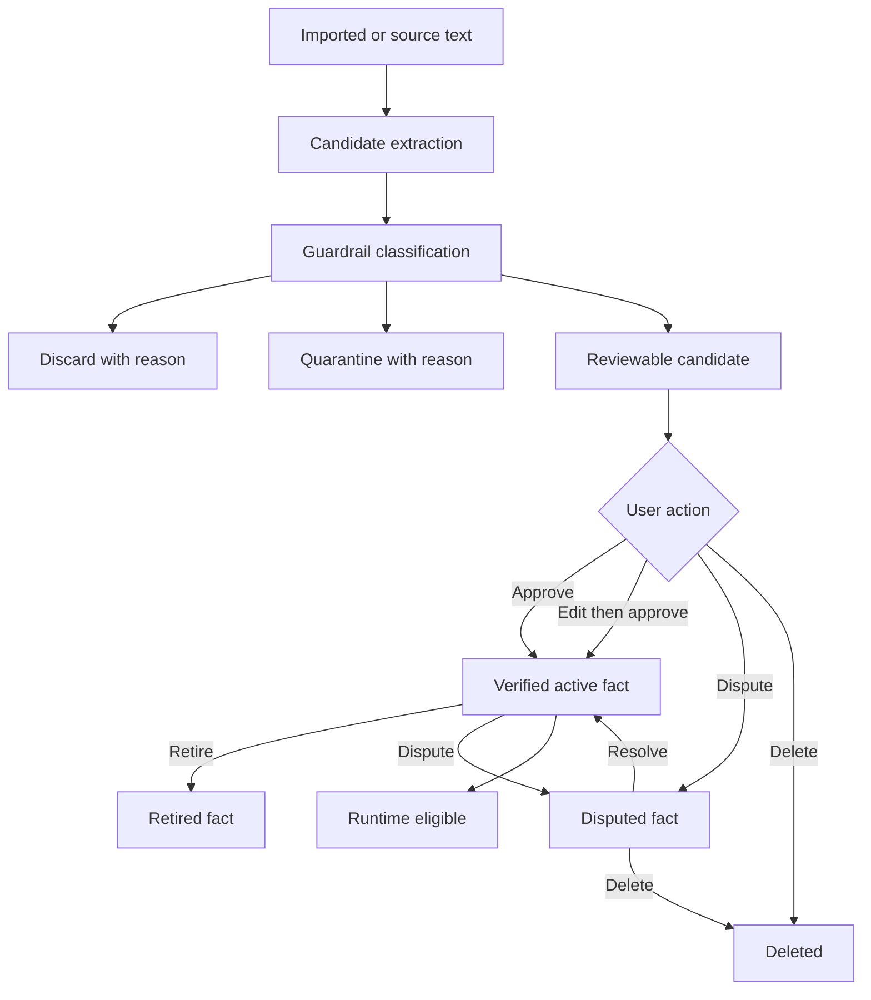

# Personal Facts Guardrails Contract

## 1. Purpose

This contract defines candidate extraction and review guardrails for the Personal Facts system. It exists so that imported text, assistant-authored prose, quoted examples, sentence fragments, stale claims, and ambiguous identity-like claims do not silently become durable user memory.

The contract establishes doctrine before implementation. It is the canonical policy surface for candidate creation, rejection, quarantine, promotion, and runtime exclusion. It does not itself change runtime behavior.

## 2. Scope

This contract governs:

- Candidate creation policy
- Candidate rejection and quarantine reasons
- Source-role and authorship policy
- Evidence requirements
- Promotion eligibility
- Runtime exclusion rules
- Lifecycle and revision/audit rules

This contract is **docs-only**. It does not implement behavior, change extractor code, modify database schemas, alter API routes, or modify UI components.

## 3. Non-goals

- No extractor implementation changes.
- No regex or LLM extraction tuning.
- No schema migration.
- No API route changes.
- No frontend component changes.
- No runtime retrieval or prompt assembly changes.
- No approval workflow behavior changes.
- No release claim expansion.
- No ADR creation in this task.

## 4. Current-truth anchors

### What is true now

- Personal facts exist as higher-level fact memory in the storage model (`personal_facts`, `personal_fact_evidence`, `personal_fact_revisions` tables per `docs/architecture/data-and-storage.md`).
- Personal fact evidence and revisions are part of the lifecycle.
- Candidate facts must remain outside runtime use until explicitly approved (per ADR-013 Verified Personal Facts Context Injection).
- OpenAI export import into chat history exists on `main` (per `docs/architecture/00-current-state.md`).
- The quarantine model correctly prevents candidate facts from participating in retrieval, prompt assembly, or runtime behavior.

### What is not yet true

- OpenAI export import does not imply general third-party sync support.
- Current release posture remains local-first beta hardening.
- This contract does not prove or change runtime support.
- No source-role guardrails currently gate candidate creation.
- No canonical rejection reason tokens exist for the candidate lifecycle.

### What this contract may assume

- The personal facts tables are stable and will not be restructured by guardrail work.
- The quarantine-to-approved lifecycle is the correct contract and will not be inverted.
- OpenAI export import will continue to produce import-source labels on messages.
- Personal fact persistence paths, approval endpoints, and retrieval injection seams exist and are testable.
- The account export + restore contract applies to facts, evidence, and revision lineage.

## 5. ADR impact

- **Classification**: Aligned with existing ADR(s) / contracts.
- **Governing docs/contracts**:
  - `docs/architecture/00-current-state.md`
  - `docs/architecture/data-and-storage.md`
  - `docs/architecture/account-export-restore-contract.md`
  - `docs/architecture/canonical-token-philosophy.md`
  - `docs/architecture/runtime-protocol-token-contract.md`
  - `docs/architecture/self-extending-agent-plugin-system.md`
  - `docs/Campaign/personal-facts-guardrails-campaign-index.md`
- **Reason**: This contract formalizes candidate-policy doctrine for an existing Personal Facts lifecycle without changing runtime behavior. It does not alter acceptance semantics, retrieval doctrine, message/attempt identity, control-plane boundaries, or any ADR-governed runtime contract.
- **Future ADR warning**: A later implementation task may require ADR alignment or a new ADR if it changes runtime eligibility semantics, identity consent boundaries, extraction authority, export/restore guarantees, or source-of-truth rules for personal facts.

## 6. Canonical terms

| Term | Definition |
|---|---|
| **Personal Fact** | A durable, structured claim about the user stored in the `personal_facts` table with associated evidence and revision lineage. |
| **Candidate Fact** | A proposed personal fact that has been extracted but not yet reviewed, approved, or trusted. Quarantined by default. |
| **Verified Fact** | A candidate that has passed user review, been explicitly approved (or edit-then-approved), and whose lifecycle status reflects trusted user intent. |
| **Active Fact** | A verified fact whose lifecycle status is `active`. Only active facts are runtime-eligible. |
| **Retired Fact** | A previously-verified fact whose lifecycle status is `retired`. Excluded from runtime use. |
| **Disputed Fact** | A candidate or verified fact whose lifecycle status reflects a user dispute. Excluded from runtime use until resolved. |
| **Evidence Row** | A `personal_fact_evidence` record linking a fact to its source (message, import, or manual entry) with provenance metadata. |
| **Revision Row** | A `personal_fact_revisions` record capturing a lifecycle transition (approve, edit, dispute, retire, delete) with audit history. |
| **Source Role** | The authorial role of the source text: `user`, `assistant`, `system`, or `tool`. Determines authorship trust posture. |
| **User-authored claim** | Text originating from a user-role message turn, where the user made a first-person statement about themselves. Highest trust tier. |
| **Assistant-authored text** | Text generated by an LLM assistant. Must not be promoted as user identity without explicit user confirmation. |
| **Imported source text** | Text from an external import (ChatGPT export, Claude export). Evidence, not identity truth. Carries import-source metadata. |
| **Promotion** | The user-initiated action of moving a candidate to verified status. The trust boundary between extraction and identity. |
| **Runtime eligibility** | The property that permits a fact to participate in retrieval, prompt assembly, or runtime behavior. Only `active` facts are runtime-eligible. |
| **Rejection reason** | A canonical label describing why a candidate was discarded or quarantined. Must become a canonical token if used across backend/frontend/tests. |
| **Quarantine reason** | A canonical label describing why a candidate is held in quarantine rather than surfaced for immediate review. Distinct from rejection. |

## 7. Candidate lifecycle

The candidate lifecycle flows from source text through extraction, guardrail classification, review, and runtime eligibility.

Key lifecycle rules:

- **Candidate creation is not trust.** Extraction produces candidates. Candidates are not facts.
- **Quarantine is not failure.** A quarantined candidate is protected from runtime use while awaiting review.
- **Approval is the trust boundary.** Only explicit user approval (or edit-then-approve) moves a candidate to verified.
- **Verified active status is the runtime boundary.** Only `active` facts participate in retrieval, prompt assembly, or runtime behavior.
- **Every transition must record a revision row.** Lifecycle changes must be auditable.
- **Deletion must preserve evidence provenance.** Deleted facts should retain evidence rows for audit unless explicit purge policy is invoked.

## 8. Source-role and authorship policy

### User-authored claims

Text from a user-role message turn, expressed in first person about the user, may be treated as a candidate with default reviewable posture. Evidence must include the role, source message reference, and excerpt.

### Assistant-authored text

Assistant-authored text **must not be promoted as user identity** without explicit user confirmation. This includes:

- Generated prose, explanations, and descriptions
- Assistant-generated summaries of user traits
- Assistant-authored responses that restate user-provided information
- Assistant-generated personality profiles or trait inferences

If an assistant turn contains a claim about the user, it must be flagged with a source-role reason and held in quarantine (or surfaced as reviewable with heightened caution) until the user explicitly confirms the claim.

### System and developer-like text

Text originating from `system` role messages, `user_editable_context` blocks, or developer-authored prompt material must be treated as instructions or preferences, not identity facts. System-role text must not become a candidate without explicit mapping to a user-authored confirmatory message.

### Quoted text

Text that appears within an assistant message as a quotation, blockquote, or attributed excerpt must not become a user fact unless independent evidence shows the user explicitly claimed it as true about themselves. Quoted user text embedded in assistant turns is evidence of what the *assistant recalled*, not what the *user asserted*.

### Examples and hypothetical statements

Text containing "for example," "imagine if," "suppose," "what if," or similar hypothetical framing must be classified as non-assertive. Hypothetical text is not a durable fact claim.

### Imported ChatGPT export messages

Imported conversation history is evidence, not identity truth. Rules for imported text:

- Assistant-authored imported messages must follow assistant-authored policy.
- User-authored imported messages are source evidence but carry a timestamp caveat (the claim may be stale).
- `model_editable_context` blocks in imported messages are instructor-facing preferences, not user identity claims.
- Import-source labels (`chatgpt_import`, `claude_import`) must be preserved and visible in review.

### Ambiguous role or source metadata

**Ambiguous authorship must fail closed** into quarantine or discard, not promotion. When the source role is missing, unclear, or contradictory:

- The candidate must be quarantined with a source-role reason.
- Evidence must include the best available provenance.
- Automatic promotion must not occur.

### Generated summaries or transformed prose

If an extraction pipeline generates a summary, paraphrase, or transformation of source text, the generated text is derivative, not original evidence. Derivative candidates must reference the original source evidence and must not be promoted without user review of both the derivative and original text.

## 9. Candidate shape policy

### Required shape for reviewable candidates

Every reviewable candidate must carry, or be resolvable to:

| Field | Description |
|---|---|
| `candidate_id` | Persistence identifier for the candidate, if the implementation has one. |
| `key` or `domain` | The canonical fact key or domain label (e.g., `user_name`, `user_location_city`, `user_role`). |
| `value` | The asserted fact value as a complete, reviewable statement. |
| `confidence` | Numeric or categorical confidence score from the extractor. |
| `source_summary` | Human-readable summary of the source evidence. |
| `evidence_reference` | Link or locator to the evidence row(s). |
| `source_role` | The authorial role when available: `user`, `assistant`, `system`, `tool`. |
| `source_type` | The origin of the source: `chat_message`, `chatgpt_import`, `claude_import`, `manual_entry`. |
| `source_timestamp` | Timestamp of the source message or evidence, when available. |
| `guardrail_status` | The candidate's guardrail disposition: `reviewable`, `quarantined`, `discarded`, `promotion_blocked`. |
| `reason_code` or `reason_label` | The canonical reason for the current guardrail status. |
| `runtime_posture` | Whether the fact is eligible for retrieval: `eligible` (active only) or `excluded`. |

### Invalid or high-risk shapes

Candidates with the following shapes must be rejected or quarantined:

| Shape | Rejection / quarantine rule |
|---|---|
| Sentence-fragment key | Key is a partial phrase, not a complete statement. Quarantine or discard. |
| Excessively long key | Key is a paragraph masquerading as a fact. Quarantine. |
| Prompt-like key | Key resembles a system prompt or instruction (e.g., "You are a helpful assistant who..."). Discard. |
| Key from quoted or generated prose | Key is derived from assistant prose, examples, or hypothetical text. Quarantine with source-role reason. |
| Incomplete value fragment | Value is a sentence fragment, trailing ellipsis, or cut-off text. Quarantine or discard. |
| Assistant-authored identity claim | Claim about the user from assistant text without user confirmation. Quarantine with source-role reason. |
| Unsupported domain label | Domain is not in the recognized fact domain taxonomy. Quarantine. |
| Missing or ambiguous evidence | Evidence reference is null, unresolvable, or insufficient. Quarantine with evidence reason. |

A "complete statement" means the key and value together form a self-contained, reviewable assertion that does not require external context to understand.

## 10. Candidate disposition policy

| Disposition | When applied | Runtime posture |
|---|---|---|
| `discard` | Candidate fails a hard guardrail (prompt-like, assistant identity claim with no evidence, unparseable). Not shown to user. | Excluded |
| `quarantine` | Candidate fails a soft guardrail or has ambiguous provenance. Held for review but not surfaced as trustable. | Excluded |
| `reviewable` | Candidate passes all guardrails and is ready for user review. Surfaces in the review UI. | Excluded until approved |
| `promotion_blocked` | Candidate would be reviewable but a dependency (e.g., missing evidence reference) prevents it. Held until resolved. | Excluded |
| `verified` | Candidate has been explicitly approved (or edit-then-approved) by the user. Trust boundary crossed. | Excluded until `active` |
| `active` | Verified fact with lifecycle status `active`. | Eligible |
| `disputed` | User has flagged a candidate or fact as disputed. | Excluded |
| `retired` | Previously-verified fact that the user has retired. | Excluded |
| `deleted` | Soft-deleted fact. Evidence rows preserved for audit. | Excluded |

## 11. Reason taxonomy proposal

The following reason labels are **proposed**. They must become canonical tokens (per `docs/architecture/canonical-token-philosophy.md` and `docs/architecture/runtime-protocol-token-contract.md`) before they are used across backend, frontend, tests, API responses, or docs.

| Reason label | Meaning | Disposition |
|---|---|---|
| `source_role_assistant` | Source role is assistant; text may be generated, not user-authored. | quarantine |
| `source_role_system_like` | Source role is system, developer, or user_editable_context. | quarantine or discard |
| `source_role_ambiguous` | Source role is missing, unclear, or conflicting. | quarantine |
| `quoted_or_hypothetical` | Text is quoted, hypothetical, or an example, not an assertion. | quarantine |
| `sentence_fragment_key` | Candidate key is a sentence fragment, not a complete statement. | quarantine or discard |
| `excessive_key_length` | Candidate key exceeds reasonable statement length. | quarantine |
| `invalid_fact_domain` | Domain label is not recognized. | quarantine |
| `incomplete_value_fragment` | Candidate value is a fragment or cut-off text. | quarantine or discard |
| `stale_or_time_sensitive` | Candidate may be stale; timestamp indicates age or time-sensitivity. | reviewable with caveat |
| `contradiction_possible` | Candidate may contradict an existing verified fact. | reviewable with conflict flag |
| `sensitive_identity_like_claim` | Candidate resembles a sensitive trait or identity claim. | quarantine |
| `missing_evidence` | Evidence reference is null, unresolvable, or insufficient. | quarantine or promotion_blocked |
| `low_confidence` | Confidence score is below threshold for auto-reviewable. | quarantine |
| `import_noise` | Candidate derived from import text with noise characteristics. | quarantine |
| `user_review_required` | Candidate needs user review; no guardrail rejection but not auto-promotable. | reviewable |

**Tokenization rule**: Any reason label that crosses backend, frontend, tests, API responses, or docs must become a canonical token before implementation spreads it. Do not create ad hoc repeated literals in implementation code.

## 12. Promotion eligibility

Before a candidate can become a verified active fact, all of the following must be true:

1. **User approval or edit-then-approve**: The user has explicitly approved the candidate or edited the candidate and then approved the edited version.
2. **Valid candidate shape**: The candidate key and value form a complete, reviewable statement.
3. **Preserved evidence link**: The candidate retains a reference to its evidence row(s).
4. **Non-ambiguous authorship**: The source-role guardrail has not flagged the candidate as assistant-authored, system-like, or ambiguous without user resolution.
5. **Lifecycle status transition recorded**: A revision row documents the approval transition.
6. **Revision/history preserved**: When edit-then-approve is used, the original candidate value and the edited value are both preserved.

Hard rules:

- **Confidence alone cannot promote a fact.** High confidence is advisory, not authoritative.
- **High confidence cannot bypass quarantine.** Confidence is a signal for review prioritization, not a promotion shortcut.
- **Imported history cannot bypass review.** Import-source labels do not confer trust.

## 13. Runtime eligibility

- **Verified active facts are runtime-eligible.** A fact is runtime-eligible if and only if its lifecycle status is `active` and it has been explicitly verified.
- **Candidate, quarantined, disputed, retired, deleted, and unresolved facts are not runtime-eligible.** These lifecycle states must not participate in retrieval, prompt assembly, or runtime behavior.
- **Runtime eligibility means** the fact may be injected into provider context, included in retrieval results, or used in prompt assembly.
- **Runtime exclusion must be testable** before implementation is considered complete. Tests must prove that non-active facts are not present in retrieval results, prompt context, or provider payloads.

## 14. Evidence and provenance requirements

### Minimum evidence per candidate

Every candidate must carry or be resolvable to:

| Evidence field | Required | Notes |
|---|---|---|
| `source_type` | Yes | `chat_message`, `chatgpt_import`, `claude_import`, `manual_entry` |
| `source_role` | When available | `user`, `assistant`, `system`, `tool` |
| `source_label` | When import | `chatgpt_import`, `claude_import`, or equivalent |
| `source_excerpt` or `source_locator` | Yes | Enough context for a human reviewer to judge the claim |
| `source_timestamp` | When available | For staleness assessment |
| `confidence` | Yes | Extractor-reported confidence |
| `reason` or `disposition` metadata | Yes | Why the candidate is in its current state |
| `original_value` | When edit-then-approve | The pre-edit candidate value for audit |

### Evidence and revision lineage

- **Evidence must not be silently dropped.** If evidence is missing or unresolvable, the candidate must not be promoted.
- **Revision lineage must not be silently dropped.** Every lifecycle transition must produce a revision row.
- **Export and restore must preserve evidence and revision lineage** (per `docs/architecture/account-export-restore-contract.md`).

## 15. Import-aware policy

OpenAI export-derived source text is treated with heightened skepticism:

- **Treat as noisy historical evidence**, not identity truth.
- **Preserve import-source labels** (`chatgpt_import`, `claude_import`) on candidate evidence.
- **Do not infer durable identity from assistant prose** in imported conversations.
- **Do not infer durable identity from jokes, examples, quoted text, or transformed summaries** in imported conversations.
- **Stale facts should be reviewable with visible time/source posture** rather than silently trusted. A fact from a 2-year-old imported conversation about a transient user state should carry a staleness caveat.
- **Import-derived candidates should carry an `import_noise` reason or equivalent flag** until reviewed, unless the source text is clearly a user-authored first-person claim.

## 16. UI review policy

The review UI should eventually present:

| UI element | Content |
|---|---|
| Candidate key / domain | The canonical fact key or domain label |
| Candidate value | The complete assertable value |
| Confidence | Numeric or categorical confidence display |
| Source role | User, assistant, system, tool, or unknown badge |
| Source summary | Human-readable excerpt or locator |
| Reason label | Why the candidate is in its current state |
| Runtime posture | Eligible (active only) or excluded status |
| Actions | Approve, edit-then-approve, dispute, delete affordances |
| Distinction | Clear visual boundary between candidate (untrusted) and verified (active) facts |

This task does **not** implement UI changes. Later UI implementation tasks must remain token/layout compliant per `docs/architecture/canonical-token-philosophy.md`.

## 17. Test and proof requirements for later implementation

### Expected proof surfaces

- **Pure guardrail unit tests**: Classification logic for source-role, shape, and confidence filters tested in isolation.
- **Imported-history fixture tests**: Representative imported conversation excerpts proving noise detection.
- **Backend candidate creation tests**: Prove guardrail gates fire before candidate persistence.
- **Backend promotion eligibility tests**: Prove only verified active facts reach runtime eligibility.
- **Runtime exclusion tests**: Prove candidate, quarantined, disputed, and retired facts are absent from retrieval, prompt context, and provider payloads.
- **UI reason-display tests**: Prove reason labels and runtime posture render correctly.
- **Lifecycle tests**: Prove approve, edit-then-approve, dispute, retire, and delete transitions produce correct revision rows.

### Required fixture classes

| Fixture class | What it tests | Expected outcome |
|---|---|---|
| Clean user-authored fact | User states "I live in Portland" in a user-role message. | Reviewable candidate |
| Assistant-authored false identity claim | Assistant writes "The user is a professional chef" without user having stated it. | Quarantined or discarded with `source_role_assistant` |
| Quoted text | Assistant writes 'You said earlier: "I'm moving to Seattle"' — a quotation. | Quarantined with `quoted_or_hypothetical` |
| Hypothetical / example | User writes "For example, imagine I work at a bakery" — hypothetical framing. | Quarantined with `quoted_or_hypothetical` |
| Sentence-fragment key | Extractor produces key "lives in" with no subject. | Quarantined or discarded with `sentence_fragment_key` |
| Incomplete value fragment | Extractor produces value "works at the..." (trailing ellipsis). | Quarantined or discarded with `incomplete_value_fragment` |
| Stale fact | 2-year-old imported message claims a temporary user state. | Reviewable with `stale_or_time_sensitive` caveat |
| Contradictory fact | Imported message says "I live in Denver" but active fact says "I live in Portland." | Reviewable with `contradiction_possible` flag |
| Sensitive identity-like claim | Extracted candidate asserts a demographic trait. | Quarantined with `sensitive_identity_like_claim` |
| Missing evidence | Candidate has null evidence reference. | Quarantined or promotion_blocked with `missing_evidence` |
| Imported ChatGPT export noise | Assistant-authored prose from a ChatGPT export conversation. | Quarantined with `source_role_assistant` and `import_noise` |

## 18. Invariants

1. No durable trait inference without explicit approval.
2. Imported source text is evidence, not identity truth.
3. Candidate facts do not participate in retrieval, prompt assembly, or runtime behavior.
4. Verified active facts are the only runtime-eligible personal facts.
5. Confidence scores never override quarantine.
6. Evidence and revision lineage must not be silently dropped.
7. Assistant-authored text must not be promoted as user identity.
8. Ambiguous authorship fails closed.
9. Guardrail reason labels that cross backend/frontend/tests must become canonical tokens before they spread.
10. This contract must not widen the current beta release promise.

## 19. Documentation follow-through

- This task creates the architecture contract only.
- Do not update `docs/architecture/00-current-state.md`.
- A narrow link to this contract is added to the `docs/architecture/README.md` doc map because the README has an explicit doc map section and this is a new architecture contract governing a runtime-adjacent policy surface.

## 20. Suggested next implementation task

**Add guardrail classification fixtures and pure tests before implementing extractor changes.**

Tests should define the seam before extractor behavior is changed. The fixtures from section 17 should be created as standalone test inputs that exercise the guardrail classification logic in isolation. Only after the tests prove correct rejection and acceptance of representative fixture classes should extractor code be modified to integrate the guardrail layer.
