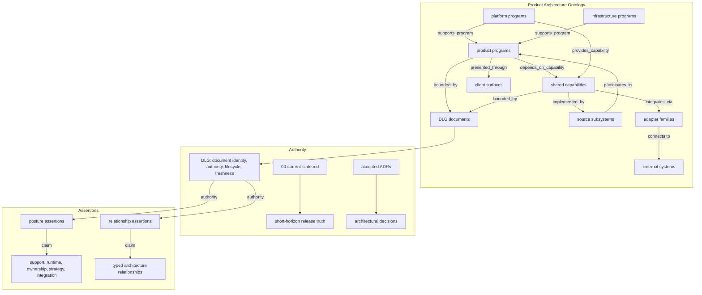

# Product Lanes and Boundaries

## Purpose

This document defines the proposed Codexify Product Architecture Ontology: a stable vocabulary for product programs, platform programs, shared capabilities, client surfaces, adapter families, and their allowed architectural relationships. If ADR-057 is accepted, it will extend the accepted [Document Lifecycle Graph (DLG)](./document-lifecycle-graph-contract.md) and work alongside accepted ADRs and [current-state](./00-current-state.md) truth.

The ontology answers "what stable part of Codexify is this?" and "what architectural role can it play?"—not "what is currently supported?" or "what is currently implemented?"

## Relationship to the DLG

| Concern | Canonical surface |
|---|---|
| Document identity, paths, aliases | DLG |
| Document authority, lifecycle, freshness, disposition | DLG |
| Evidence classification, supersession, contradiction | DLG |
| Retrieval policy and Agent Reading Packets | DLG |
| Stable product-program vocabulary | Product Architecture Ontology |
| Platform-program, shared-capability, client-surface, adapter-family vocabulary | Product Architecture Ontology |
| Product-architecture relation vocabulary and dependency direction doctrine | Product Architecture Ontology |
| Current posture (support, runtime, ownership, strategy, integration) | Product Architecture Assertions |
| Current architecture relationship instances | Product Architecture Assertions |
| Short-horizon release truth and active blockers | `00-current-state.md` |
| Accepted architectural decisions | Governing ADRs |
| Implementation behavior | Code, tests, and live proof |

The ontology extends the DLG; it does not duplicate or replace it. DLG lifecycle, authority, freshness, evidence, supersession, contradiction, and retrieval semantics remain in the DLG. The ontology adds stable product vocabulary, typed relationship semantics, and assertion semantics.

## Stable semantic addresses versus filesystem paths

Every stable architecture concept has a semantic address:

- `codexify:program:<slug>` — product, platform, or infrastructure program
- `codexify:capability:<slug>` — shared platform capability
- `codexify:client:<slug>` — client surface
- `codexify:adapter:<slug>` — adapter family
- `codexify:source:<domain>:<slug>` — future source subsystem
- `codexify:assertion:product-architecture:<stable-id>` — product architecture assertion

These are semantic addresses, not filesystem paths. Moving code does not change concept identity. Changing support posture does not change concept identity. Path is never architecture identity.

## Relational trails and query-specific graph paths

A graph path is a relational trail assembled by the resolver for a specific question. It is not a filesystem path, permanent hierarchy, or canonical graph object. Graph paths are traversed, not stored.

## Stable product-program identities

### `codexify:program:digital-cognitive-workspace`

**Digital Cognitive Workspace** — the core product program.

Concerns: conversations, threads, documents, memory, projects, intentions, tasks, personalization, semantic search and retrieval, user-owned cognitive workspace behavior.

Program class: `product`

### `codexify:program:node-runtime`

**Node Runtime** — the backend platform program.

Concerns: API, durable storage, workers, queues, provider mediation, jobs, tool execution, health and diagnostics, runtime lifecycle, synchronization support.

Program class: `platform`

### `codexify:program:threadspace`

**ThreadSpace** — product and network program.

Concerns: node identity, operator identity, user identity, device identity, invitations, trust, membership, social graph ownership, presence, federation, relay and coordination protocols, replication and synchronization.

Program class: `product_and_network`

### `codexify:program:home-presence`

**Home Presence** — product and physical-interface program.

Concerns: cameras, microphones, speakers, local perception, household identity recognition, environmental and household memory, presence events, privacy and consent policies.

Program class: `product_and_physical_interface`

### `codexify:program:infrastructure-services`

**Infrastructure Services** — supporting infrastructure program.

Concerns: hosted semantic spaces, remote compute, backups, coordination relays, connectivity assistance, hosted inference, recovery services, optional federation support.

Program class: `infrastructure`

**Clients are not a product program.** Client surfaces are a separate architecture concept type.

## Platform-program identity

The Node Runtime is the canonical platform program. It owns the API, workers, queues, persistence, provider mediation, and runtime lifecycle. A platform program may provide or host shared capabilities.

## Infrastructure-program identity

Infrastructure Services is the canonical infrastructure program. It provides optional hosted services. Infrastructure is not required for local-first operation. ThreadSpace authority must not silently centralize in hosted services.

## Shared platform capabilities

| Capability ID | Title |
|---|---|
| `codexify:capability:identity` | Identity |
| `codexify:capability:authorization-policy` | Authorization and Policy |
| `codexify:capability:context-retrieval-assembly` | Context Retrieval and Assembly |
| `codexify:capability:continuity` | Continuity |
| `codexify:capability:semantic-spaces` | Semantic Spaces |
| `codexify:capability:delegation-coordination` | Delegation and Coordination |
| `codexify:capability:persistence` | Persistence |
| `codexify:capability:runtime-lifecycle` | Runtime Lifecycle |
| `codexify:capability:events-receipts-observability` | Events, Receipts, and Observability |
| `codexify:capability:provider-tool-adapter-interfaces` | Provider and Tool Adapter Interfaces |

Rules:

- Shared capabilities may support multiple programs.
- A program may depend on several shared capabilities.
- A platform program may provide or host shared capabilities.
- A shared capability must not depend directly on one product-specific UI implementation.
- A shared capability may expose contracts consumed by multiple programs.
- Capability identity must remain vendor-neutral unless the capability itself is explicitly vendor-specific.

Actual current `provides_capability`, `depends_on_capability`, and `supports_program` edges must be represented as relationship assertions when they describe current Codexify architecture.

## Client surfaces

| Client ID | Title |
|---|---|
| `codexify:client:web` | Web Client |
| `codexify:client:desktop` | Desktop Client |
| `codexify:client:browser-extension` | Browser Extension |
| `codexify:client:browser-host` | Browser Host |
| `codexify:client:mobile` | Mobile Client |
| `codexify:client:home-device` | Home Device Client |

Rules:

- Clients may present or interact with product programs.
- Clients do not own Codexify user identity.
- Clients do not become canonical persistence authorities.
- Clients do not become policy authorities.
- Clients may hold bounded local/session state under existing contracts.
- A client's presence in the repository does not prove support or release qualification.

## Adapter families

| Adapter ID | Title |
|---|---|
| `codexify:adapter:openai-compatible-inference` | OpenAI-Compatible Inference |
| `codexify:adapter:codex-execution` | Codex Execution |
| `codexify:adapter:claude-compatible-inference` | Claude-Compatible Inference |
| `codexify:adapter:local-inference` | Local Inference |
| `codexify:adapter:deepseek` | DeepSeek |
| `codexify:adapter:whooshd` | Whoosh'd |
| `codexify:adapter:external-agent-runtime` | External Agent Runtime |
| `codexify:adapter:external-tool` | External Tool |
| `codexify:adapter:storage` | Storage |
| `codexify:adapter:networking` | Networking |

Rules:

- Provider-specific integrations are adapters, not identity authorities.
- Codexify-native authentication remains distinct from provider authorization.
- A Codex account is not a Codexify identity prerequisite.
- OpenAI-compatible protocol support is an interoperability boundary, not proof of vendor lock-in.
- Codex execution is an adapter or execution lane, not a mandatory product dependency.
- External providers and harnesses remain subordinate to Guardian, policy, lineage, identity, and transcript boundaries.
- Adapters may connect capabilities to external systems.
- Adapters must not redefine product authority or user ownership.

## Source-subsystem concept

A source subsystem is a future graph concept identifying a bounded implementation surface (backend package, frontend feature directory, client application, adapter implementation, worker family, storage subsystem, deployment profile, or test/proof harness).

Identity pattern: `codexify:source:<domain>:<slug>`

Future source-subsystem records must:

- Use repository-relative paths.
- Support more than one path where a subsystem legitimately spans files.
- Identify owning programs and capabilities through typed relationship assertions.
- Identify governing documents through DLG document IDs.
- Separate runtime participation from repository presence.
- Preserve unknown or entangled boundaries honestly.
- Avoid assigning an entire broad namespace to one lane merely because some descendants participate in it.

**No source directories have been moved or classified.** This is a future contract only.

## Product Architecture Assertions

Product Architecture Assertions are evidence-backed records representing claims about stable architecture concepts. They are temporal and evidence-backed; they are not intrinsic stable concept properties.

### Assertion kinds

- `posture` — orthogonal dimension claims (support, runtime, ownership, strategy, integration)
- `relationship` — typed architectural edge between two stable concepts

Every assertion must contain:

- `schema_version`, `assertion_id`, `assertion_kind`, `subject_id`
- `assertion_scope`, `effective_from`, optional `effective_until`
- `authority_document_ids`, `evidence_document_ids`, `governing_adr_document_ids`
- `repository_revision`, `evidence_class`, `notes`, `record_purpose`

`record_purpose` distinguishes `canonical_assertion` from `example_only`.

All authority, evidence, and governing ADR references must use DLG document identities.

### Posture assertions

Posture assertions use these orthogonal dimensions:

| Dimension | Values |
|---|---|
| Support posture | `supported`, `internal`, `optional`, `strategic`, `experimental`, `historical`, `unknown` |
| Runtime participation | `required`, `supporting`, `optional`, `inactive`, `unknown` |
| Ownership state | `owned`, `unowned`, `entangled`, `unknown` |
| Strategy state | `now`, `next`, `observatory`, `parked`, `unknown` |
| Integration state | `integrated`, `partial`, `contract_only`, `prototype`, `absent`, `unknown` |

Key distinctions:

- Support posture and runtime participation are different.
- Strategic value does not imply runtime activation.
- Repository presence does not imply support.
- A contract does not prove integration.
- A unit test does not prove live support.
- `unowned` and `entangled` are ownership states, not maturity statuses.
- An assertion may become stale without changing the underlying concept.

### Relationship assertions

Relationship assertions record that a typed architecture relationship is claimed to hold between permitted endpoint identities. Most endpoints are stable architecture concepts; `participates_in`, `bounded_by`, and `classified_by` also admit DLG document or Product Architecture Assertion identities in the exact positions defined by the predicate.

Required fields: `subject_id`, `predicate`, `object_id`.

Relationship validity may change over time without changing endpoint identities. Expired relationships remain historical records. Conflicting current relationship assertions must remain explicit until resolved.

## Orthogonal posture dimensions

Posture dimensions are deliberately orthogonal. Ownership warnings (`unowned`, `entangled`) may coexist with any support or runtime posture. A program can be `supported` while `entangled`. A capability can be `strategic` while `unowned`. These warnings must be reported, not hidden.

## Derived flat projection labels

These labels are deterministic derived outputs from posture assertions, not canonical source assertions:

| Label | Meaning |
|---|---|
| `current_core` | Product program with support=`supported`, runtime=`required`, current release authority |
| `current_support` | Platform/capability with support=`supported`, runtime=`supporting`, supporting a current-core program |
| `active_optional` | Support=`optional` or `internal`, runtime=`optional`, not required by canonical path |
| `strategic_parked` | Support=`strategic`, strategy=`parked` or `observatory`, runtime=`inactive` or `unknown` |
| `experimental` | Support=`experimental`, integration=`prototype`, `partial`, or `unknown` |
| `historical` | Support=`historical` or DLG lifecycle=`retired`/`tombstoned` |

Flat labels must never be used as canonical source assertions. Future generated projections may expose them for convenience.

## Product Architecture relationship vocabulary

| Predicate | Meaning |
|---|---|
| `participates_in` | Source subsystem, DLG document, or capability participates in a program |
| `provides_capability` | Platform program or source subsystem provides a shared capability |
| `depends_on_capability` | Product or platform program depends on a shared capability |
| `presented_through` | Program is presented through a client surface |
| `integrates_via` | Capability or program integrates through an adapter family |
| `implemented_by` | Architecture concept is implemented by a source subsystem |
| `bounded_by` | Architecture concept or source subsystem is bounded by a governing DLG document |
| `supports_program` | Capability, platform, or infrastructure program supports a product program |
| `classified_by` | DLG document or source subsystem is classified by an assertion |

The assertion schema enforces endpoint categories that are visible from ID shape. Program-class restrictions for `provides_capability`, `depends_on_capability`, and `supports_program` are resolved from the ontology's `program_class` metadata rather than copied into a second program registry.

Semantics:

- `participates_in` does not prove support.
- `implemented_by` does not prove runtime activation.
- `presented_through` does not make a client authoritative.
- `integrates_via` does not grant the adapter identity authority.
- `supports_program` does not make optional infrastructure mandatory.
- `bounded_by` must resolve to a DLG document identity.
- `classified_by` must resolve to a Product Architecture Assertion.
- Weak `related_to` edges must not determine ownership, posture, support, or dependency direction.
- Relation direction must be explicit.
- Cycles must be forbidden where they would imply recursive ownership or dependency authority.

## Allowed dependency directions

- Client surface → product or platform program contract
- Product program → shared capability contract
- Platform program → shared capability implementation
- Shared capability → adapter interface
- Adapter implementation → external provider, tool, service, or network
- Infrastructure program → bounded support contract for product or platform programs
- Source subsystem → governing DLG contracts and accepted ADR documents

Programs may depend on another program only through an explicit accepted contract. Shared capabilities may support multiple programs. Client surfaces may consume shared capabilities only through approved program or platform interfaces.

## Forbidden dependency examples

- Shared capability → product-specific UI implementation
- Shared capability → client-owned identity or policy
- Adapter implementation → Codexify identity authority
- Provider account → Codexify user identity
- Provider account → workspace or ThreadSpace membership authority
- Client surface → canonical persistence authority
- Client surface → canonical policy authority
- Optional hosted service → hidden central authority for ThreadSpace
- Product program → provider-specific implementation when an adapter boundary exists
- Strategic program → current-core status without current release authority and evidence
- Experiment → supported product claim without promotion evidence
- Repository path presence → product support claim
- Repository path proximity → ownership claim
- DLG lifecycle state → product support posture
- Product support posture → document authority
- Generated projection → canonical source mutation
- Architecture ontology → runtime implementation proof
- Vector similarity → canonical architecture relation
- Client or adapter concept → document authority
- Relationship assertion → permission to execute architecture changes

## DLG document identity as the authority/evidence domain

All architecture relationships that target ADRs, architecture contracts, current-state documents, proof records, inspections, or other governed documents must resolve through the DLG document identity domain.

Example: `codexify:doc:adr:056-document-lifecycle-graph`

Fields referring to governing ADRs use `governing_adr_document_ids` (not `governing_adr_ids`). Fields referring to authority or evidence use `authority_document_ids` and `evidence_document_ids`.

There is no separate `codexify:adr:*` or `codexify:contract:*` identity namespace.

## How agents resolve product architecture

A future resolver sequence:

1. Classify the question by knowledge intent.
2. Resolve DLG authority and lifecycle first.
3. Select governing documents.
4. Resolve product-program and capability references from those documents.
5. Traverse ontology-permitted Product Architecture relationship assertions within a bounded hop count.
6. Resolve current posture through posture assertions supported by current authority.
7. Resolve relationship validity through relationship assertions and their effective periods.
8. Preserve stale, conflicting, unknown, unowned, entangled, inferred, and superseded findings.
9. Enforce reading and graph-traversal budgets.
10. Emit one Agent Reading Packet containing both knowledge authority and architecture context.
11. Record why every selected source, concept, and relationship assertion was included.
12. Expose the relational trail used to derive the answer.

The resolver must not infer support from repository presence, infer ownership from directory name, use vector similarity as architecture authority, or manufacture current relationship instances from ontology type definitions.

## How to classify new work

Tasks can be classified against this ontology. A future tool or human reviewer can determine:

- Which program or programs the change affects.
- Which shared capabilities it touches.
- Which client surfaces it modifies.
- Which adapter families it extends.
- What dependency direction it follows.
- What governing ADRs or contracts bound it.

This classification is orthogonal to the existing task spec protocol; it adds product-architecture context.

## Five-minute orientation rule

Future architecture-impacting and cross-program tasks should state:

- Current program or programs
- Current architecture role
- Shared capability or capabilities involved
- Current milestone or assertion source
- Relevant relationship assertion or governing seam
- User capability advanced
- Governing DLG contract or ADR document identity
- Client surfaces affected
- Adapter families affected
- Explicit dependency direction
- Explicit non-goals
- Definition of done
- Required proof class

This does not replace the Codexify Task Spec Protocol. It adds product-architecture context to it.

## Now, Next, and Observatory projections

These are generated planning views, not ontology state. They must not be stored permanently on stable program definitions.

- **Now**: current release-authority-backed work; active program with required or supporting runtime participation; selected human priority.
- **Next**: accepted upcoming work; prerequisite-aware; not yet part of the current release promise.
- **Observatory**: strategic, parked, experimental, research, or watchlist work; retained for visibility; excluded from the active critical path unless explicitly activated.

Represent them through temporal strategy assertions, not stable concept fields.

## Lane-budget rule

- One primary active product program.
- One supporting platform or infrastructure program.
- All other programs remain Next, Observatory, parked, or explicitly optional unless a human decision activates them.

This is a coordination policy. It does not determine product identity, automatically modify current-state truth, or prohibit small maintenance or safety work outside the active lane. It does prohibit agents from silently promoting strategic work into the critical path.

## Promotion and parking rules

**Promotion** requires:

- Explicit human selection.
- Governing ADR or contract alignment.
- Clear ownership.
- Permitted dependency direction.
- Current relationship assertions where required.
- Implementation evidence appropriate to the claim.
- Proof surface.
- Current-state follow-through when release posture changes.

**Parking** must preserve:

- Stable concept identity.
- Governing documents.
- Source relationships.
- Relationship history.
- Known implementation state.
- Unresolved risks.
- Future reactivation conditions.

A parked program must not be deleted or rewritten as historical merely because it is not current.

## Repository presence versus product support

Repository presence does not imply support. A directory full of source code is observed structure, not a support claim. Only current-state authority, governing ADRs, accepted posture assertions, and live proof determine what is supported.

## Product identity versus current priority

- Program identity is stable.
- Capability identity is stable.
- Client identity is stable.
- Adapter-family identity is stable.
- Strategic value is durable but revisable.
- Current priority is temporal.
- Runtime participation is temporal.
- Support posture is temporal.
- Architecture relationship validity may be temporal.
- Ownership may be incomplete.
- Integration may be partial.
- Repository presence is merely observed structure.
- Filesystem location is not semantic identity.

## Future source-mapping workflow

**Phase 1: DLG inventory** — complete the document inventory; resolve pointers, supersession, authority, and stale material; identify governing sources.

**Phase 2: Source-surface inventory** — enumerate bounded implementation surfaces; assign stable source-subsystem IDs; record repository-relative paths; do not classify broad namespaces wholesale.

**Phase 3: Architecture assertions** — connect source subsystems to programs and capabilities using relationship assertions; record posture assertions; cite governing DLG document identities and proof; preserve unknown and entangled surfaces.

**Phase 4: Human review** — review ownership; review relationship assertions; resolve cross-program boundaries; approve dependency exceptions; select canonical mappings.

**Phase 5: Generated projection** — generate a product-lane registry or graph view; include graph and ontology revision; include assertion-set revision; mark output generated and non-editable.

**Phase 6: Enforcement** — add dependency-boundary tests; add source-anchor invalidation; add assertion freshness checks; add agent-reading integration; report drift and orphaned source surfaces.

**Phase 7: Code movement** — only after accepted mappings and proof; one bounded subsystem per task; preserve import, migration, deployment, and release behavior; update graph relationships and assertions transactionally.

## Future generated product-lane projection

A future generated projection (TOML, JSON, or other deterministic format) must be generated from DLG records, ontology concepts, accepted posture assertions, accepted relationship assertions, current-state authority, and source-subsystem records. It must not be hand-maintained.

It must include: schema version, generation time, repository revision, DLG revision, ontology revision, assertion-set revision, authority inputs, current primary and supporting lanes, program and capability views, source-subsystem mappings, derived flat projection labels, relationship trails, unresolved mappings, ownership warnings, stale assertions, conflicting assertions, and dependency violations.

## Future code-moving workflow

After accepted mappings and proof, one bounded subsystem may be moved per task. The task must preserve import, migration, deployment, and release behavior and update graph relationships and assertions transactionally. Source movement must never perform broad namespace reassignment.

## Mermaid diagram

## Non-goals

- No independent TOML registry.
- No full product-lane map.
- No repository-wide classification.
- No source-subsystem record corpus.
- No current architecture relationship corpus.
- No runtime behavior change.
- No API route, worker, queue, migration, database schema, Compose change, provider change, auth change.
- No browser, ThreadSpace, Home Presence, hosted-service, or client implementation.
- No code movement.
- No repository split.
- No generated backlog.
- No release claim.
- No automatic architecture approval.
- No parallel ADR or contract identity domain.
- No static ontology encoding of mutable current relationship truth.

## Implementation status

The ontology is **proposed** under ADR-057. The ontology is not a runtime implementation, release claim, or repository inventory. It is not a parallel DLG. Semantic IDs are not filesystem paths. Graph paths are relational trails assembled for a question.

The ontology defines relationship vocabulary. Assertions record actual relationship claims. No source directories have been moved or classified. No generated product registry exists yet.

`00-current-state.md` remains current release truth. Accepted ADRs govern architectural decisions. ADRs and contracts are referenced by DLG document identity. Product posture is temporal. Architecture relationships may be temporal. Product identity is stable. DLG lifecycle and product posture are different axes.
