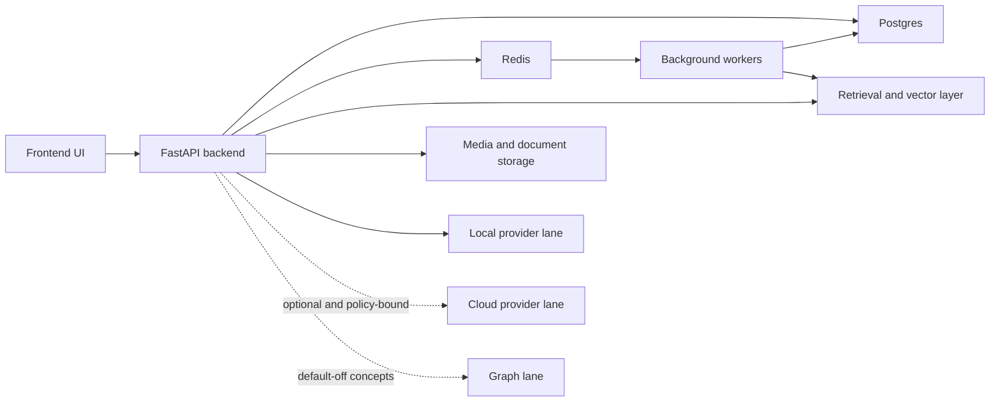

# Runtime Architecture for Public Explanation

## Public-safe component map

- `Current`: React frontend
- `Current`: FastAPI backend
- `Current`: Postgres as the primary system of record
- `Current`: Redis for queues, locks, heartbeats, and task-event transport
- `Current`: Worker processes for chat, embeddings, and related background tasks
- `Current`: Retrieval and vector layer for semantic context
- `Current`: Media and document ingestion pipeline
- `Current`: Local versus cloud provider boundary, with current support anchored to local-only posture
- `Exploration`: Optional graph concepts exist in the repo, but graph writes remain default-off on the supported Compose path

## Simplified explanation

Codexify is not a single model call with a pretty shell around it.
The product is a multi-part local runtime: UI, backend, database, queue, workers, and retrieval surfaces working together to preserve thread continuity and artifact lineage.

## Simplified diagram

## What this proves

- `Current`: Codexify has a real runtime architecture beyond a browser prompt box.
- `Current`: Background work, persistence, and retrieval are part of the product story.
- `Current`: Local-first posture is enforced at the runtime and config layer, not just in brand language.

## What this does not prove

- It does not prove public cloud support is part of the current release promise.
- It does not prove the site repo uses this same architecture.
- It does not prove every optional seam is release-ready.
- It does not prove acceptance of a task means successful completion.

## Public explanation guidance

- Explain the runtime as a bounded local system with explicit storage, queue, worker, and retrieval layers.
- Do not expose unnecessary internal topology, private routes, or operator-only details.
- Keep the emphasis on inspectability, ownership, and continuity rather than novelty theater.
