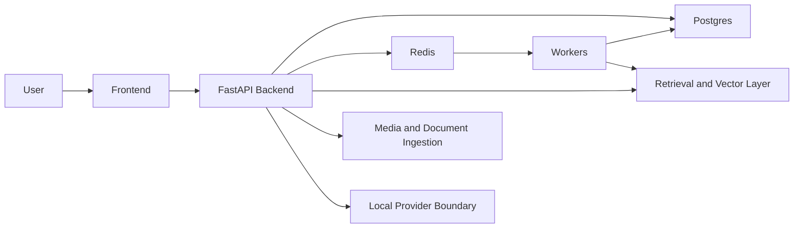

# 02 Runtime Architecture for Public Explanation

## Public-safe component map

`Current`:
- Frontend: the user-facing workspace shell
- FastAPI backend: request handling, routing, policy, persistence coordination
- Postgres: durable system of record
- Redis: queueing, locks, task events, worker coordination
- Workers: background completion, embedding, and related job execution
- Retrieval/vector layer: semantic indexing and retrieval
- Media/document ingestion: upload, parsing, indexing, artifact handling
- Local/cloud provider boundary: current supported posture is local-only; cloud-capable lanes exist in architecture but are not the supported beta promise
- Optional graph concepts: graph-related ideas and adapters exist, but graph writes remain default-off on the supported Compose path

## Simplified topology

## What this proves

`Current`:
- Codexify is not only a thin chat client; it has explicit backend, persistence, queue, and retrieval layers.
- The product is designed around durable state plus asynchronous execution.
- Observability and system-state distinctions matter to the architecture.

## What this does not prove

`Current`:
- It does not prove Codexify.Space uses this topology.
- It does not prove every architectural lane is part of the public beta promise.
- It does not prove cloud support, autonomous orchestration, federation durability, or public graph-write support.
- It does not prove desktop packaging supersedes the Compose path.

## Public explanation guidance

Use this level of explanation when the website needs to say how Codexify works:
- browser or app shell in front
- backend and data layers coordinating work
- workers handling asynchronous tasks
- retrieval and document handling grounding the assistant in user materials

Avoid:
- exposing internal route lists
- surfacing private operator-only diagnostics
- presenting optional or default-off subsystems as release commitments
