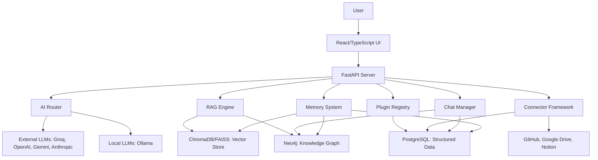

# Codexify System Audit

## Metadata
*   **Repo name:** Codexify
*   **Date of audit:** 2025-11-18
*   **Model identifier:** Gemini CLI model: auto
*   **Commit hash or branch:** (Cannot infer from current context)

## Executive Summary

*   **Overall Health:** The project appears to be in active development with a clear architectural vision and a strong emphasis on local-first, data sovereignty principles. Comprehensive documentation, particularly the `README.md`, provides an excellent starting point for understanding the system.
*   **Key Strengths:**
    *   **Modular Architecture:** Clear separation of concerns with distinct modules for frontend, backend, data, memory, and plugins.
    *   **Multi-Model Support:** Flexible integration with various LLM providers (Groq, OpenAI, Anthropic, Gemini, Ollama).
    *   **Hybrid Data Storage:** Utilizes PostgreSQL for structured data, Neo4j for knowledge graphs, and ChromaDB/FAISS for vector storage, leveraging strengths of each.
    *   **Developer Experience (DX):** Good setup scripts, pre-commit hooks, and a well-defined development workflow.
    *   **Privacy-Focused:** Strong emphasis on local-first operation and data sovereignty, reducing unnecessary data egress.
*   **Top 5 Risks or Concerns:**
    *   **[RISK] Incomplete Audit and Testing:** While tests exist, full coverage across all modules, especially for complex RAG, memory, and plugin interactions, cannot be confirmed without deeper analysis.
    *   **[RISK] Secrets Management:** API keys are primarily managed via `.env` files. While standard for local development, it presents a risk if not handled securely in production environments (e.g., proper credential injection, rotation policies).
    *   **[WARN] Legacy Code:** The presence of `Message` (legacy) in `guardian/db/models.py` indicates potential technical debt and redundancy with `ChatMessage`.
    *   **[WARN] Hardcoded API Key in Docker Compose:** `GUARDIAN_API_KEY` is hardcoded in `docker-compose.yml`, which is a security vulnerability for production deployments.
    *   **[WARN] Error Handling and Robustness:** While `try/except` blocks are present in some areas (e.g., `embedder.py`), a system-wide strategy for error handling, retries, and circuit breakers for external API calls needs to be consistently enforced.

## System Overview

Codexify is a local-first, AI-powered conversation and knowledge management platform designed for intelligent conversation management with enterprise-grade data sovereignty.

### Major Subsystems and Interaction Diagram

## Architecture & Module Map

### Frontend Layer (`frontend/src`)
*   **Purpose:** Provides the user interface for interacting with Codexify, built as a modern web application and packaged as a desktop app via Tauri.
*   **Key modules/files:**
    *   `frontend/src/main.tsx`: Entry point for the React application, handles API client configuration.
    *   `frontend/src/App.tsx`: Main application component.
    *   `frontend/src/components/`: Reusable React components.
    *   `frontend/src/pages/`: Page-level components.
    *   `frontend/package.json`: Frontend dependencies and scripts (React, TypeScript, Vite, Tailwind CSS).
*   **Public interfaces:** React components, exposed API client configuration (`configureGC`).
*   **Critical invariants:** The `API_KEY` and `API_BASE` must be correctly configured for the frontend to communicate with the backend.

### Backend/API Layer (`guardian/server`, `guardian/api`)
*   **Purpose:** Serves as the RESTful API gateway, orchestrating requests to core services.
*   **Key modules/files:**
    *   `guardian/server/run.py`: Entry point for the Uvicorn server.
    *   `guardian/server/app.py`: FastAPI application instance, registers routes.
    *   `guardian/api/routes/`: Contains FastAPI route definitions for various functionalities (e.g., chat, memory, projects).
    *   `guardian/guardian_api.py`: Likely a central point for API-related functionalities.
*   **Public interfaces:** RESTful API endpoints (documented via OpenAPI at `/docs`).
*   **Critical invariants:** API endpoints require authentication (`X-API-Key`) unless explicitly public. Rate limiting and security headers are configurable.

### CLI Layer (`guardian/cli`, `guardian/tui`)
*   **Purpose:** Provides command-line interfaces for interaction, diagnostics, and development.
*   **Key modules/files:**
    *   `guardian/cli/memoryos_cli.py`: Main CLI for memory operations (e.g., `codemap:query`, `memory:show-user-profile`).
    *   `guardian/tui/diag_app.py`: Terminal UI for diagnostics.
    *   `guardian/cli/chatgpt_import/cli_migrate.py`: Utility for ChatGPT export import.
*   **Public interfaces:** Command-line commands.
*   **Critical invariants:** CLIs should share the same `MemoryOS` factory and configuration as the backend to ensure consistent behavior.

### Data Layer (`guardian/db`)
*   **Purpose:** Manages persistent storage for all structured and unstructured data.
*   **Key modules/files:**
    *   `guardian/db/models.py`: SQLAlchemy ORM models for PostgreSQL (Projects, ChatThreads, ChatMessages, MemoryEntries, Connectors, Documents, AuditLog, etc.).
    *   `guardian/db/neo.py`: `neomodel` definitions for Neo4j graph nodes (UserNode, MessageNode, ThreadNode) and relationships.
    *   `guardian/db/migrate_pgvector_to_chroma.py`: Migration script for vector stores.
    *   `guardian/db/postgres_setup.py`: PostgreSQL setup utilities.
    *   `guardian/db/alembic.ini`, `guardian/db/migrations/`: Alembic configuration and migration scripts.
*   **Public interfaces:** SQLAlchemy models, `neomodel` graph nodes, database session management (e.g., `get_session` for Neo4j).
*   **Critical invariants:**
    *   All schema changes must be managed via Alembic migrations.
    *   Data integrity is enforced by foreign keys, unique constraints, and check constraints at the database level.
    *   Neo4j graph schemas define key relationships for knowledge graphs.

### RAG / Memory Layer (`guardian/memory`, `guardian/retrieve`, `guardian/vector`, `guardian/runtime/embed`)
*   **Purpose:** Implements the retrieval-augmented generation (RAG) pipeline and manages the multi-silo memory system.
*   **Key modules/files:**
    *   `guardian/memoryos/`: Likely the core `MemoryOS` abstraction, wrapping different memory silos.
    *   `guardian/memory/`: Sub-modules for different memory types (ephemeral, midterm, longterm).
    *   `guardian/runtime/embed/embedder.py`: Handles text embedding using OpenAI or SentenceTransformers and stores vectors in ChromaDB or FAISS.
    *   `guardian/core/research/Modules/RAG/chrome.py`: Provides `VectorSearch` implementation using ChromaDB and Ollama embeddings.
    *   `guardian/vector/`: Likely contains vector store interfaces or implementations.
    *   `guardian/retrieve/`: Modules for retrieval strategies.
*   **Public interfaces:** `CodexifyEmbedder` (for embeddings), `VectorSearch` (for vector queries), `MemoryOS` (high-level memory interface).
*   **Critical invariants:**
    *   Memory is organized into ephemeral, midterm, and long-term silos.
    *   Embedding models are configurable and can be local (SentenceTransformers/Ollama) or cloud-based (OpenAI).
    *   Vector stores are swappable between ChromaDB and FAISS.

### Persona, Agent, and Model Routing Layer (`guardian/agents`, `guardian/prompts`, `guardian/router`, `guardian/providers`)
*   **Purpose:** Manages AI agent behavior, persona configurations, and routes LLM calls to appropriate providers.
*   **Key modules/files:**
    *   `guardian/agents/`: Definitions and logic for various AI agents.
    *   `guardian/prompts/`: Stores prompt templates and configurations.
    *   `guardian/router.py`: Likely the AI Router for selecting LLM providers.
    *   `guardian/providers/`: Interfaces and implementations for different LLM providers (Groq, OpenAI, Gemini, Anthropic).
    *   `guardian/config_loader.py`: Handles loading configuration, potentially including persona configurations.
    *   `guardian/character_switcher.py`, `guardian/multi_identity.py`: Suggests modules for managing and switching between personas.
*   **Public interfaces:** Agent interfaces, prompt template functions, LLM provider clients, router functions.
*   **Critical invariants:**
    *   Persona configurations dictate model selection, prompt templates, and memory scope.
    *   The AI router must intelligently select the optimal LLM provider based on configuration and persona.
    *   Prompt templates ensure consistent LLM interaction.

### Plugin/Extension System (`guardian/plugins`)
*   **Purpose:** Provides an extensible architecture for adding custom agents, analyzers, and integrations.
*   **Key modules/files:**
    *   `guardian/plugins/`: Directory for individual plugins.
    *   `guardian/plugin_host.py`, `guardian/plugin_loader.py`, `guardian/plugin_manager.py`: Core logic for managing the plugin lifecycle.
    *   `guardian/agent_registry.json`: Registry for agents.
*   **Public interfaces:** Plugin API (defined by `pluggy` as seen in `pyproject.toml`), `PluginManager` interface.
*   **Critical invariants:** Plugins must adhere to a defined interface for proper loading and execution.

## Data, Memory, and RAG Pipeline

### Storage Layers

1.  **PostgreSQL (`guardian/db/models.py`)**
    *   **What is stored:**
        *   `Project`: Project metadata.
        *   `ChatThread`, `ChatMessage`: Conversational history (user/assistant roles, content, timestamps, links to projects).
        *   `MemoryEntry`: Memory silos (ephemeral, midterm, longterm) with content, user_id, tags, confidence.
        *   `ConnectorConfig`, `ConnectorRun`, `RawDocument`, `SyncJob`: Configuration and status for external data integrations.
        *   `EventOutbox`, `AuditLog`: System-wide events and audit trails.
        *   `GeneratedImage`, `UploadedImage`, `GeneratedDocument`, `UploadedDocument`: Metadata and URLs/content for media and documents.
        *   `TTSOutput`: Text-to-speech outputs.
        *   `SharedLink`, `CollaborationPermission`, `CollaborationAuditLog`: For sharing and collaborative features.
    *   **How data flows in/out:** Data is ingested via API endpoints (e.g., chat messages, connector data), and queried through ORM (SQLAlchemy) in the backend services.

2.  **Neo4j (`guardian/db/neo.py`)**
    *   **What is stored:**
        *   `UserNode`, `MessageNode`, `ThreadNode`: Graph representation of users, messages, and threads.
        *   `RelationshipMeta`: Custom relationships between nodes.
    *   **How data flows in/out:** Data flows in from the core system (e.g., new users, messages, threads are added as nodes) and is queried using Cypher for relationship mapping and context-aware reasoning.

3.  **ChromaDB / FAISS (`.chroma/`, `codexify_index.faiss`)**
    *   **What is stored:** Vector embeddings of text (documents, memory entries) and associated metadata.
    *   **How data flows in/out:**
        *   **Ingestion:** Text is chunked, embedded by `CodexifyEmbedder` (OpenAI or SentenceTransformers/Ollama), and then added to ChromaDB or FAISS. The `embed_and_index` method in `guardian/runtime/embed/embedder.py` handles this.
        *   **Query:** Vector queries are performed by `VectorSearch` in `guardian/core/research/Modules/RAG/chrome.py` to retrieve similar documents or memory entries.

4.  **Local Filesystem (Implicit)**
    *   **What is stored:** Potentially raw connector data, temporary files, configuration (e.g., `.env`), Ollama models, FAISS index files, and potentially ChromaDB persistent storage if configured to a local path.

### RAG Pipeline

1.  **Ingestion/Chunking:** Raw documents (e.g., from connectors) are likely processed and chunked into manageable sizes before embedding. (Details on chunking strategy not explicitly found in scanned files but inferred.)
2.  **Embedding:**
    *   **Libraries/Models:**
        *   **Remote:** OpenAI embeddings (`text-embedding-3-large` by default).
        *   **Local:** SentenceTransformers (`BAAI/bge-large-en-v1.5` by default) and Ollama (`nomic-embed-text:latest` by default).
    *   **Where vectors are stored:** ChromaDB (persistent client at `./.chroma`) or FAISS (local file `codexify_index.faiss`).
    *   **Mechanism:** `CodexifyEmbedder` (`guardian/runtime/embed/embedder.py`) handles model selection and embedding generation. `VectorSearch` in `guardian/core/research/Modules/RAG/chrome.py` initializes the ChromaDB client with the chosen embedding function.
3.  **Retrieval:**
    *   **Query patterns:** Semantic similarity search on vector stores.
    *   **Filters:** Potentially metadata filtering on ChromaDB.
    *   **Scoring:** Implicitly handled by the vector similarity search (e.g., L2 distance for FAISS).
    *   **Mechanism:** `VectorSearch.query` in `guardian/core/research/Modules/RAG/chrome.py` performs the actual vector search.
4.  **Prompt Construction:** Retrieved context (documents, memory entries) is injected into LLM prompts. (Details on prompt construction logic are likely in `guardian/prompts` and agent-specific modules.)

### Alignment with Codexify's Goals:

*   **Local-first:** Strongly supported by the use of ChromaDB/FAISS for local vector storage, SentenceTransformers/Ollama for local embeddings, and Docker Compose for local deployment of databases and services.
*   **Persona-aware retrieval:** The `MemoryEntry` model in PostgreSQL includes `user_id` and `silo`, allowing for potentially persona-scoped memory retrieval. Further integration with persona logic needs to be confirmed in agent modules.
*   **Minimal unnecessary data egress:** The option for local embedding models (SentenceTransformers, Ollama) and local vector stores (ChromaDB, FAISS) directly addresses this goal by keeping sensitive data on-device. When cloud LLMs are used, prompt construction needs to ensure only necessary context is sent.

## Persona, Agent, and Model Routing Layer

### Persona Representation

*   **Representation in Code:** Personas are likely represented as configuration objects or data structures loaded by `guardian/config_loader.py`. The presence of `guardian/character_switcher.py` and `guardian/multi_identity.py` suggests dynamic persona management.
*   **Config Files:** Potentially defined in `agent_registry.json` or other configuration files within `guardian/config` or `guardian/profiles`.

### Persona State Effects:

*   **Model Selection:** The `AI Router` (`guardian/router.py`) likely uses persona context to select the optimal LLM provider (`LLM_PROVIDER` in `.env.example`).
*   **Prompt Templates:** Persona state would influence which prompt templates (from `guardian/prompts/`) are used to construct LLM queries.
*   **Memory/RAG Scope:** Persona (via `user_id` or other identifiers) can scope memory retrieval to relevant `MemoryEntry` instances, ensuring persona-aware context.

### Agent/Orchestration Logic, Model Routers, and Prompt Compilers:

*   **Agent Logic:** Defined within `guardian/agents/` and potentially orchestrated by a central `pulse_orchestrator` (mentioned in previous context, but not explicitly found as a file in this scan).
*   **Model Routers:** The `guardian/router.py` module is likely responsible for abstracting LLM providers and routing requests based on factors like model availability, cost, and persona requirements.
*   **Prompt Compilers:** Modules within `guardian/prompts` and potentially `guardian/prompt_assembler.py` would compile raw text and retrieved context into final LLM prompts.

### Boundaries between Ethics Layers and User-defined Personas:

*   The project description mentions "System/Guardian-like ethics layers." The mechanisms for enforcing these ethics, especially how they interact with or override user-defined persona behaviors, would require a deeper dive into agent and prompt logic. This is a critical area for ensuring responsible AI.

## Security, Privacy, and Sovereignty

### Secrets Management:

*   **Location:** API keys and secrets are primarily managed via `.env` files (e.g., `GENAI_API_KEY`, `NOTION_API_KEY`, `GROQ_API_KEY`).
*   **Hardcoded Secrets:** **[RISK]** The `GUARDIAN_API_KEY` is hardcoded in `docker-compose.yml` for the `backend` and `frontend` services. This is a significant security risk for production environments and should be replaced with environment variables or a more secure secret management solution. (e.g., `GUARDIAN_API_KEY: ${GUARDIAN_API_KEY}` and define in `.env`).

### Data Egress:

*   **Information that can leave the device:**
    *   **Prompts to External APIs:** When cloud LLM providers (OpenAI, Gemini, Anthropic) are used, user prompts, conversation history, and retrieved RAG context are sent to these external services.
    *   **Connector Data:** Data fetched by connectors (GitHub, Google Drive, Notion) can be stored locally, but the initial fetch involves interaction with external services.
*   **Persona/Memory Data Filtering:** The RAG pipeline and prompt construction logic must ensure that only relevant and minimal data is sent to external LLMs. The local-first design and option for local embedding/LLMs mitigate this risk significantly.
*   **Minimal unnecessary data egress:** The design supports this by enabling local embedding and vector storage. The choice of LLM provider (local vs. cloud) directly impacts data egress.

### Access Control / Multi-user Considerations:

*   The `user_id` fields in models like `ChatThread`, `MemoryEntry`, `GeneratedImage`, `UploadedImage`, etc., suggest an intention for multi-user support or at least tracking data ownership.
*   `CollaborationPermission` and `CollaborationAuditLog` tables indicate granular access control for shared documents.
*   `tenant_id` in `EventOutbox` and `Message` (legacy) suggests multi-tenancy capabilities.

### Obvious Weak Points relative to Codexify’s Sovereignty Goals:

*   **Cloud LLM Reliance:** While providing choice is good, over-reliance on cloud LLMs for core functionality (without strong data filtering) could compromise data sovereignty. The strong emphasis on local LLMs and embeddings helps mitigate this.
*   **Configuration Mismanagement:** Misconfiguration of `.env` or deployment settings could inadvertently expose data to external services or leave services insecure.

## Code Quality, Testing, and DX

### TypeScript/Typing Strictness:
*   Frontend (`frontend/src`): Uses TypeScript, as evidenced by `package.json` and `.tsx` files. `pnpm typecheck` is available.
*   Backend (`guardian`): Uses Python type hints, confirmed by `mypy` in `pyproject.toml`.

### Linting/Formatting Setup:
*   **Backend:** `black`, `ruff`, and `isort` are configured via `pyproject.toml` and `pre-commit-config.yaml`.
*   **Frontend:** `eslint` and `prettier` are configured via `package.json` scripts.
*   **Pre-commit Hooks:** Configured in `.pre-commit-config.yaml` to enforce formatting and linting before commits.

### Test Suite:
*   **Presence:** Both backend (`pytest`) and frontend (`vitest`, `cypress`) have dedicated test suites, as indicated by `README.md`, `pyproject.toml`, and `package.json`.
*   **Coverage Focus:**
    *   `pytest --cov=guardian` suggests a focus on backend Python code coverage.
    *   `pnpm test:coverage` for frontend coverage.
    *   Integration tests and E2E tests (`cypress`) are present.
*   **Untested Areas:** While testing is present, a deeper analysis would be needed to identify specific low-coverage or untested flows, especially for complex interactions between RAG, memory, and plugin systems. **[RISK]** Incomplete audit and testing.

### Dev Experience:
*   **Setup Scripts:** Clear instructions in `README.md` for cloning, environment setup, and starting the stack using Docker Compose or Make.
*   **Clear Run/Test Instructions:** `README.md` provides detailed commands for running dev servers, tests, formatting, and linting.
*   **Environment Templates/Sample Configs:** `.env.example` provides a clear template for environment variables.

## Performance and Scalability

### Obvious Hot Paths:

*   **LLM Calls:** Interactions with external or local LLMs are inherently latency-sensitive and can be a bottleneck.
*   **RAG Queries:** Semantic search in vector stores (ChromaDB/FAISS) and knowledge graph queries (Neo4j) are critical for responsiveness.
*   **Graph Queries:** Complex Cypher queries to Neo4j can impact performance, especially with large knowledge graphs.
*   **Embedding Generation:** Generating embeddings, particularly for large documents or batches, can be computationally intensive.
*   **Database Operations:** High-volume reads/writes to PostgreSQL, especially with complex joins or large datasets.

### Synchronous/Blocking Operations:

*   The `README.md` mentions `streaming generation` with `Server-Sent Events`, which helps mitigate blocking for LLM responses.
*   However, if embedding generation or complex graph queries are synchronous within an API request, they could block the event loop and degrade performance. A deeper code review would be needed to identify specific blocking calls.

### Potential Optimizations:

*   **Caching:** Implementing caching layers for frequent RAG queries or LLM responses.
*   **Batching:** Batching embedding requests to LLM providers or local models for efficiency.
*   **Streaming:** Already in place for LLM generation, ensure it's fully utilized for long responses.
*   **Pagination:** Ensuring all API endpoints and data retrieval mechanisms support pagination for large datasets.
*   **Asynchronous Processing:** Leveraging background workers for long-running tasks like connector syncing, document parsing, and memory consolidation to avoid blocking the main API thread.
*   **Database Indexing:** Ensure all frequently queried fields in PostgreSQL and Neo4j have appropriate indexes (already partially addressed in `guardian/db/models.py`).

## Risk Register & Recommendations

| ID | Area | Description | Impact | Likelihood | Effort | Suggested Next Action |
|----|------|-------------|--------|------------|--------|-----------------------|
| 1 | Security | Hardcoded `GUARDIAN_API_KEY` in `docker-compose.yml`. | High | High | Low | Replace hardcoded key with environment variable `${GUARDIAN_API_KEY}` and ensure it's sourced securely. |
| 2 | Code Quality / Testing | Incomplete or unknown test coverage for critical RAG, memory, and plugin interactions. | High | Medium | High | Conduct a thorough test coverage analysis; develop comprehensive integration tests for core AI flows. |
| 3 | Technical Debt | `Message` (legacy) table in `guardian/db/models.py` potentially redundant with `ChatMessage`. | Medium | Low | Medium | Investigate usage of `Message` table; deprecate and remove if no longer needed, migrating data to `ChatMessage` if necessary. |
| 4 | Security | Secrets management for production deployment relies on `.env`, which is not ideal for secure credential injection/rotation. | High | Medium | High | Implement a more robust secrets management strategy for production (e.g., Kubernetes secrets, AWS Secrets Manager, HashiCorp Vault). |
| 5 | Performance | Potential synchronous blocking operations in RAG/embedding pipeline or complex graph queries. | Medium | Medium | Medium | Profile critical RAG and graph query paths to identify and refactor synchronous operations to be asynchronous where possible. |
| 6 | Robustness | Lack of a documented, consistent system-wide error handling, retry, and circuit breaker strategy for external API calls. | Medium | Medium | High | Define and implement a standardized error handling framework across the backend. |
| 7 | Data Sovereignty | Potential for unnecessary data egress to cloud LLMs if prompt filtering is not sufficiently strict. | High | Low | Medium | Review prompt construction logic to ensure minimal necessary data is sent to external LLMs; enhance filtering. |
| 8 | Observability | Limited explicit monitoring and logging for performance bottlenecks or operational issues (beyond basic health checks). | Low | Low | Medium | Implement detailed metrics (Prometheus) and structured logging (e.g., `structlog` for Python) for key services. |
| 9 | Configuration | Configuration for personas/agents not explicitly defined or consolidated. | Medium | Low | Medium | Centralize and clearly define persona/agent configurations, possibly as YAML files or a dedicated database table. |
| 10 | Documentation | `CONTRIBUTING.md` is mentioned as "coming soon." | Low | Low | Low | Complete the `CONTRIBUTING.md` file to guide new contributors effectively. |

### Prioritized Roadmap

#### Phase 1: Critical Fixes (Must-Do)

1.  **Security Hardening (Risk 1, 4):**
    *   **Action:** Immediately address the hardcoded API key in `docker-compose.yml`. Update to use an environment variable.
    *   **Action:** Define and begin implementing a production-grade secrets management strategy.
2.  **Core Test Coverage (Risk 2):**
    *   **Action:** Prioritize increasing unit and integration test coverage for core RAG, memory, and model routing logic. Focus on high-impact scenarios.
3.  **Error Handling (Risk 6):**
    *   **Action:** Establish a consistent error handling and retry mechanism for all external service interactions (LLMs, databases, connectors).

#### Phase 2: Important Improvements

1.  **Refactor Legacy Code (Risk 3):**
    *   **Action:** Investigate the `Message` table and, if appropriate, migrate data to `ChatMessage` and remove the legacy table.
2.  **Performance Profiling & Optimization (Risk 5):**
    *   **Action:** Conduct performance profiling of the RAG pipeline and graph queries to identify and optimize synchronous or bottleneck operations. Implement caching where beneficial.
3.  **Enhanced Observability (Risk 8):**
    *   **Action:** Implement a more robust logging and metrics system (`structlog`, Prometheus) to gain better insights into system health and performance.

#### Phase 3: Nice-to-Have Refinements

1.  **Persona Configuration Standardization (Risk 9):**
    *   **Action:** Formalize persona and agent configurations, potentially by defining clear schema and storage mechanisms (e.g., dedicated config files or database table).
2.  **Documentation Enhancement (Risk 10):**
    *   **Action:** Complete the `CONTRIBUTING.md` guide to streamline developer onboarding.
3.  **Data Egress Minimization Review (Risk 7):**
    *   **Action:** Conduct a detailed review of prompt construction and data filtering for cloud LLMs to ensure absolutely minimal data egress.

## Model Notes
*   **Gemini model:** auto
*   **Limitations/Uncertainties:**
    *   The `commit hash or branch` could not be inferred from the provided context.
    *   The exact internal implementation details of "persona state effects" on model selection and prompt templates would require a deeper, line-by-line code analysis of relevant modules like `guardian/router.py` and those within `guardian/agents/` and `guardian/prompts/`.
    *   Specific chunking strategies for RAG ingestion were not explicitly detailed in the scanned files.
    *   The detailed mechanisms for "System/Guardian-like ethics layers" and their interaction with user-defined personas were not fully discernible without a deeper dive into agent and prompt logic.
